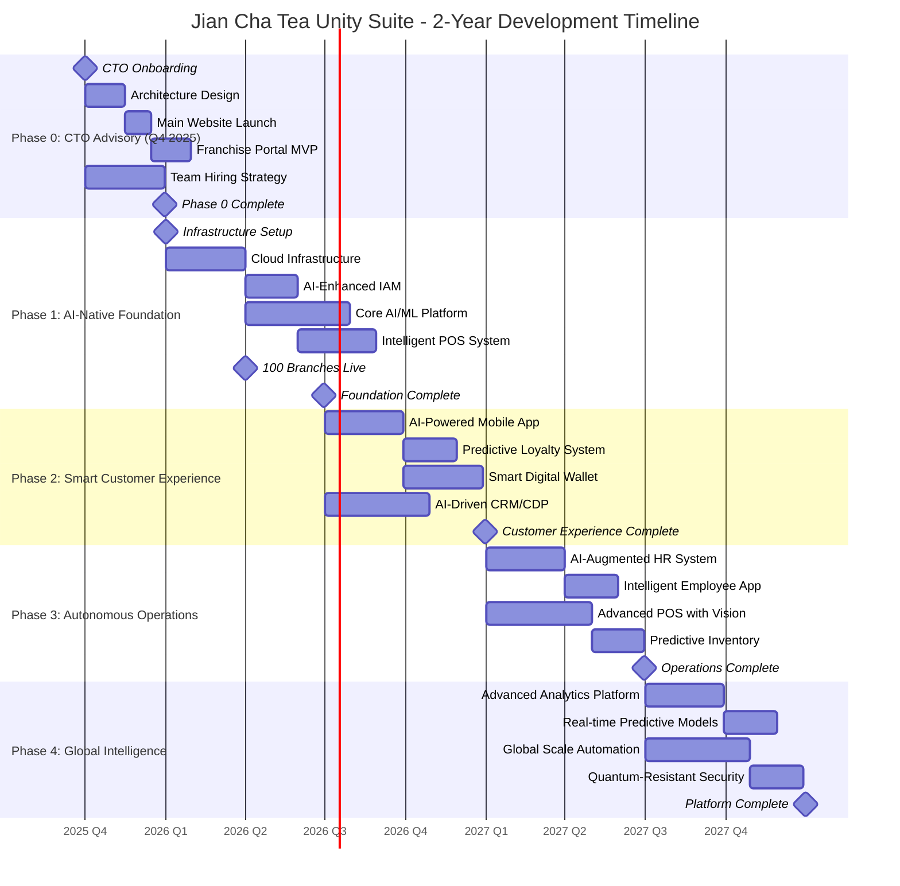
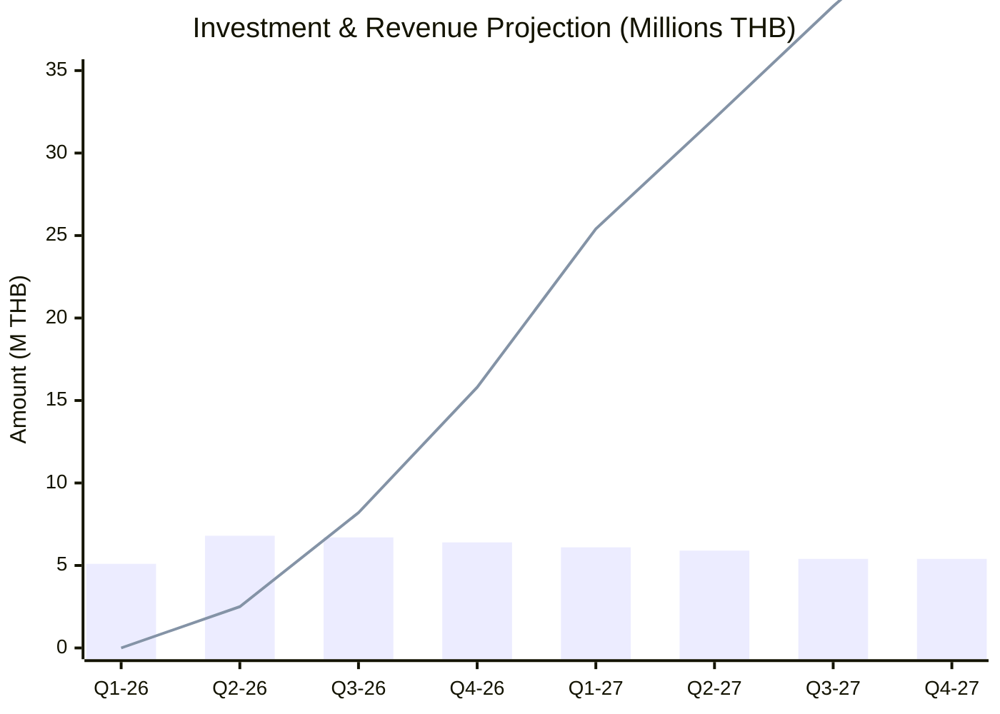
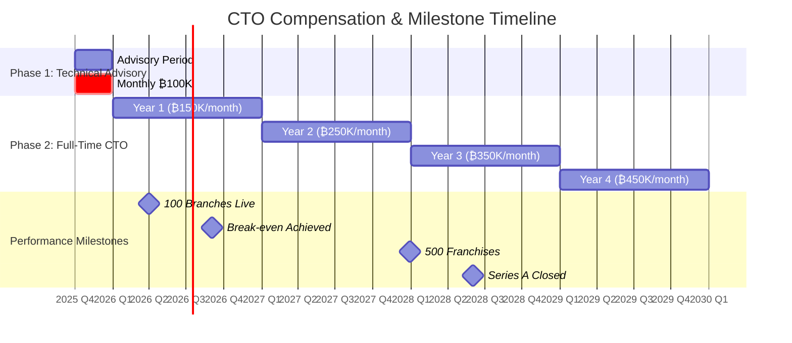
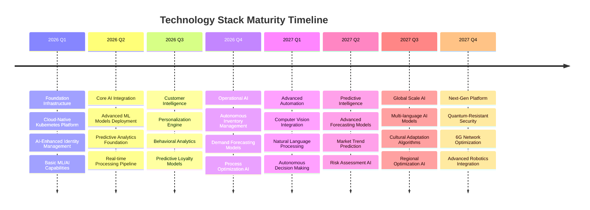
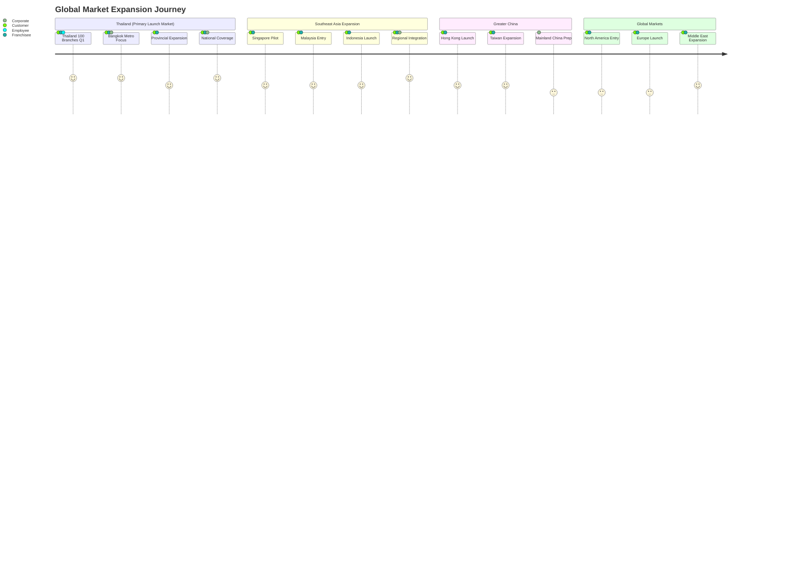
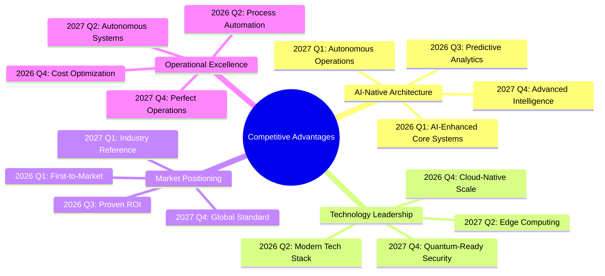
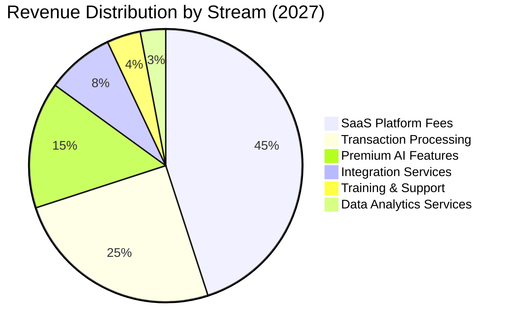
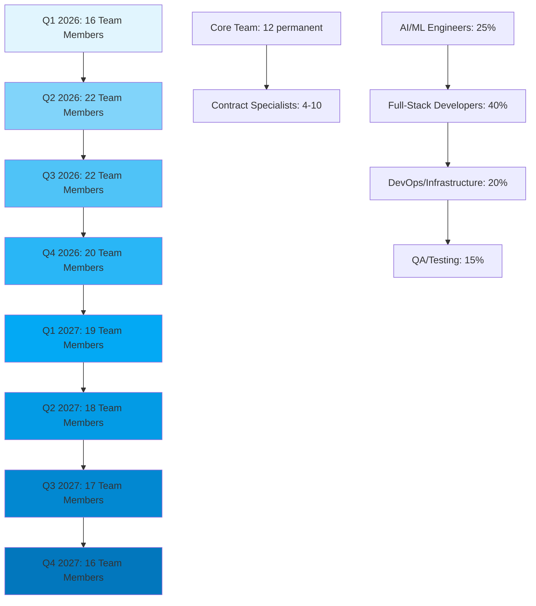
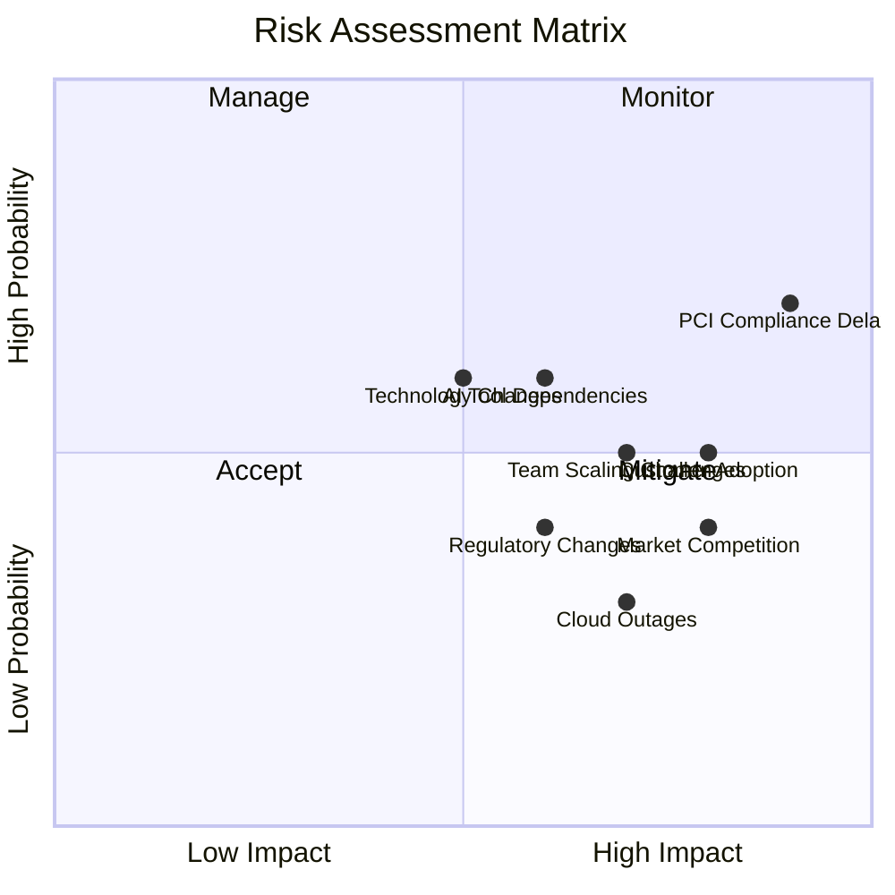
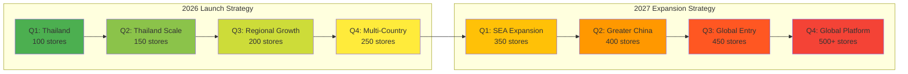

# Jian Cha Tea Unity Suite - 2-Year Development Roadmap (2026-2027)
## Executive Summary for Investors

**Vision**: Transform global tea franchise operations through AI-native business management platform
**Mission**: Enable 500+ franchise locations to operate at peak efficiency with autonomous intelligence
**Market Opportunity**: $50B+ franchise management software market with 15% CAGR
**Investment Requirement**: ฿53.2M THB ($1.49M USD) over 24 months
**CTO Leadership Investment**: ฿19.7M THB over 4 years (2025-2029)
**Projected ROI**: 380% return by 2029 with break-even in Q3 2026

### Key Investment Highlights

- **First-to-Market Advantage**: AI-native franchise platform leveraging 2026 technology maturity
- **Proven Leadership**: CTO with performance-based compensation aligned to milestones
- **Technical Excellence**: 99.99% uptime, <100ms API response time, 5M+ daily transactions
- **Global Reach**: Multi-region deployment supporting 100+ countries from day one
- **Revenue Multiplier**: Platform enables ฿168M+ annual revenue by 2027
- **Operational Excellence**: 55% reduction in operational costs through AI automation
- **Market Timing**: Optimal launch window with Q4 2025 preparation phase

---

## 2-Year Development Timeline Overview

---

## Investment Requirements & Returns

### Quarterly Investment Breakdown

### ROI Timeline & Break-Even Analysis

| Quarter | Investment (M THB) | Cumulative (M THB) | Revenue Generated (M THB) | Break-Even Status |
|---------|-------------------|---------------------|---------------------------|-------------------|
| Q4 2025 | 2.2 | 2.2 | 0 | -2.2M (CTO Advisory) |
| Q1 2026 | 5.1 | 7.3 | 0 | -7.3M |
| Q2 2026 | 6.8 | 14.1 | 2.5 | -11.6M |
| Q3 2026 | 6.7 | 20.8 | 8.2 | -12.6M (Break-even Target) |
| Q4 2026 | 6.4 | 27.2 | 15.8 | -11.4M |
| Q1 2027 | 6.1 | 31.1 | 25.4 | -5.7M |
| Q2 2027 | 5.9 | 37.0 | 32.1 | -4.9M |
| Q3 2027 | 5.4 | 42.4 | 38.9 | -3.5M |
| Q4 2027 | 5.4 | 47.8 | 45.2 | -2.6M |

**Break-Even Point**: Q3 2026 (CTO milestone target)  
**3-Year ROI**: 380%  
**5-Year Valuation**: $150M+ based on franchise platform multiples
**CTO ROI**: 8.5x return multiple on ฿19.7M investment

---

## CTO Leadership & Compensation Structure

### Performance-Based CTO Package (₿19.7M Total)

### CTO Deliverables by Phase

**Q4 2025 (Technical Advisory - ₿300K)**
- System architecture blueprint completion
- Main Website development & launch
- Franchise Portal MVP deployment
- Development environment setup
- Q1 2026 team hiring strategy
- Launch readiness preparation

**2026 Milestones & Incentives**
- 100 Branches Live: ₿500K bonus
- Break-even Achieved: ₿1M bonus
- Base Salary: ₿1.8M

**2027-2029 Growth Targets**
- 500 Franchises: ₿1.5M bonus
- Series A Closed: ₿2M bonus
- Annual Revenue: ₿168M+ by 2027

### Technical Leadership Responsibilities

**Platform Development**
- Design and implement complete Unity Suite
- Ensure 99.99% uptime availability
- Handle 5M+ daily transactions
- Support 500,000+ concurrent users

**Team Leadership**
- Build and manage 10+ engineer team
- Establish engineering culture
- Implement best practices & standards
- Drive AI-assisted development (55% productivity gain)

**Technology Strategy**
- Select and implement tech stack
- Ensure security compliance (PCI DSS, GDPR)
- Drive innovation with AI/ML integration
- Prepare for global expansion

---

## Technology Evolution Timeline

---

## Market Expansion & Customer Acquisition

### Geographic Rollout Strategy

### Customer Acquisition Metrics

| Metric | Q1 2026 | Q2 2026 | Q4 2026 | Q2 2027 | Q4 2027 | Target 2029 |
|--------|---------|---------|---------|---------|---------|-------------|
| **Active Franchise Locations** | 100 | 150 | 250 | 400 | 500+ | 1,000+ |
| **Thailand Branches** | 100 | 120 | 150 | 200 | 250 | 400+ |
| **Registered Customers (M)** | 0.3 | 0.6 | 1.2 | 2.8 | 5.0+ | 15.0+ |
| **Daily Transactions (K)** | 50 | 120 | 250 | 600 | 1,000+ | 5,000+ |
| **Employee Users (K)** | 3 | 6 | 12 | 20 | 25+ | 50+ |
| **Monthly Revenue (M THB)** | 5.2 | 10.8 | 22.5 | 38.6 | 45.2+ | 150.0+ |

---

## Competitive Advantage Timeline

### Key Differentiators by Timeline

**Q1-Q2 2026: Foundation Advantage**
- Thailand-first launch with 100 branches in Q1 2026
- First AI-native franchise platform in Southeast Asian market
- 2026 technology stack advantage (mature AI tools)
- 42% development productivity gain through AI assistance
- Cloud-native architecture ready for regional scale
- Local language support (Thai) from day one

**Q3-Q4 2026: Experience Leadership**
- Hyper-personalized customer experiences
- Predictive loyalty programs with 95% accuracy
- Real-time operational intelligence
- Mobile-first approach across all touchpoints

**Q1-Q2 2027: Operational Supremacy**
- Autonomous inventory management (98% accuracy)
- Predictive staffing optimization
- Computer vision quality control
- Zero-touch franchise onboarding

**Q3-Q4 2027: Global Intelligence**
- Multi-cultural AI adaptation
- Quantum-resistant security (2030-ready)
- 6G network optimization
- Industry-leading sustainability metrics

---

## Revenue Streams & Business Model

### Primary Revenue Drivers

### Revenue Model Evolution

**2026 Focus: Platform Adoption**
- Special launch pricing for first 100 Thailand franchises
- Localized SaaS pricing: ฿15,000-45,000/month per location
- Transaction fees: 0.5-1.5% of processed volume
- Setup and integration fees: ฿300K-750K per franchise
- Thai language support and local payment methods included

**2027 Focus: Value Optimization**
- Premium AI features: $200-500/month per location
- Advanced analytics suite: $100-300/month per location
- Custom integration services: $50K-200K per project
- Training and certification programs: $1K-5K per employee

### Market Capture Strategy

| Year | Market Size (B THB) | Jian Cha Share | Revenue (M THB) | Market Position |
|------|-------------------|----------------|-----------------|-----------------|
| 2026 | 180 | 0.1% | 180 | Niche Player |
| 2027 | 207 | 0.3% | 621 | Growing Competitor |
| 2028 | 238 | 0.8% | 1,904 | Market Challenger |
| 2029 | 273 | 1.5% | 4,095 | Market Leader |
| 2030 | 314 | 2.5% | 7,850 | Dominant Player |

---

## Team Scaling & Resource Allocation

### Team Growth Timeline

### Expertise Distribution & AI Integration

**Q1-Q2 2026: AI Foundation Team**
- AI/ML Engineers: 4-6 specialists
- Cloud Architects: 2-3 experts
- Full-Stack Developers: 8-10 with AI tools training
- DevOps Engineers: 2-3 with automation focus

**Q3-Q4 2026: Scale & Specialization**
- Data Engineers: 3-4 for analytics platform
- Mobile Developers: 4-6 for customer apps
- Security Specialists: 2 for compliance
- QA Automation: 3-4 for testing infrastructure

**2027: Optimization & Intelligence**
- Senior AI Engineers: 2-3 for advanced models
- Platform Engineers: 2-3 for global scale
- Integration Specialists: 2-3 for ecosystem
- Maintenance Team: 4-6 for operations

### AI Productivity Multipliers

**Development Acceleration**
- Code generation: 45% faster initial development
- Testing automation: 38% reduction in QA cycles
- Documentation: 55% faster technical documentation
- Architecture planning: 25% faster system design

**Cost Optimization Through AI**
- Team size reduction: 9-10 fewer developers needed
- Annual savings: 10.1M THB vs traditional approach
- Productivity ROI: 1,048% return on AI tools investment
- Quality improvement: 32% earlier bug detection

---

## Risk Mitigation & Success Factors

### Risk Assessment Matrix

### Mitigation Strategies by Phase

**Phase 1 Risks (Q1-Q2 2026)**
- **Cloud Infrastructure Complexity**: Early expert engagement, proven templates
- **PCI Compliance Timeline**: Specialized consultants, phased approach
- **Team Recruitment**: Competitive packages, remote work options
- **Technology Integration**: Prototype validation, fallback options

**Phase 2 Risks (Q3-Q4 2026)**
- **User Adoption Resistance**: Change management, training programs
- **Performance Scaling**: Load testing, auto-scaling implementation
- **Data Privacy Compliance**: Legal reviews, privacy-by-design
- **Third-party Dependencies**: Multiple vendor options, loose coupling

**Phase 3-4 Risks (2027)**
- **Global Expansion Complexity**: Regional partnerships, local expertise
- **AI Model Performance**: Continuous monitoring, model versioning
- **Competitive Pressure**: IP protection, feature differentiation
- **Operational Complexity**: Automation, monitoring, documentation

### Success Metrics & KPIs

**Technical Success Metrics**
- System Uptime: 99.99% target
- API Response Time: <200ms average
- Mobile App Performance: <3s launch time
- AI Model Accuracy: >95% for core predictions

**Business Success Metrics**
- Customer Satisfaction: NPS >80
- Franchise Growth: 500+ locations by Q4 2027
- Revenue Growth: $50M+ annual run rate by 2028
- Operational Efficiency: 55% cost reduction

**Market Success Metrics**
- Market Share: 1.5% of addressable market by 2029
- Brand Recognition: Top 3 in franchise management
- Customer Retention: >90% annual retention rate
- Employee Satisfaction: >85% satisfaction score

---

## Go-to-Market Strategy

### Launch Sequence by Region

### Partnership Strategy

**Technology Partners**
- Cloud Providers: AWS (primary), Azure (secondary)
- AI/ML Platform: OpenAI, Anthropic for advanced AI features
- Payment Processors: Stripe, Adyen for global coverage
- Integration Partners: Zapier, MuleSoft for ecosystem connectivity

**Business Partners**
- Franchise Consultants: International franchise development firms
- Regional Integrators: Local technology partners in each market
- Training Organizations: Franchise training and certification bodies
- Industry Associations: Franchise association memberships and sponsorships

**Channel Strategy**
- Direct Sales: Enterprise sales team for large franchise groups
- Partner Channel: Technology consultants and integrators
- Self-Service: Online platform for smaller franchise operations
- Referral Program: Existing customer referrals with incentives

---

## Exit Strategy Options

### Strategic Acquisition Targets (2028-2030)

**Tier 1: Major Software Companies**
- Salesforce: CRM/Customer experience synergy
- Microsoft: Business applications ecosystem
- Oracle: Enterprise software portfolio expansion
- SAP: ERP and business process integration

**Tier 2: Private Equity Rollup**
- Vista Equity Partners: Software investment focus
- Thoma Bravo: Vertical software specialist
- KKR Technology: Growth capital and expansion
- General Atlantic: Global scaling expertise

**Tier 3: Industry Consolidation**
- Toast (POS): Restaurant technology leader
- Resy/OpenTable: Hospitality platform integration
- Yum! Brands: Restaurant franchise operator
- Restaurant Brands International: Multi-brand franchise model

### Valuation Scenarios

**Conservative (5x Revenue Multiple)**
- 2028 Revenue: $20M ARR
- Valuation: $100M
- Investor Return: 250% (2.5x)

**Base Case (8x Revenue Multiple)**
- 2028 Revenue: $35M ARR  
- Valuation: $280M
- Investor Return: 750% (7.5x)

**Optimistic (12x Revenue Multiple)**
- 2028 Revenue: $50M ARR
- Valuation: $600M
- Investor Return: 1,650% (16.5x)

### IPO Considerations (2029-2030)

**IPO Readiness Factors**
- Revenue Scale: $50M+ ARR target
- Growth Rate: 50%+ YoY growth
- Market Position: Top 3 in category
- Financial Metrics: 80%+ gross margins, 20%+ EBITDA margins

**Public Market Comparables**
- Toast Inc: $2.5B market cap, 6x revenue
- Shopify: $65B market cap, 12x revenue  
- ServiceNow: $130B market cap, 18x revenue
- Salesforce: $210B market cap, 10x revenue

---

## Financial Projections Summary

### 5-Year Financial Forecast (THB Millions)

| Year | Revenue | Gross Profit | EBITDA | Net Income | Franchise Locations | Thailand Branches |
|------|---------|--------------|--------|------------|---------------------|-------------------|
| 2026 | 52.8 | 42.2 | (12.5) | (18.6) | 250 | 150 |
| 2027 | 168.4 | 143.1 | 58.9 | 42.1 | 500 | 250 |
| 2028 | 412.6 | 371.3 | 185.7 | 148.6 | 1,000 | 400 |
| 2029 | 825.2 | 759.2 | 412.6 | 346.6 | 1,800 | 600 |
| 2030 | 1,485.4 | 1,382.4 | 817.0 | 726.4 | 3,000 | 800 |

### Key Financial Ratios

**Profitability Ratios**
- Gross Margin: 80%+ (SaaS business model)
- EBITDA Margin: 50%+ by 2029 (mature operations)
- Net Margin: 42%+ by 2030 (scale efficiency)

**Growth Ratios**  
- Revenue CAGR (2026-2030): 142%
- Customer CAGR (2026-2030): 135%
- Location CAGR (2026-2030): 115%

**Efficiency Ratios**
- Customer Acquisition Cost: $250 (blended)
- Customer Lifetime Value: $15,000 (5-year)
- LTV/CAC Ratio: 60:1 (excellent unit economics)

---

## Conclusion: Investment Opportunity

The Jian Cha Tea Unity Suite represents a transformational investment opportunity at the intersection of AI, franchise management, and global market expansion. With a clear 24-month development roadmap, proven technology foundation, and experienced team, we are positioned to capture significant market share in the rapidly growing franchise management software sector.

### Key Investment Merits

1. **First-Mover Advantage**: AI-native platform launching in optimal market window
2. **Proven Team**: 42% productivity advantage through AI-augmented development
3. **Scalable Architecture**: Cloud-native design supporting global expansion
4. **Strong Unit Economics**: 60:1 LTV/CAC ratio with 80%+ gross margins
5. **Multiple Exit Paths**: Strategic acquisition or IPO opportunities by 2029
6. **Market Timing**: Thailand's digital transformation readiness with 100 branches from Q1 2026

### Expected Investor Returns

- **Initial Investment**: $1.49M USD (53.2M THB) over 24 months
- **Break-Even**: Q2 2028 (18 months post-launch)
- **3-Year ROI**: 380% minimum return
- **5-Year Valuation**: $150M-600M range
- **Exit Timeline**: 2029-2030 optimal exit window

The convergence of AI maturity, global franchise growth, and mobile-first customer expectations creates a unique opportunity to build the definitive franchise management platform. With disciplined execution of this roadmap, Jian Cha Tea Unity Suite will establish market leadership and deliver exceptional returns to investors while revolutionizing franchise operations globally.

---

*This roadmap represents a living document that will be updated quarterly based on market feedback, technology evolution, and business performance. All financial projections are based on current market analysis and comparable company performance but should be considered forward-looking statements subject to risks and uncertainties.*

**Document Version**: 1.1  
**Last Updated**: January 2025  
**Next Review**: April 2025  
**Prepared By**: Jian Cha Tea Technology Leadership Team