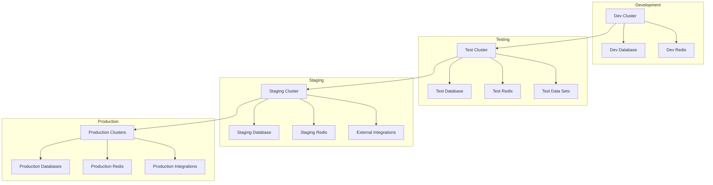
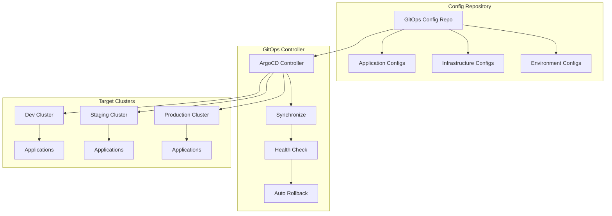
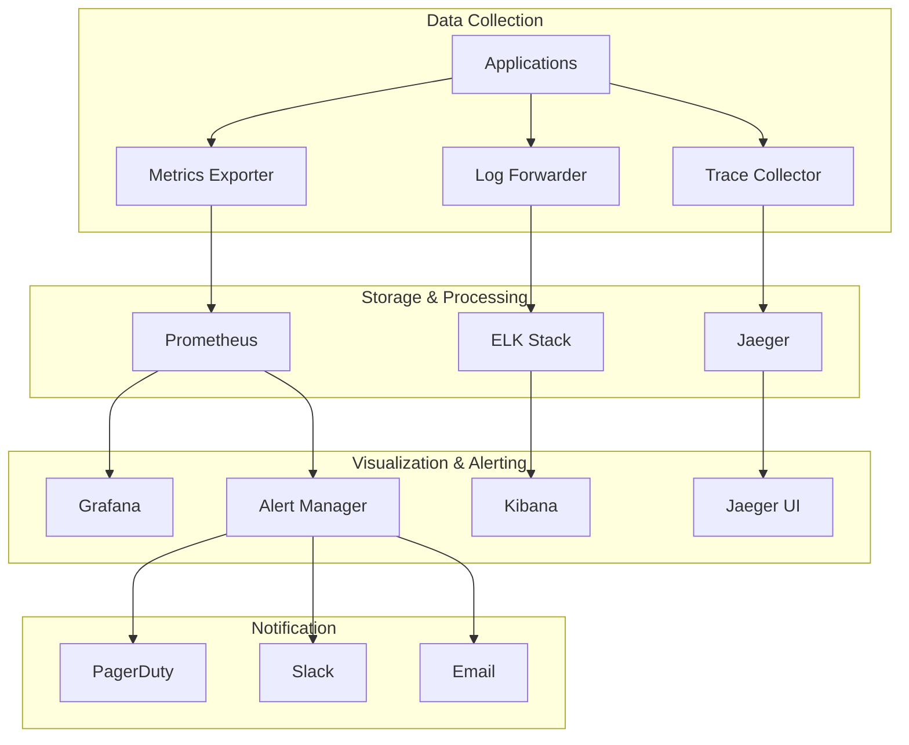
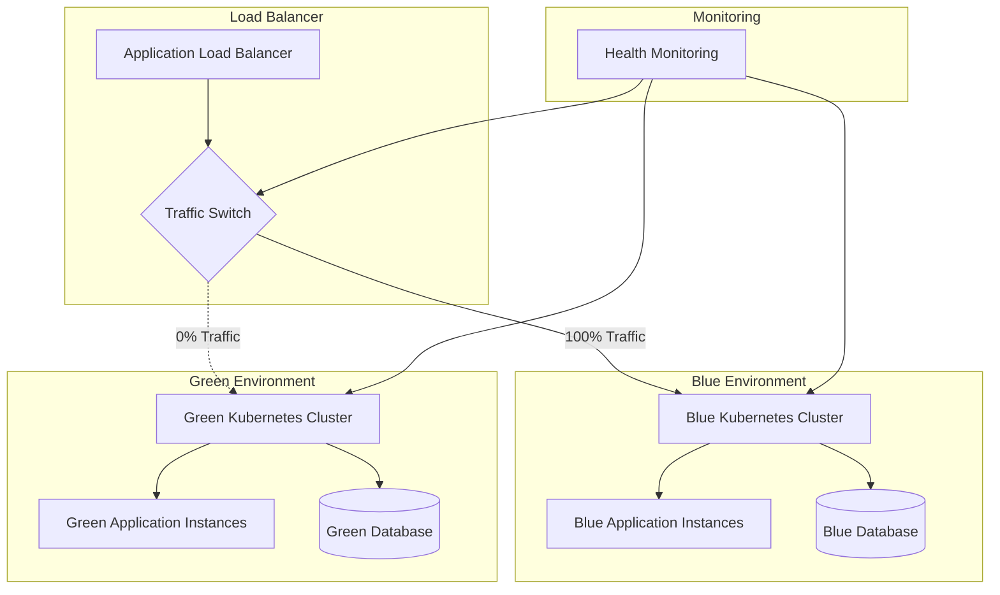
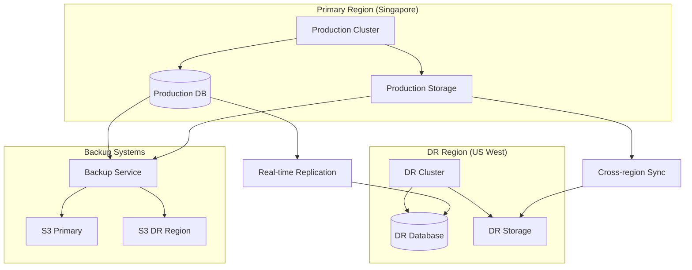

# Deployment Architecture - Jian Cha Tea Unity Suite

## Executive Summary

This document outlines the comprehensive deployment architecture for the Jian Cha Tea Unity Suite, focusing on CI/CD pipelines, DevOps practices, container orchestration, and infrastructure automation. The architecture is designed to support continuous delivery, automated testing, infrastructure as code, and GitOps practices while ensuring security, compliance, and operational excellence.

The deployment strategy emphasizes automation, reliability, and scalability to support global franchise operations across multiple regions with zero-downtime deployments and rapid rollback capabilities.

---

## 1. CI/CD Pipeline Architecture

### 1.1 Overall Pipeline Strategy

```mermaid
graph LR
    subgraph "Source Control"
        Dev[Developer] --> Git[GitLab Repository]
        Git --> MR[Merge Request]
    end
    
    subgraph "CI Pipeline"
        MR --> Build[Build & Test]
        Build --> Scan[Security Scan]
        Scan --> Package[Package & Push]
    end
    
    subgraph "CD Pipeline"
        Package --> Deploy[Deploy to Dev]
        Deploy --> Test[Integration Test]
        Test --> Staging[Deploy to Staging]
        Staging --> Prod[Deploy to Production]
    end
    
    subgraph "GitOps"
        Prod --> ArgoCD[ArgoCD]
        ArgoCD --> K8s[Kubernetes]
        K8s --> Monitor[Monitoring]
    end
```



### 1.2 CI Pipeline Components

#### Source Control Management
**Platform**: GitLab Enterprise Edition

**Repository Structure**:
```
jian-cha-platform/
├── services/
│   ├── pos-service/
│   ├── customer-service/
│   ├── payment-service/
│   └── analytics-service/
├── frontends/
│   ├── customer-app/
│   ├── franchise-portal/
│   └── admin-dashboard/
├── infrastructure/
│   ├── terraform/
│   ├── kubernetes/
│   └── helm-charts/
├── ci/
│   ├── pipeline-templates/
│   ├── security-configs/
│   └── quality-gates/
└── docs/
    ├── api/
    ├── deployment/
    └── runbooks/
```

**Branching Strategy**: GitFlow with feature branches
- **main**: Production-ready code
- **develop**: Integration branch for features
- **feature/***: Individual feature development
- **release/***: Release preparation
- **hotfix/***: Production hotfixes

#### Build Pipeline Configuration

**GitLab CI Configuration** (.gitlab-ci.yml):
```yaml
stages:
  - validate
  - build
  - test
  - security
  - package
  - deploy

variables:
  DOCKER_REGISTRY: registry.gitlab.com/jianchatea
  KUBERNETES_NAMESPACE: jianchatea-$CI_ENVIRONMENT_NAME

# Template for microservices
.microservice_template: &microservice_template
  stage: build
  image: docker:20.10.16
  services:
    - docker:20.10.16-dind
  before_script:
    - docker login -u $CI_REGISTRY_USER -p $CI_REGISTRY_PASSWORD $CI_REGISTRY
  script:
    - docker build -t $CI_REGISTRY_IMAGE/$SERVICE_NAME:$CI_COMMIT_SHA .
    - docker push $CI_REGISTRY_IMAGE/$SERVICE_NAME:$CI_COMMIT_SHA
  only:
    changes:
      - services/$SERVICE_NAME/**/*
```

#### Quality Gates and Testing

**Test Pyramid Implementation**:
```mermaid
pyramid
    title Test Pyramid
    "E2E Tests (10%)" : 0 : 100
    "Integration Tests (20%)" : 0 : 200
    "Unit Tests (70%)" : 0 : 700
```

**Quality Gate Criteria**:
- **Unit Test Coverage**: >80%
- **Integration Test Coverage**: >60%
- **Code Quality**: SonarQube quality gate passed
- **Security Scan**: No critical/high vulnerabilities
- **Performance**: API response time <200ms
- **Documentation**: API documentation updated

### 1.3 Security Integration

#### Container Security Scanning
**Tools**: Trivy, Snyk, OWASP Dependency Check

**Security Pipeline Stage**:
```yaml
security_scan:
  stage: security
  image: aquasec/trivy:latest
  script:
    - trivy image --exit-code 1 --severity HIGH,CRITICAL $CI_REGISTRY_IMAGE/$SERVICE_NAME:$CI_COMMIT_SHA
  artifacts:
    reports:
      container_scanning: security-report.json
  only:
    - merge_requests
    - main
    - develop
```

#### Static Application Security Testing (SAST)
- **GitLab SAST**: Built-in SAST scanning
- **SonarQube**: Code quality and security analysis
- **Semgrep**: Custom security rules
- **License Compliance**: Dependency license verification

#### Infrastructure Security
- **Terraform Security**: Checkov for infrastructure scanning
- **Kubernetes Security**: OPA Gatekeeper policies
- **Secrets Management**: HashiCorp Vault integration
- **Network Policies**: Calico network policies

### 1.4 Artifact Management

#### Container Registry Strategy
**Primary**: GitLab Container Registry
**Backup**: Amazon ECR (cross-region replication)

**Image Tagging Strategy**:
- **Latest**: Always points to latest main branch build
- **Semantic Version**: v1.2.3 for releases
- **Commit SHA**: Full commit SHA for exact tracking
- **Environment**: dev, staging, prod tags for deployments

#### Binary Artifacts
- **JAR/WAR Files**: Stored in GitLab Package Registry
- **NPM Packages**: Private npm registry in GitLab
- **Helm Charts**: Stored in GitLab Helm Repository
- **Terraform Modules**: GitLab Terraform Module Registry

---

## 2. Environment Strategy

### 2.1 Environment Architecture



### 2.2 Environment Specifications

#### Development Environment
**Purpose**: Active development and initial testing
**Infrastructure**:
- **Kubernetes**: Shared EKS cluster with namespace isolation
- **Compute**: 3 nodes, t3.medium instances
- **Database**: RDS PostgreSQL (db.t3.micro)
- **Cache**: ElastiCache Redis (cache.t3.micro)
- **Storage**: 100GB persistent volumes

**Configuration**:
- **Scaling**: Minimal (1 replica per service)
- **Resources**: CPU: 100m, Memory: 256Mi per container
- **Data**: Anonymized production data (last 30 days)
- **Monitoring**: Basic metrics and logging
- **Backup**: Daily snapshots, 7-day retention

#### Testing Environment
**Purpose**: Automated testing and QA validation
**Infrastructure**:
- **Kubernetes**: Dedicated EKS cluster
- **Compute**: 5 nodes, t3.large instances
- **Database**: RDS PostgreSQL (db.t3.small)
- **Cache**: ElastiCache Redis (cache.t3.small)
- **Storage**: 500GB persistent volumes

**Configuration**:
- **Scaling**: Moderate (2-3 replicas per service)
- **Resources**: CPU: 200m, Memory: 512Mi per container
- **Data**: Comprehensive test datasets
- **Monitoring**: Full monitoring stack
- **Backup**: Automated testing data refresh

#### Staging Environment
**Purpose**: Production validation and user acceptance testing
**Infrastructure**:
- **Kubernetes**: Dedicated EKS cluster (production-like)
- **Compute**: 7 nodes, t3.xlarge instances
- **Database**: RDS PostgreSQL (db.r5.large)
- **Cache**: ElastiCache Redis (cache.r5.large)
- **Storage**: 1TB persistent volumes

**Configuration**:
- **Scaling**: Production-like (3-5 replicas per service)
- **Resources**: CPU: 500m, Memory: 1Gi per container
- **Data**: Anonymized production data (complete dataset)
- **Monitoring**: Full production monitoring
- **Backup**: Production-like backup strategy

#### Production Environment
**Purpose**: Live customer-facing services
**Infrastructure**: See Production Deployment Architecture section

### 2.3 Environment Management

#### Infrastructure as Code (IaC)
**Tool**: Terraform with environment-specific configurations

**Directory Structure**:
```
infrastructure/terraform/
├── modules/
│   ├── eks-cluster/
│   ├── rds-database/
│   ├── redis-cache/
│   └── monitoring/
├── environments/
│   ├── dev/
│   ├── test/
│   ├── staging/
│   └── production/
└── shared/
    ├── networking/
    ├── security/
    └── dns/
```

#### Environment Promotion Strategy
**Promotion Pipeline**:
1. **Dev → Test**: Automatic on merge to develop branch
2. **Test → Staging**: Manual approval after test validation
3. **Staging → Production**: Manual approval with change control
4. **Hotfix**: Direct to staging, then production with expedited approval

**Validation Gates**:
- **Automated Tests**: Must pass all test suites
- **Security Scan**: No critical vulnerabilities
- **Performance Test**: Meet performance benchmarks
- **Smoke Tests**: Basic functionality verification
- **Approval**: Required approvals based on environment

---

## 3. Container Orchestration with Kubernetes

### 3.1 Kubernetes Architecture

#### Cluster Design
**Multi-Cluster Strategy**:
- **Development**: Single cluster with namespace isolation
- **Testing**: Dedicated cluster for test isolation
- **Staging**: Production-like cluster for final validation
- **Production**: Multi-region clusters for high availability

**Cluster Specifications (Production)**:
```yaml
apiVersion: eksctl.io/v1alpha5
kind: ClusterConfig

metadata:
  name: jianchatea-prod-singapore
  region: ap-southeast-1
  version: "1.28"

nodeGroups:
  - name: system-nodes
    instanceType: t3.medium
    minSize: 2
    maxSize: 4
    desiredCapacity: 3
    labels:
      node-type: system
    taints:
      - key: system
        value: true
        effect: NoSchedule

  - name: app-nodes
    instanceType: t3.xlarge
    minSize: 5
    maxSize: 20
    desiredCapacity: 10
    labels:
      node-type: application
    volumeSize: 100
    volumeType: gp3

  - name: data-nodes
    instanceType: r5.2xlarge
    minSize: 2
    maxSize: 8
    desiredCapacity: 3
    labels:
      node-type: data-intensive
    volumeSize: 200
    volumeType: gp3
```

#### Namespace Strategy
**Namespace Organization**:
```yaml
# Production namespaces
jianchatea-system        # System components (monitoring, logging)
jianchatea-core          # Core platform services
jianchatea-customer      # Customer-facing services
jianchatea-operations    # Operations services (POS, inventory)
jianchatea-analytics     # Analytics and reporting services
jianchatea-external      # External integrations
```

### 3.2 Kubernetes Resource Management

#### Resource Quotas and Limits
```yaml
apiVersion: v1
kind: ResourceQuota
metadata:
  name: namespace-quota
  namespace: jianchatea-core
spec:
  hard:
    requests.cpu: "50"
    requests.memory: 100Gi
    limits.cpu: "100"
    limits.memory: 200Gi
    persistentvolumeclaims: "10"
    services.loadbalancers: "5"
```

#### Pod Security Standards
```yaml
apiVersion: v1
kind: Namespace
metadata:
  name: jianchatea-core
  labels:
    pod-security.kubernetes.io/enforce: restricted
    pod-security.kubernetes.io/audit: restricted
    pod-security.kubernetes.io/warn: restricted
```

#### Network Policies
```yaml
apiVersion: networking.k8s.io/v1
kind: NetworkPolicy
metadata:
  name: core-service-policy
  namespace: jianchatea-core
spec:
  podSelector:
    matchLabels:
      app: pos-service
  policyTypes:
  - Ingress
  - Egress
  ingress:
  - from:
    - namespaceSelector:
        matchLabels:
          name: jianchatea-customer
    ports:
    - protocol: TCP
      port: 8080
```

### 3.3 Application Deployment Patterns

#### Deployment Configuration Template
```yaml
apiVersion: apps/v1
kind: Deployment
metadata:
  name: pos-service
  namespace: jianchatea-core
  labels:
    app: pos-service
    version: v1.0.0
spec:
  replicas: 5
  strategy:
    type: RollingUpdate
    rollingUpdate:
      maxSurge: 2
      maxUnavailable: 1
  selector:
    matchLabels:
      app: pos-service
  template:
    metadata:
      labels:
        app: pos-service
        version: v1.0.0
    spec:
      securityContext:
        runAsNonRoot: true
        runAsUser: 65534
        fsGroup: 65534
      containers:
      - name: pos-service
        image: registry.gitlab.com/jianchatea/pos-service:v1.0.0
        ports:
        - containerPort: 8080
          name: http
        resources:
          requests:
            cpu: 500m
            memory: 1Gi
          limits:
            cpu: 1000m
            memory: 2Gi
        env:
        - name: DATABASE_URL
          valueFrom:
            secretKeyRef:
              name: database-secrets
              key: url
        livenessProbe:
          httpGet:
            path: /actuator/health
            port: 8080
          initialDelaySeconds: 60
          periodSeconds: 30
        readinessProbe:
          httpGet:
            path: /actuator/health/readiness
            port: 8080
          initialDelaySeconds: 30
          periodSeconds: 10
```

#### Service Mesh Integration (Future)
**Istio Configuration** (Phase 3 implementation):
```yaml
apiVersion: security.istio.io/v1beta1
kind: PeerAuthentication
metadata:
  name: default
  namespace: jianchatea-core
spec:
  mtls:
    mode: STRICT

---
apiVersion: networking.istio.io/v1beta1
kind: VirtualService
metadata:
  name: pos-service
  namespace: jianchatea-core
spec:
  hosts:
  - pos-service
  http:
  - match:
    - headers:
        version:
          exact: v2
    route:
    - destination:
        host: pos-service
        subset: v2
  - route:
    - destination:
        host: pos-service
        subset: v1
```

---

## 4. GitOps Implementation

### 4.1 GitOps Architecture



### 4.2 ArgoCD Configuration

#### ArgoCD Installation and Setup
```yaml
# ArgoCD namespace
apiVersion: v1
kind: Namespace
metadata:
  name: argocd

---
# ArgoCD RBAC Configuration
apiVersion: v1
kind: ConfigMap
metadata:
  name: argocd-rbac-cm
  namespace: argocd
data:
  policy.default: role:readonly
  policy.csv: |
    p, role:admin, applications, *, */*, allow
    p, role:admin, clusters, *, *, allow
    p, role:admin, repositories, *, *, allow
    g, jianchatea:platform-team, role:admin
    g, jianchatea:devops-team, role:admin
```

#### Application Configuration
```yaml
apiVersion: argoproj.io/v1alpha1
kind: Application
metadata:
  name: pos-service
  namespace: argocd
spec:
  project: jianchatea-platform
  source:
    repoURL: https://gitlab.com/jianchatea/platform-config
    targetRevision: main
    path: applications/pos-service/overlays/production
  destination:
    server: https://kubernetes.default.svc
    namespace: jianchatea-core
  syncPolicy:
    automated:
      prune: true
      selfHeal: true
    syncOptions:
    - CreateNamespace=true
    - PrunePropagationPolicy=foreground
    - PruneLast=true
  revisionHistoryLimit: 10
```

### 4.3 Configuration Management

#### Kustomize Structure
```
platform-config/
├── applications/
│   ├── pos-service/
│   │   ├── base/
│   │   │   ├── deployment.yaml
│   │   │   ├── service.yaml
│   │   │   ├── configmap.yaml
│   │   │   └── kustomization.yaml
│   │   └── overlays/
│   │       ├── development/
│   │       ├── staging/
│   │       └── production/
│   └── customer-service/
├── infrastructure/
│   ├── monitoring/
│   ├── logging/
│   └── security/
└── shared/
    ├── secrets/
    └── policies/
```

#### Environment-Specific Overlays
```yaml
# applications/pos-service/overlays/production/kustomization.yaml
apiVersion: kustomize.config.k8s.io/v1beta1
kind: Kustomization

namespace: jianchatea-core

resources:
- ../../base

patchesStrategicMerge:
- deployment-patch.yaml
- service-patch.yaml

configMapGenerator:
- name: pos-service-config
  files:
  - application.properties
  behavior: replace

replicas:
- name: pos-service
  count: 5

images:
- name: pos-service
  newTag: v1.2.3
```

### 4.4 GitOps Workflows

#### Promotion Workflow
1. **Development**: Auto-sync from main branch
2. **Staging**: Manual promotion via GitOps repository update
3. **Production**: Approval-based promotion with change control

#### Rollback Strategy
```yaml
# ArgoCD Application with rollback configuration
spec:
  syncPolicy:
    automated:
      selfHeal: true
    retry:
      limit: 3
      backoff:
        duration: 5s
        factor: 2
        maxDuration: 10m
```

---

## 5. Monitoring and Observability

### 5.1 Monitoring Stack Architecture



### 5.2 Prometheus Configuration

#### Prometheus Setup
```yaml
apiVersion: monitoring.coreos.com/v1
kind: Prometheus
metadata:
  name: prometheus
  namespace: monitoring
spec:
  serviceAccountName: prometheus
  serviceMonitorSelector:
    matchLabels:
      app: jianchatea
  ruleSelector:
    matchLabels:
      app: jianchatea
  retention: 30d
  storage:
    volumeClaimTemplate:
      spec:
        storageClassName: gp3
        accessModes: ["ReadWriteOnce"]
        resources:
          requests:
            storage: 100Gi
  resources:
    requests:
      memory: 4Gi
      cpu: 2000m
    limits:
      memory: 8Gi
      cpu: 4000m
```

#### Service Monitoring
```yaml
apiVersion: monitoring.coreos.com/v1
kind: ServiceMonitor
metadata:
  name: pos-service
  namespace: monitoring
  labels:
    app: jianchatea
spec:
  selector:
    matchLabels:
      app: pos-service
  endpoints:
  - port: metrics
    interval: 30s
    path: /actuator/prometheus
```

### 5.3 Logging Architecture

#### Logging Stack Configuration
```yaml
# Fluentd DaemonSet for log collection
apiVersion: apps/v1
kind: DaemonSet
metadata:
  name: fluentd
  namespace: logging
spec:
  selector:
    matchLabels:
      name: fluentd
  template:
    metadata:
      labels:
        name: fluentd
    spec:
      serviceAccount: fluentd
      containers:
      - name: fluentd
        image: fluent/fluentd-kubernetes-daemonset:v1-debian-elasticsearch
        env:
        - name: FLUENT_ELASTICSEARCH_HOST
          value: "elasticsearch-master"
        - name: FLUENT_ELASTICSEARCH_PORT
          value: "9200"
        - name: FLUENT_ELASTICSEARCH_SCHEME
          value: "http"
        volumeMounts:
        - name: varlog
          mountPath: /var/log
          readOnly: true
        - name: varlibdockercontainers
          mountPath: /var/lib/docker/containers
          readOnly: true
      volumes:
      - name: varlog
        hostPath:
          path: /var/log
      - name: varlibdockercontainers
        hostPath:
          path: /var/lib/docker/containers
```

### 5.4 Application Performance Monitoring

#### Distributed Tracing
```yaml
# Jaeger deployment
apiVersion: apps/v1
kind: Deployment
metadata:
  name: jaeger-all-in-one
  namespace: tracing
spec:
  replicas: 1
  selector:
    matchLabels:
      app: jaeger
  template:
    metadata:
      labels:
        app: jaeger
    spec:
      containers:
      - name: jaeger
        image: jaegertracing/all-in-one:1.45
        env:
        - name: COLLECTOR_ZIPKIN_HOST_PORT
          value: ":9411"
        - name: MEMORY_MAX_TRACES
          value: "100000"
        ports:
        - containerPort: 5775
          protocol: UDP
        - containerPort: 6831
          protocol: UDP
        - containerPort: 6832
          protocol: UDP
        - containerPort: 5778
          protocol: TCP
        - containerPort: 16686
          protocol: TCP
        - containerPort: 14268
          protocol: TCP
        - containerPort: 14250
          protocol: TCP
        - containerPort: 9411
          protocol: TCP
```

#### Custom Metrics Collection
```yaml
# Custom metrics for business KPIs
apiVersion: v1
kind: ConfigMap
metadata:
  name: custom-metrics-config
  namespace: monitoring
data:
  recording-rules.yaml: |
    groups:
    - name: jianchatea.business.rules
      rules:
      - record: jianchatea:transaction_rate_5m
        expr: sum(rate(pos_transactions_total[5m])) by (store_id)
      
      - record: jianchatea:revenue_per_store_1h
        expr: sum(rate(pos_transaction_amount_total[1h])) by (store_id)
      
      - record: jianchatea:customer_satisfaction_score
        expr: avg(customer_rating) by (store_id)
```

---

## 6. Infrastructure as Code (IaC)

### 6.1 Terraform Architecture

#### Terraform Structure
```
infrastructure/terraform/
├── modules/
│   ├── networking/
│   │   ├── vpc/
│   │   ├── subnets/
│   │   └── security-groups/
│   ├── compute/
│   │   ├── eks/
│   │   ├── ec2/
│   │   └── auto-scaling/
│   ├── data/
│   │   ├── rds/
│   │   ├── elasticache/
│   │   └── s3/
│   └── monitoring/
│       ├── cloudwatch/
│       └── prometheus/
├── environments/
│   ├── dev/
│   ├── staging/
│   └── production/
└── shared/
    ├── dns/
    ├── certificates/
    └── iam/
```

#### EKS Module Example
```hcl
# modules/compute/eks/main.tf
resource "aws_eks_cluster" "main" {
  name     = var.cluster_name
  role_arn = aws_iam_role.cluster.arn
  version  = var.kubernetes_version

  vpc_config {
    subnet_ids              = var.subnet_ids
    endpoint_private_access = var.endpoint_private_access
    endpoint_public_access  = var.endpoint_public_access
    public_access_cidrs     = var.public_access_cidrs
  }

  enabled_cluster_log_types = [
    "api",
    "audit",
    "authenticator",
    "controllerManager",
    "scheduler"
  ]

  encryption_config {
    provider {
      key_arn = aws_kms_key.cluster.arn
    }
    resources = ["secrets"]
  }

  depends_on = [
    aws_iam_role_policy_attachment.cluster_policy,
    aws_iam_role_policy_attachment.cluster_service_policy,
  ]

  tags = var.tags
}

resource "aws_eks_node_group" "main" {
  cluster_name    = aws_eks_cluster.main.name
  node_group_name = var.node_group_name
  node_role_arn   = aws_iam_role.node.arn
  subnet_ids      = var.private_subnet_ids

  scaling_config {
    desired_size = var.desired_capacity
    max_size     = var.max_capacity
    min_size     = var.min_capacity
  }

  update_config {
    max_unavailable_percentage = 25
  }

  instance_types = var.instance_types
  capacity_type  = var.capacity_type
  ami_type       = var.ami_type
  disk_size      = var.disk_size

  launch_template {
    id      = aws_launch_template.node.id
    version = aws_launch_template.node.latest_version
  }

  depends_on = [
    aws_iam_role_policy_attachment.node_policy,
    aws_iam_role_policy_attachment.cni_policy,
    aws_iam_role_policy_attachment.registry_policy,
  ]

  tags = var.tags
}
```

### 6.2 Environment Configuration

#### Production Environment
```hcl
# environments/production/main.tf
module "networking" {
  source = "../../modules/networking"

  environment = "production"
  region      = "ap-southeast-1"
  
  vpc_cidr           = "10.0.0.0/16"
  availability_zones = ["ap-southeast-1a", "ap-southeast-1b", "ap-southeast-1c"]
  
  public_subnet_cidrs  = ["10.0.1.0/24", "10.0.2.0/24", "10.0.3.0/24"]
  private_subnet_cidrs = ["10.0.11.0/24", "10.0.12.0/24", "10.0.13.0/24"]
  
  enable_nat_gateway = true
  enable_vpn_gateway = false
  
  tags = local.common_tags
}

module "eks_cluster" {
  source = "../../modules/compute/eks"

  cluster_name       = "jianchatea-prod-singapore"
  kubernetes_version = "1.28"
  
  subnet_ids = module.networking.private_subnet_ids
  
  node_groups = [
    {
      name           = "system-nodes"
      instance_types = ["t3.medium"]
      min_capacity   = 2
      max_capacity   = 4
      desired_capacity = 3
      
      taints = [
        {
          key    = "system"
          value  = "true"
          effect = "NO_SCHEDULE"
        }
      ]
    },
    {
      name           = "app-nodes"
      instance_types = ["t3.xlarge"]
      min_capacity   = 5
      max_capacity   = 20
      desired_capacity = 10
    }
  ]
  
  tags = local.common_tags
}

module "rds" {
  source = "../../modules/data/rds"

  identifier = "jianchatea-prod-singapore"
  engine     = "postgres"
  engine_version = "15.3"
  
  instance_class    = "db.r5.2xlarge"
  allocated_storage = 1000
  storage_encrypted = true
  
  multi_az               = true
  backup_retention_period = 30
  backup_window          = "03:00-04:00"
  maintenance_window     = "sun:04:00-sun:05:00"
  
  subnet_group_name = module.networking.database_subnet_group_name
  security_group_ids = [module.networking.database_security_group_id]
  
  tags = local.common_tags
}
```

### 6.3 State Management and Security

#### Remote State Configuration
```hcl
# environments/production/backend.tf
terraform {
  backend "s3" {
    bucket         = "jianchatea-terraform-state-prod"
    key            = "production/terraform.tfstate"
    region         = "ap-southeast-1"
    encrypt        = true
    dynamodb_table = "terraform-lock-table"
    
    role_arn = "arn:aws:iam::ACCOUNT_ID:role/TerraformExecutionRole"
  }
}
```

#### Security Best Practices
- **State Encryption**: All Terraform state files encrypted at rest
- **State Locking**: DynamoDB table for state locking
- **IAM Roles**: Least privilege IAM roles for Terraform execution
- **Secrets Management**: Integration with AWS Secrets Manager
- **Network Security**: Private subnets for sensitive resources
- **Audit Logging**: CloudTrail for all infrastructure changes

---

## 7. Blue-Green Deployment Strategy

### 7.1 Blue-Green Deployment Architecture



### 7.2 Deployment Process

#### Blue-Green Deployment Pipeline
```yaml
blue_green_deploy:
  stage: deploy
  environment:
    name: production
  script:
    # Deploy to green environment
    - kubectl config use-context green-cluster
    - helm upgrade --install app-green ./helm-chart --values values-production.yaml
    
    # Wait for green environment to be ready
    - kubectl rollout status deployment/app -n jianchatea-core --timeout=600s
    
    # Run health checks on green environment
    - ./scripts/health-check.sh green
    
    # Run smoke tests on green environment
    - ./scripts/smoke-tests.sh green
    
    # Switch traffic to green environment
    - ./scripts/switch-traffic.sh blue-to-green
    
    # Monitor for 10 minutes
    - sleep 600
    
    # Verify green environment is healthy
    - ./scripts/health-check.sh green --extended
    
    # Scale down blue environment
    - kubectl config use-context blue-cluster
    - kubectl scale deployment/app --replicas=1 -n jianchatea-core
  
  on_failure:
    script:
      # Rollback to blue environment
      - ./scripts/switch-traffic.sh green-to-blue
      - kubectl config use-context green-cluster
      - kubectl scale deployment/app --replicas=0 -n jianchatea-core
```

### 7.3 Traffic Switching Mechanism

#### Istio Virtual Service for Traffic Splitting
```yaml
apiVersion: networking.istio.io/v1beta1
kind: VirtualService
metadata:
  name: blue-green-switch
  namespace: jianchatea-core
spec:
  hosts:
  - api.jianchatea.com
  gateways:
  - jianchatea-gateway
  http:
  - match:
    - headers:
        x-canary:
          exact: "true"
    route:
    - destination:
        host: app-service
        subset: green
  - route:
    - destination:
        host: app-service
        subset: blue
      weight: 100
    - destination:
        host: app-service
        subset: green
      weight: 0

---
apiVersion: networking.istio.io/v1beta1
kind: DestinationRule
metadata:
  name: blue-green-destinations
  namespace: jianchatea-core
spec:
  host: app-service
  subsets:
  - name: blue
    labels:
      version: blue
  - name: green
    labels:
      version: green
```

#### Automated Health Checks
```bash
#!/bin/bash
# scripts/health-check.sh

ENVIRONMENT=$1
EXTENDED=${2:-false}

# Define endpoints based on environment
if [ "$ENVIRONMENT" = "blue" ]; then
    BASE_URL="https://blue.api.jianchatea.com"
elif [ "$ENVIRONMENT" = "green" ]; then
    BASE_URL="https://green.api.jianchatea.com"
fi

# Basic health checks
echo "Running basic health checks for $ENVIRONMENT environment..."

# Check application health endpoint
curl -f "$BASE_URL/health" || exit 1

# Check database connectivity
curl -f "$BASE_URL/health/db" || exit 1

# Check external service connectivity
curl -f "$BASE_URL/health/external" || exit 1

if [ "$EXTENDED" = "--extended" ]; then
    echo "Running extended health checks..."
    
    # Performance test
    ab -n 100 -c 10 "$BASE_URL/api/pos/health" || exit 1
    
    # Integration test
    ./scripts/integration-tests.sh "$BASE_URL" || exit 1
    
    # Load test
    ./scripts/load-test.sh "$BASE_URL" 50 300 || exit 1
fi

echo "Health checks passed for $ENVIRONMENT environment"
```

### 7.4 Database Migration Strategy

#### Zero-Downtime Database Changes
```yaml
# Database migration job
apiVersion: batch/v1
kind: Job
metadata:
  name: db-migration-v1.2.0
  namespace: jianchatea-core
spec:
  template:
    spec:
      restartPolicy: Never
      containers:
      - name: migration
        image: migrate/migrate
        command:
        - migrate
        - -path=/migrations
        - -database=postgresql://$(DB_URL)
        - up
        env:
        - name: DB_URL
          valueFrom:
            secretKeyRef:
              name: database-secrets
              key: url
        volumeMounts:
        - name: migrations
          mountPath: /migrations
      volumes:
      - name: migrations
        configMap:
          name: migration-scripts-v1.2.0
```

#### Backward Compatibility Strategy
1. **Additive Changes Only**: New columns, tables, indexes
2. **Dual Write Period**: Write to both old and new schema
3. **Migration Phase**: Migrate existing data
4. **Dual Read Period**: Read from new schema with fallback
5. **Cleanup Phase**: Remove old schema after validation

---

## 8. Disaster Recovery and Backup

### 8.1 Disaster Recovery Architecture



### 8.2 Backup Strategy

#### Database Backup Configuration
```yaml
# Automated database backup job
apiVersion: batch/v1
kind: CronJob
metadata:
  name: database-backup
  namespace: jianchatea-system
spec:
  schedule: "0 2 * * *"  # Daily at 2 AM
  jobTemplate:
    spec:
      template:
        spec:
          restartPolicy: OnFailure
          containers:
          - name: postgres-backup
            image: postgres:15
            command:
            - /bin/bash
            - -c
            - |
              TIMESTAMP=$(date +%Y%m%d_%H%M%S)
              pg_dump $DATABASE_URL | gzip > /backup/backup_$TIMESTAMP.sql.gz
              aws s3 cp /backup/backup_$TIMESTAMP.sql.gz s3://jianchatea-backups/database/
              # Cleanup local files older than 7 days
              find /backup -name "backup_*.sql.gz" -mtime +7 -delete
            env:
            - name: DATABASE_URL
              valueFrom:
                secretKeyRef:
                  name: database-secrets
                  key: backup-url
            - name: AWS_ACCESS_KEY_ID
              valueFrom:
                secretKeyRef:
                  name: aws-secrets
                  key: access-key
            - name: AWS_SECRET_ACCESS_KEY
              valueFrom:
                secretKeyRef:
                  name: aws-secrets
                  key: secret-key
            volumeMounts:
            - name: backup-storage
              mountPath: /backup
          volumes:
          - name: backup-storage
            persistentVolumeClaim:
              claimName: backup-pvc
```

#### Application Data Backup
```bash
#!/bin/bash
# scripts/application-backup.sh

BACKUP_DATE=$(date +%Y%m%d)
BACKUP_LOCATION="s3://jianchatea-backups/applications/$BACKUP_DATE"

# Backup persistent volumes
kubectl get pv -o json | jq '.items[] | select(.spec.claimRef.namespace=="jianchatea-core")' > pv-backup.json

# Backup secrets and configmaps
kubectl get secrets -n jianchatea-core -o yaml > secrets-backup.yaml
kubectl get configmaps -n jianchatea-core -o yaml > configmaps-backup.yaml

# Backup application configurations
kubectl get applications -n argocd -o yaml > applications-backup.yaml

# Upload to S3
aws s3 cp pv-backup.json "$BACKUP_LOCATION/"
aws s3 cp secrets-backup.yaml "$BACKUP_LOCATION/"
aws s3 cp configmaps-backup.yaml "$BACKUP_LOCATION/"
aws s3 cp applications-backup.yaml "$BACKUP_LOCATION/"

# Cleanup local files
rm -f *-backup.json *-backup.yaml
```

### 8.3 Recovery Procedures

#### RTO/RPO Targets
| Service Tier | RTO Target | RPO Target | Recovery Method |
|-------------|------------|------------|-----------------|
| **Tier 1** (POS, Payment) | 15 minutes | 0 minutes | Hot standby, real-time replication |
| **Tier 2** (Customer App, CRM) | 1 hour | 5 minutes | Warm standby, near real-time sync |
| **Tier 3** (Analytics, Reporting) | 4 hours | 1 hour | Cold standby, batch sync |

#### Automated Recovery Scripts
```bash
#!/bin/bash
# scripts/disaster-recovery.sh

DR_REGION="us-west-2"
PRIMARY_REGION="ap-southeast-1"
RECOVERY_TYPE=$1  # full|partial|test

case $RECOVERY_TYPE in
  "full")
    echo "Initiating full disaster recovery..."
    
    # Switch DNS to DR region
    aws route53 change-resource-record-sets --hosted-zone-id $HOSTED_ZONE_ID \
      --change-batch file://dr-dns-change.json
    
    # Scale up DR cluster
    eksctl scale nodegroup --cluster=jianchatea-dr-uswest --name=app-nodes --nodes=10
    
    # Deploy applications to DR cluster
    kubectl config use-context dr-cluster
    argocd app sync --server $ARGOCD_DR_SERVER --auth-token $ARGOCD_TOKEN
    
    # Verify DR environment health
    ./scripts/health-check.sh dr --extended
    ;;
    
  "partial")
    echo "Initiating partial recovery for specific services..."
    kubectl config use-context dr-cluster
    kubectl scale deployment/$SERVICE_NAME --replicas=3
    ;;
    
  "test")
    echo "Running DR test..."
    ./scripts/dr-test.sh
    ;;
esac
```

---

## 9. Security and Compliance

### 9.1 DevSecOps Integration

#### Security Scanning Pipeline
```yaml
security_pipeline:
  stage: security
  parallel:
    sast_scan:
      script:
        - semgrep --config=auto --json --output=sast-report.json .
      artifacts:
        reports:
          sast: sast-report.json
    
    dependency_scan:
      script:
        - snyk test --json > dependency-report.json || true
      artifacts:
        reports:
          dependency_scanning: dependency-report.json
    
    container_scan:
      script:
        - trivy image --format json --output container-report.json $CI_REGISTRY_IMAGE:$CI_COMMIT_SHA
      artifacts:
        reports:
          container_scanning: container-report.json
    
    infrastructure_scan:
      script:
        - checkov -d infrastructure/ --framework terraform --output json > infra-report.json
      artifacts:
        reports:
          infrastructure: infra-report.json
```

### 9.2 Kubernetes Security

#### Pod Security Standards
```yaml
apiVersion: v1
kind: Namespace
metadata:
  name: jianchatea-core
  labels:
    pod-security.kubernetes.io/enforce: restricted
    pod-security.kubernetes.io/audit: restricted
    pod-security.kubernetes.io/warn: restricted

---
apiVersion: kyverno.io/v1
kind: ClusterPolicy
metadata:
  name: require-pod-security
spec:
  validationFailureAction: enforce
  background: false
  rules:
  - name: check-security-context
    match:
      any:
      - resources:
          kinds:
          - Pod
          namespaces:
          - jianchatea-*
    validate:
      message: "Security context is required"
      pattern:
        spec:
          securityContext:
            runAsNonRoot: true
            runAsUser: ">0"
```

#### Network Policies
```yaml
apiVersion: networking.k8s.io/v1
kind: NetworkPolicy
metadata:
  name: default-deny-all
  namespace: jianchatea-core
spec:
  podSelector: {}
  policyTypes:
  - Ingress
  - Egress

---
apiVersion: networking.k8s.io/v1
kind: NetworkPolicy
metadata:
  name: allow-same-namespace
  namespace: jianchatea-core
spec:
  podSelector: {}
  policyTypes:
  - Ingress
  - Egress
  ingress:
  - from:
    - namespaceSelector:
        matchLabels:
          name: jianchatea-core
  egress:
  - to:
    - namespaceSelector:
        matchLabels:
          name: jianchatea-core
```

### 9.3 Secrets Management

#### Vault Integration
```yaml
# Vault configuration for Kubernetes
apiVersion: v1
kind: ServiceAccount
metadata:
  name: vault-auth
  namespace: jianchatea-core

---
apiVersion: secrets-store.csi.x-k8s.io/v1
kind: SecretProviderClass
metadata:
  name: vault-secrets
  namespace: jianchatea-core
spec:
  provider: vault
  parameters:
    vaultAddress: "https://vault.jianchatea.com"
    vaultKubernetesMountPath: "kubernetes"
    roleName: "jianchatea-core"
    objects: |
      - objectName: "database-password"
        secretPath: "secret/database"
        secretKey: "password"
      - objectName: "api-key"
        secretPath: "secret/external-apis"
        secretKey: "payment-gateway"
  secretObjects:
  - secretName: app-secrets
    type: Opaque
    data:
    - objectName: database-password
      key: db-password
    - objectName: api-key
      key: payment-api-key
```

---

## 10. Performance Optimization

### 10.1 Deployment Performance

#### Helm Chart Optimization
```yaml
# values.yaml for optimized deployments
replicaCount: 5

image:
  repository: registry.gitlab.com/jianchatea/pos-service
  pullPolicy: IfNotPresent
  tag: "v1.2.3"

resources:
  limits:
    cpu: 1000m
    memory: 2Gi
  requests:
    cpu: 500m
    memory: 1Gi

autoscaling:
  enabled: true
  minReplicas: 5
  maxReplicas: 20
  targetCPUUtilizationPercentage: 70
  targetMemoryUtilizationPercentage: 80

podDisruptionBudget:
  minAvailable: 3

nodeSelector:
  node-type: application

tolerations:
- key: "app"
  operator: "Equal"
  value: "jianchatea"
  effect: "NoSchedule"

affinity:
  podAntiAffinity:
    preferredDuringSchedulingIgnoredDuringExecution:
    - weight: 100
      podAffinityTerm:
        labelSelector:
          matchExpressions:
          - key: app
            operator: In
            values:
            - pos-service
        topologyKey: kubernetes.io/hostname
```

### 10.2 Database Optimization

#### Connection Pooling Configuration
```yaml
apiVersion: v1
kind: ConfigMap
metadata:
  name: pgbouncer-config
  namespace: jianchatea-core
data:
  pgbouncer.ini: |
    [databases]
    jianchatea = host=postgres-primary port=5432 dbname=jianchatea

    [pgbouncer]
    listen_port = 6432
    listen_addr = 0.0.0.0
    auth_type = md5
    auth_file = /etc/pgbouncer/userlist.txt
    
    pool_mode = transaction
    server_reset_query = DISCARD ALL
    max_client_conn = 1000
    default_pool_size = 100
    min_pool_size = 10
    reserve_pool_size = 10
    
    log_connections = 1
    log_disconnections = 1
    log_stats = 1
    stats_period = 60
```

---

## Conclusion

This deployment architecture provides a comprehensive foundation for the Jian Cha Tea Unity Suite platform, emphasizing automation, reliability, security, and scalability. The architecture supports:

**Key Capabilities**:
- **Zero-downtime deployments** through blue-green strategy
- **Automated CI/CD pipelines** with comprehensive testing
- **GitOps-based configuration management** for consistency
- **Multi-environment support** with proper isolation
- **Comprehensive monitoring** and observability
- **Infrastructure as Code** for reproducible deployments
- **Security-first approach** with automated scanning
- **Disaster recovery** with defined RTO/RPO targets

**Implementation Benefits**:
- **Reduced deployment risk** through automation and testing
- **Faster time-to-market** with streamlined pipelines
- **Improved reliability** through infrastructure as code
- **Enhanced security** with integrated scanning and policies
- **Operational excellence** through comprehensive monitoring
- **Cost optimization** through efficient resource management

The deployment architecture is designed to evolve with the platform, supporting the growth from pilot stores to global franchise operations while maintaining the highest standards of reliability, security, and performance.

The architecture provides the foundation for delivering a world-class franchise management platform that can scale to support 500+ locations globally while maintaining operational excellence and security compliance.