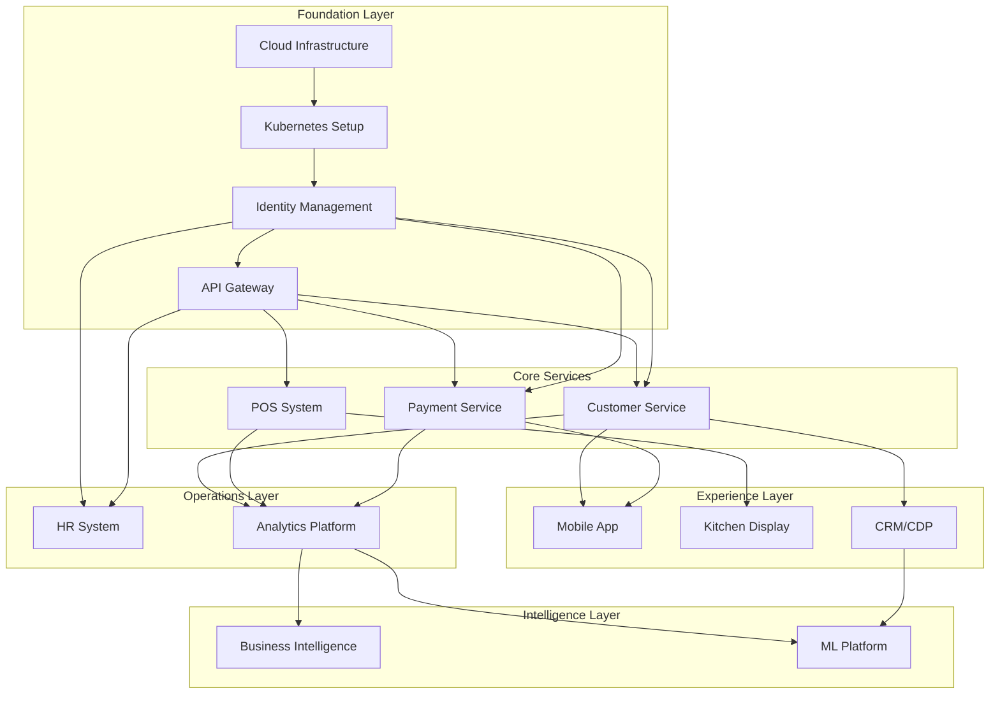

# Implementation Priority Matrix - Jian Cha Tea Unity Suite

## Executive Summary

This document outlines the strategic prioritization framework for implementing the Jian Cha Tea Unity Suite platform. Using a comprehensive analysis methodology including MoSCoW prioritization, business value vs complexity assessment, and dependency mapping, we provide clear guidance on implementation sequence and resource allocation.

**Key Recommendations:**
- **Phase 1 Focus**: Core infrastructure and POS system (Must Have + Foundation)
- **Phase 2 Priority**: Customer experience and payment systems (Should Have + High Value)
- **Phase 3 Sequence**: Operational systems and franchise management (Should Have + Dependencies)
- **Phase 4 Enhancement**: Advanced analytics and AI/ML capabilities (Could Have + Future Value)

---

## 1. MoSCoW Analysis Framework

### Must Have (Critical for Business Operations)
These components are essential for basic franchise operations and cannot be compromised.

#### Infrastructure & Platform Services
**Priority Score: 10/10 | Implementation: Q1-Q2 2025**

- **Identity & Access Management (IAM)**
  - Multi-tenant authentication system
  - OAuth 2.0/OIDC implementation
  - Role-based access control (RBAC)
  - *Business Impact*: Foundational security for all systems
  - *Risk if Delayed*: Cannot implement any other system securely

- **Core Infrastructure**
  - Kubernetes orchestration platform
  - API Gateway with security
  - Event streaming (Apache Kafka)
  - *Business Impact*: Foundation for all microservices
  - *Risk if Delayed*: Entire platform development blocked

- **Database Infrastructure**
  - PostgreSQL primary databases
  - Redis caching layer
  - Database backup and recovery
  - *Business Impact*: Data persistence for all operations
  - *Risk if Delayed*: No data storage capability

#### Core Business Operations
**Priority Score: 10/10 | Implementation: Q2-Q3 2025**

- **POS System Core**
  - Transaction processing
  - Payment integration (cash, card, digital)
  - Offline capability
  - Receipt printing
  - *Business Impact*: Direct revenue generation capability
  - *Risk if Delayed*: Cannot process customer transactions

- **Basic Inventory Management**
  - Stock tracking
  - Real-time inventory updates
  - Low stock alerts
  - *Business Impact*: Prevents stockouts and revenue loss
  - *Risk if Delayed*: Operational inefficiency and lost sales

- **Payment & Wallet Service Core**
  - Payment processing
  - PCI DSS compliance
  - Fraud detection basics
  - Settlement processing
  - *Business Impact*: Secure revenue collection
  - *Risk if Delayed*: Cannot accept electronic payments

### Should Have (Important for Competitive Advantage)
These components significantly enhance business value and operational efficiency.

#### Customer Experience Suite
**Priority Score: 8/10 | Implementation: Q3-Q4 2025**

- **Customer Mobile App**
  - Order placement and management
  - Menu browsing with customization
  - Store locator
  - Push notifications
  - *Business Impact*: Enhanced customer convenience and engagement
  - *Risk if Delayed*: Reduced competitive advantage, lower customer satisfaction

- **Digital Wallet Advanced Features**
  - Loyalty points integration
  - Auto top-up functionality
  - Wallet-to-wallet transfers
  - Promotional credits
  - *Business Impact*: Increased customer retention and spend
  - *Risk if Delayed*: Limited customer engagement tools

- **Loyalty Program System**
  - Points earning and redemption
  - Tier management
  - Personalized rewards
  - Member benefits
  - *Business Impact*: Customer retention and lifetime value increase
  - *Risk if Delayed*: Reduced customer loyalty and repeat business

#### Operational Excellence
**Priority Score: 8/10 | Implementation: Q4 2025-Q2 2026**

- **CRM/CDP Platform**
  - Customer data unification
  - Segmentation engine
  - Campaign management
  - Personalization engine
  - *Business Impact*: Targeted marketing and customer insights
  - *Risk if Delayed*: Generic customer experience, missed revenue opportunities

- **Franchise Portal**
  - Application processing
  - Document management
  - Payment collection
  - Performance dashboards
  - *Business Impact*: Streamlined franchise operations and growth
  - *Risk if Delayed*: Manual processes, slower franchise expansion

- **HR Management System**
  - Employee lifecycle management
  - Time and attendance
  - Payroll processing
  - Performance management
  - *Business Impact*: Operational efficiency and compliance
  - *Risk if Delayed*: Manual HR processes, compliance risks

### Could Have (Nice to Have for Enhanced Operations)
These components provide additional value but are not critical for core operations.

#### Advanced Features
**Priority Score: 6/10 | Implementation: Q1-Q3 2026**

- **Employee Mobile App**
  - Self-service capabilities
  - Training modules
  - Communication tools
  - Task management
  - *Business Impact*: Employee satisfaction and productivity
  - *Risk if Delayed*: Standard HR processes continue, limited impact

- **Advanced Inventory Features**
  - Demand forecasting
  - Automated reordering
  - Supplier integration
  - Waste optimization
  - *Business Impact*: Cost optimization and efficiency gains
  - *Risk if Delayed*: Manual inventory management continues

- **Kitchen Display System (KDS)**
  - Order queue management
  - Preparation time tracking
  - Kitchen workflow optimization
  - *Business Impact*: Improved order accuracy and speed
  - *Risk if Delayed*: Paper-based kitchen operations continue

#### Analytics & Intelligence
**Priority Score: 7/10 | Implementation: Q2-Q4 2026**

- **Business Intelligence Platform**
  - Executive dashboards
  - Operational reports
  - Self-service analytics
  - Custom reporting
  - *Business Impact*: Data-driven decision making
  - *Risk if Delayed*: Limited business insights, manual reporting

- **Predictive Analytics**
  - Demand forecasting
  - Customer behavior prediction
  - Inventory optimization
  - Revenue forecasting
  - *Business Impact*: Proactive business optimization
  - *Risk if Delayed*: Reactive management approach continues

### Won't Have (Out of Scope for Current Implementation)
These components are excluded from the current 2-year roadmap.

#### Future Considerations
**Priority Score: 3/10 | Timeline: Post-2026**

- **Advanced AI Features**
  - Computer vision for quality control
  - Natural language processing for customer service
  - Advanced robotics integration
  - *Rationale*: Technology not mature enough, high complexity, uncertain ROI

- **IoT Sensor Integration**
  - Equipment monitoring sensors
  - Environmental monitoring
  - Predictive maintenance
  - *Rationale*: Requires significant hardware investment, complex implementation

- **Blockchain Integration**
  - Supply chain transparency
  - Loyalty point tokenization
  - Smart contracts for franchising
  - *Rationale*: Unproven business value, regulatory uncertainty

---

## 2. Business Value vs Complexity Matrix

### High Value, Low Complexity (Quick Wins)
**Implementation Priority: Immediate**

| Component | Business Value | Implementation Complexity | Priority Score |
|-----------|----------------|--------------------------|----------------|
| Basic POS System | Very High | Medium | 9.5 |
| IAM Core | High | Medium | 8.5 |
| Payment Processing | Very High | Medium-High | 9.0 |
| Customer Registration | High | Low | 8.0 |
| Basic Inventory | High | Low-Medium | 7.5 |

**Rationale**: These components provide immediate business value with manageable implementation complexity. They form the foundation for revenue generation and basic operations.

### High Value, High Complexity (Major Projects)
**Implementation Priority: Planned with adequate resources**

| Component | Business Value | Implementation Complexity | Priority Score |
|-----------|----------------|--------------------------|----------------|
| CRM/CDP Platform | Very High | Very High | 8.0 |
| Advanced Analytics | High | Very High | 7.0 |
| Multi-region Infrastructure | High | Very High | 7.5 |
| ML/AI Platform | High | Very High | 6.5 |
| Global Compliance System | High | Very High | 7.0 |

**Rationale**: These components require significant investment in time and resources but provide substantial business value. Careful planning and experienced teams are essential.

### Low Value, Low Complexity (Fill-in Projects)
**Implementation Priority: Resource availability dependent**

| Component | Business Value | Implementation Complexity | Priority Score |
|-----------|----------------|--------------------------|----------------|
| Basic Reporting | Medium | Low | 6.0 |
| Email Notifications | Medium | Low | 5.5 |
| Simple Dashboards | Medium | Low-Medium | 6.0 |
| Document Storage | Medium | Low | 5.5 |

**Rationale**: These components can be implemented when resources are available between major projects. They provide incremental value without significant effort.

### Low Value, High Complexity (Avoid or Defer)
**Implementation Priority: Deprioritized**

| Component | Business Value | Implementation Complexity | Priority Score |
|-----------|----------------|--------------------------|----------------|
| Advanced IoT Integration | Low | Very High | 3.0 |
| Blockchain Features | Low | Very High | 2.5 |
| Advanced AI Vision | Medium | Very High | 4.0 |
| Complex B2B Integrations | Low-Medium | Very High | 4.0 |

**Rationale**: These components should be avoided or significantly deferred due to poor value-to-effort ratio.

---

## 3. Quick Wins Identification

### Phase 1 Quick Wins (Q1-Q2 2025)
**Timeline: 3-6 months | Resource Impact: Low-Medium**

#### Infrastructure Quick Wins
- **Container Registry Setup** (2 weeks)
  - Docker registry with security scanning
  - Immediate value for development workflow
  - Low complexity, high development productivity gain

- **Basic Monitoring Stack** (3 weeks)
  - Prometheus + Grafana setup
  - Essential for production readiness
  - Moderate complexity, critical operational value

- **CI/CD Pipeline Basic** (4 weeks)
  - Automated build and deploy for core services
  - Immediate development efficiency gains
  - Medium complexity, high productivity value

#### Business Quick Wins
- **Customer Registration Portal** (4 weeks)
  - Simple registration with email verification
  - Immediate customer database growth
  - Low complexity, direct business value

- **Basic Product Catalog** (3 weeks)
  - Menu items with pricing
  - Essential for POS operation
  - Low complexity, operational requirement

- **Simple Payment Processing** (6 weeks)
  - Credit card payments via Stripe
  - Immediate revenue capability
  - Medium complexity, critical business value

### Phase 2 Quick Wins (Q3-Q4 2025)
**Timeline: 2-4 months | Resource Impact: Medium**

#### Customer Experience Quick Wins
- **Push Notification Service** (3 weeks)
  - Basic notification capability
  - Enhanced customer engagement
  - Low complexity, good customer value

- **Store Locator** (2 weeks)
  - Simple map integration
  - Customer convenience feature
  - Low complexity, customer satisfaction

- **Order History** (3 weeks)
  - Customer transaction history
  - Customer self-service capability
  - Low complexity, operational efficiency

#### Operational Quick Wins
- **Basic Reporting Dashboard** (4 weeks)
  - Daily sales and key metrics
  - Management visibility
  - Medium complexity, business insights

- **Inventory Alerts** (2 weeks)
  - Low stock notifications
  - Prevents stockouts
  - Low complexity, operational efficiency

### Success Metrics for Quick Wins
- **Development Velocity**: 25% increase in feature delivery speed
- **Customer Satisfaction**: 15% improvement in app store ratings
- **Operational Efficiency**: 20% reduction in manual processes
- **Revenue Impact**: 10% increase in electronic payment adoption

---

## 4. Dependencies Mapping

### Critical Path Dependencies

### Dependency Categories

#### Technical Dependencies (Hard Dependencies)
**Cannot proceed without prerequisite completion**

1. **Infrastructure → All Services**
   - Cloud platform setup required for all deployments
   - Network configuration prerequisite for security
   - Monitoring stack essential for production deployment

2. **IAM → All Applications**
   - Authentication service required for user access
   - Authorization framework needed for secure operations
   - User management essential for all user-facing systems

3. **API Gateway → Service Communication**
   - Request routing required for microservices
   - Rate limiting essential for system protection
   - API versioning needed for backwards compatibility

4. **Database → Data-Dependent Services**
   - Primary data store required for transactional systems
   - Cache layer needed for performance requirements
   - Backup systems essential for production deployment

#### Business Dependencies (Soft Dependencies)
**Optimal sequence for business value delivery**

1. **POS → Customer Experience**
   - Basic transaction capability before advanced features
   - Payment processing prerequisite for mobile ordering
   - Inventory integration needed for accurate availability

2. **Customer Data → Personalization**
   - User profiles required for personalized experiences
   - Transaction history needed for recommendations
   - Preference data essential for targeted marketing

3. **Operational Data → Analytics**
   - Business processes must be digitized before analysis
   - Data collection required for insights generation
   - Process standardization needed for meaningful reporting

#### Resource Dependencies
**Sequential requirements due to team expertise and capacity**

1. **Core Platform Team → Service Teams**
   - Platform expertise needed before service development
   - Infrastructure patterns established before replication
   - Security frameworks defined before implementation

2. **Backend Services → Frontend Applications**
   - API contracts required for UI development
   - Data models needed for interface design
   - Business logic implementation before user experience

### Dependency Risk Mitigation

#### High-Risk Dependencies
1. **Cloud Infrastructure Readiness**
   - *Risk*: Infrastructure delays block all development
   - *Mitigation*: Early infrastructure team establishment, proven templates
   - *Contingency*: Alternative cloud provider options

2. **IAM System Complexity**
   - *Risk*: Authentication delays block all user-facing systems
   - *Mitigation*: Use proven identity provider solutions (Auth0, Okta)
   - *Contingency*: Phased authentication rollout

3. **PCI DSS Compliance Timeline**
   - *Risk*: Compliance delays block payment processing
   - *Mitigation*: Early compliance consulting engagement
   - *Contingency*: Use compliant third-party payment processor

#### Medium-Risk Dependencies
1. **Database Migration Complexity**
   - *Risk*: Data migration issues affect all systems
   - *Mitigation*: Extensive testing and parallel run approach
   - *Contingency*: Staged migration with rollback capability

2. **Third-Party Integration Availability**
   - *Risk*: External service changes affect integration timeline
   - *Mitigation*: Early integration testing and vendor communication
   - *Contingency*: Alternative provider options identified

---

## 5. Critical Path Analysis

### Primary Critical Path: Revenue Generation
**Total Duration: 20 weeks | Critical for Business Operations**

1. **Infrastructure Setup** (4 weeks)
   - Cloud environment provisioning
   - Basic monitoring and security

2. **IAM Implementation** (4 weeks)
   - Authentication and authorization
   - User management system

3. **POS Core Development** (8 weeks)
   - Transaction processing
   - Payment integration
   - Offline capability

4. **Payment Service** (4 weeks, parallel with POS)
   - Payment gateway integration
   - PCI compliance validation

**Critical Success Factors:**
- Experienced cloud architects available
- Payment compliance expertise secured
- POS hardware integration tested early

### Secondary Critical Path: Customer Experience
**Total Duration: 16 weeks | Important for Growth**

1. **Customer Service** (4 weeks)
   - User registration and profiles
   - Basic customer data management

2. **Mobile App Foundation** (6 weeks)
   - Core app framework
   - Authentication integration

3. **Order Management** (4 weeks)
   - Order placement and tracking
   - Integration with POS system

4. **Loyalty System** (2 weeks, can be parallel)
   - Basic points earning
   - Simple redemption

### Tertiary Critical Path: Operational Excellence
**Total Duration: 24 weeks | Essential for Scale**

1. **Data Platform** (6 weeks)
   - Data warehouse setup
   - ETL pipeline foundation

2. **CRM/CDP Platform** (10 weeks)
   - Customer data integration
   - Segmentation capabilities

3. **Analytics Platform** (6 weeks)
   - Reporting framework
   - Dashboard development

4. **HR System** (2 weeks, can be parallel)
   - Employee management
   - Basic payroll integration

### Path Optimization Strategies

#### Parallel Development Opportunities
- **Infrastructure + IAM**: Can be developed simultaneously with different teams
- **POS + Payment**: Payment service development can start before POS completion
- **Mobile App + Customer Service**: UI development can proceed with API mocks
- **Analytics + CRM**: Data platform can be prepared while CRM is being built

#### Resource Smoothing
- **Week 1-8**: Heavy infrastructure team utilization
- **Week 9-16**: Transition to application development teams
- **Week 17-24**: Focus on integration and testing teams
- **Week 25-32**: Full system testing and deployment teams

#### Risk Buffer Management
- **15% time buffer** included in each critical path segment
- **Resource flexibility** between paths to handle bottlenecks
- **Scope reduction options** identified for each major component

---

## 6. Resource Allocation Recommendations

### Phase 1: Foundation (Q1-Q2 2025)
**Total Resources: 18-20 FTE**

#### Core Platform Team (8-10 FTE)
- **Infrastructure Engineers (3)**
  - Cloud platform setup and configuration
  - Kubernetes deployment and management
  - Security and compliance implementation

- **Backend Engineers (4-5)**
  - IAM system development
  - API gateway configuration
  - Core service development

- **Security Engineer (1)**
  - Security framework design
  - Compliance validation
  - Security testing and auditing

#### Application Development Team (6-8 FTE)
- **POS Developers (3-4)**
  - Transaction processing logic
  - Payment integration
  - Offline capability implementation

- **Mobile Developers (2)**
  - Customer app foundation
  - Employee app basic features

- **Frontend Developer (1-2)**
  - Admin interfaces
  - Franchise portal foundation

#### Specialist Resources (4-2 FTE)
- **Database Administrator (1)**
  - Database design and optimization
  - Backup and recovery procedures

- **QA Engineers (2)**
  - Test automation framework
  - Integration testing

- **Business Analyst (1)**
  - Requirements refinement
  - User acceptance testing

### Phase 2: Customer Experience (Q3-Q4 2025)
**Total Resources: 22-25 FTE**

#### Enhanced Application Team (12-15 FTE)
- **Mobile Development (6)**
  - Full-featured customer app
  - Advanced payment integration
  - Loyalty system implementation

- **Backend Services (4-5)**
  - CRM/CDP development
  - Personalization engine
  - Campaign management

- **Frontend Development (2-4)**
  - Customer portal
  - Enhanced franchise portal

#### Data & Analytics Team (4-5 FTE)
- **Data Engineers (2-3)**
  - Data pipeline development
  - Customer data integration

- **ML Engineers (2)**
  - Recommendation engine
  - Basic personalization models

#### Operations Team (6-5 FTE)
- **DevOps Engineers (2-3)**
  - Deployment automation
  - Monitoring enhancement

- **QA Engineers (3)**
  - End-to-end testing
  - Performance testing

- **Support Engineers (1-2)**
  - Production support
  - User training

### Resource Optimization Strategies

#### Skill Flexibility
- **Cross-trained developers** capable of working on multiple components
- **T-shaped professionals** with deep expertise and broad knowledge
- **Rotation programs** to prevent knowledge silos

#### External Resource Strategy
- **Specialized consultants** for complex technical challenges
- **Temporary augmentation** during peak development periods
- **Offshore development** for non-critical components

#### Knowledge Management
- **Documentation standards** for all development work
- **Code review processes** to ensure knowledge sharing
- **Architecture decision records** to capture reasoning
- **Regular knowledge transfer sessions** between teams

---

## 7. Risk-Based Prioritization

### Risk Assessment Matrix

#### High Probability, High Impact (Address Immediately)
1. **PCI DSS Compliance Complexity**
   - Probability: 70%
   - Impact: Critical (blocks payment processing)
   - Mitigation: Early compliance consulting, proven solutions
   - Priority: Must address in Phase 1

2. **Multi-Region Data Synchronization**
   - Probability: 60%
   - Impact: High (affects global operations)
   - Mitigation: Proven data patterns, extensive testing
   - Priority: Address before Phase 3 global rollout

3. **User Adoption Resistance**
   - Probability: 50%
   - Impact: High (affects ROI)
   - Mitigation: Change management, training, incentives
   - Priority: Continuous throughout implementation

#### High Probability, Medium Impact (Plan Mitigation)
1. **Third-Party Integration Changes**
   - Probability: 60%
   - Impact: Medium (delays specific features)
   - Mitigation: Multiple vendor options, loose coupling
   - Priority: Monitor throughout development

2. **Performance Scaling Issues**
   - Probability: 50%
   - Impact: Medium (user experience degradation)
   - Mitigation: Early load testing, scalable architecture
   - Priority: Address before major rollouts

#### Low Probability, High Impact (Contingency Plans)
1. **Major Security Breach**
   - Probability: 20%
   - Impact: Critical (regulatory and reputation)
   - Mitigation: Security-first design, regular audits
   - Contingency: Incident response plan, insurance

2. **Key Personnel Departure**
   - Probability: 30%
   - Impact: High (project delays)
   - Mitigation: Knowledge documentation, cross-training
   - Contingency: Rapid replacement procedures

### Risk-Driven Priority Adjustments

#### Early Risk Mitigation Items
1. **Security Framework Implementation**
   - Move to Phase 1 beginning to establish security foundation
   - Parallel development with infrastructure setup

2. **Compliance Validation**
   - Begin compliance assessment in Phase 1
   - Continuous compliance monitoring throughout

3. **Change Management Program**
   - Start user engagement activities early
   - Build training programs parallel to development

#### Risk-Based Scope Adjustments
1. **Payment System Simplification**
   - If PCI compliance proves too complex, use third-party processor initially
   - Can be brought in-house in later phases

2. **Global Rollout Phasing**
   - If multi-region complexity is high, focus on single region first
   - Expand globally in subsequent phases

3. **Advanced Feature Deferral**
   - If core development falls behind, defer nice-to-have features
   - Focus on must-have functionality first

---

## 8. Success Metrics & Validation

### Phase-Specific Success Metrics

#### Phase 1: Foundation Success (Q2 2025)
**Technical Metrics:**
- Infrastructure deployment: 100% successful in primary region
- Authentication system: Support 10,000 users with <500ms response
- POS system: Process 1,000 transactions with 99.9% success rate
- Security audit: Pass external security assessment

**Business Metrics:**
- Pilot stores: 10 locations successfully operating
- User feedback: >80% satisfaction from pilot users
- Transaction volume: 100+ daily transactions per pilot store
- System uptime: 99.5% during business hours

#### Phase 2: Customer Experience Success (Q4 2025)
**Technical Metrics:**
- Mobile app: 50,000+ downloads with 4.0+ store rating
- Customer registration: 100,000 registered users
- Payment processing: 99.9% success rate across all methods
- Loyalty system: 1M+ points earned and redeemed

**Business Metrics:**
- Customer engagement: 40% monthly active users
- Order value: 15% increase in average order value
- Customer retention: 60% customer return rate within 30 days
- Market expansion: 100 stores across 5 countries

#### Phase 3: Operational Excellence Success (Q2 2026)
**Technical Metrics:**
- System scalability: Support 300 concurrent stores
- Data processing: Handle 1M+ daily events
- Integration success: 100% uptime for critical integrations
- Performance: Maintain <2s response times at scale

**Business Metrics:**
- Operational efficiency: 30% reduction in manual processes
- Employee satisfaction: >85% satisfaction with new systems
- Franchise growth: 50+ new franchise applications processed
- Cost optimization: 25% reduction in operational costs

#### Phase 4: Intelligence & Scale Success (Q4 2026)
**Technical Metrics:**
- Analytics platform: <2s dashboard load time for 100+ reports
- ML models: >85% prediction accuracy for key models
- Global deployment: 500+ stores across multiple regions
- Data quality: >95% data accuracy across all systems

**Business Metrics:**
- Business insights: 100+ automated reports generated daily
- Revenue growth: Support $100M+ annual transaction volume
- Customer lifetime value: 20% increase in customer LTV
- Franchise satisfaction: >90% franchisee satisfaction score

### Validation Checkpoints

#### Quarterly Review Checkpoints
**Evaluation Criteria:**
- Technical milestone completion rate
- Budget utilization vs. plan
- Quality metrics achievement
- Stakeholder satisfaction scores

**Go/No-Go Decision Points:**
- Q2 2025: Proceed to customer experience phase
- Q4 2025: Proceed to operational systems phase  
- Q2 2026: Proceed to intelligence platform phase
- Q4 2026: Declare project success and transition to operations

#### Risk Assessment Reviews
**Monthly Risk Reviews:**
- Risk register updates
- Mitigation strategy effectiveness
- New risk identification
- Contingency plan activation criteria

**Quarterly Business Reviews:**
- ROI projection updates
- Market condition changes
- Competitive landscape analysis
- Strategic priority adjustments

### Continuous Improvement Process

#### Feedback Loops
1. **User Feedback Integration**
   - Weekly user feedback collection
   - Monthly feature prioritization based on feedback
   - Quarterly user satisfaction surveys

2. **Performance Monitoring**
   - Real-time system performance tracking
   - Weekly performance review meetings
   - Monthly optimization planning

3. **Business Value Assessment**
   - Monthly business metrics review
   - Quarterly ROI recalculation
   - Annual strategic value assessment

---

## Conclusion

This implementation priority matrix provides a comprehensive framework for delivering the Jian Cha Tea Unity Suite platform efficiently and effectively. The prioritization approach balances immediate business needs with long-term strategic value, while managing risks and dependencies throughout the implementation journey.

**Key Success Factors:**
1. **Disciplined Prioritization**: Strict adherence to MoSCoW categories and business value focus
2. **Risk-Aware Planning**: Early mitigation of high-impact risks
3. **Flexible Execution**: Ability to adjust priorities based on learnings and market changes
4. **Continuous Validation**: Regular checkpoints to ensure alignment with business objectives

**Expected Outcomes:**
- **Accelerated Time-to-Value**: Quick wins deliver immediate benefits
- **Minimized Risk**: Early risk mitigation reduces project uncertainty
- **Optimized Resource Utilization**: Clear priorities enable efficient team allocation
- **Stakeholder Alignment**: Transparent prioritization builds confidence and support

The priority matrix serves as a living document that should be reviewed and updated regularly as the implementation progresses and business conditions evolve. Success depends on maintaining focus on high-value, low-risk components while building the foundation for future enhancements and global scale.