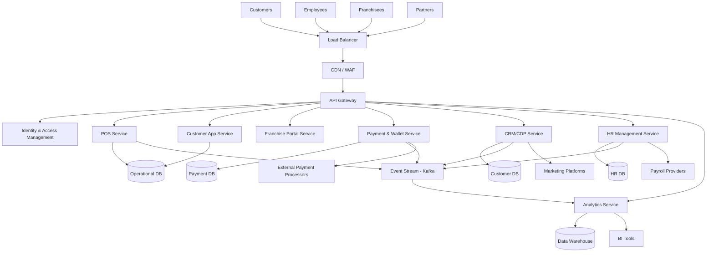
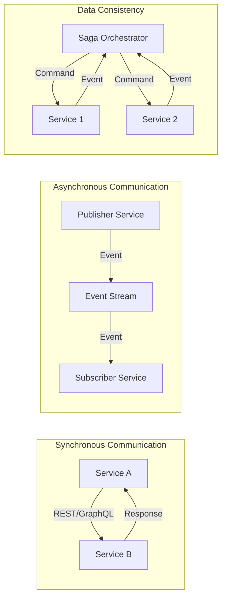
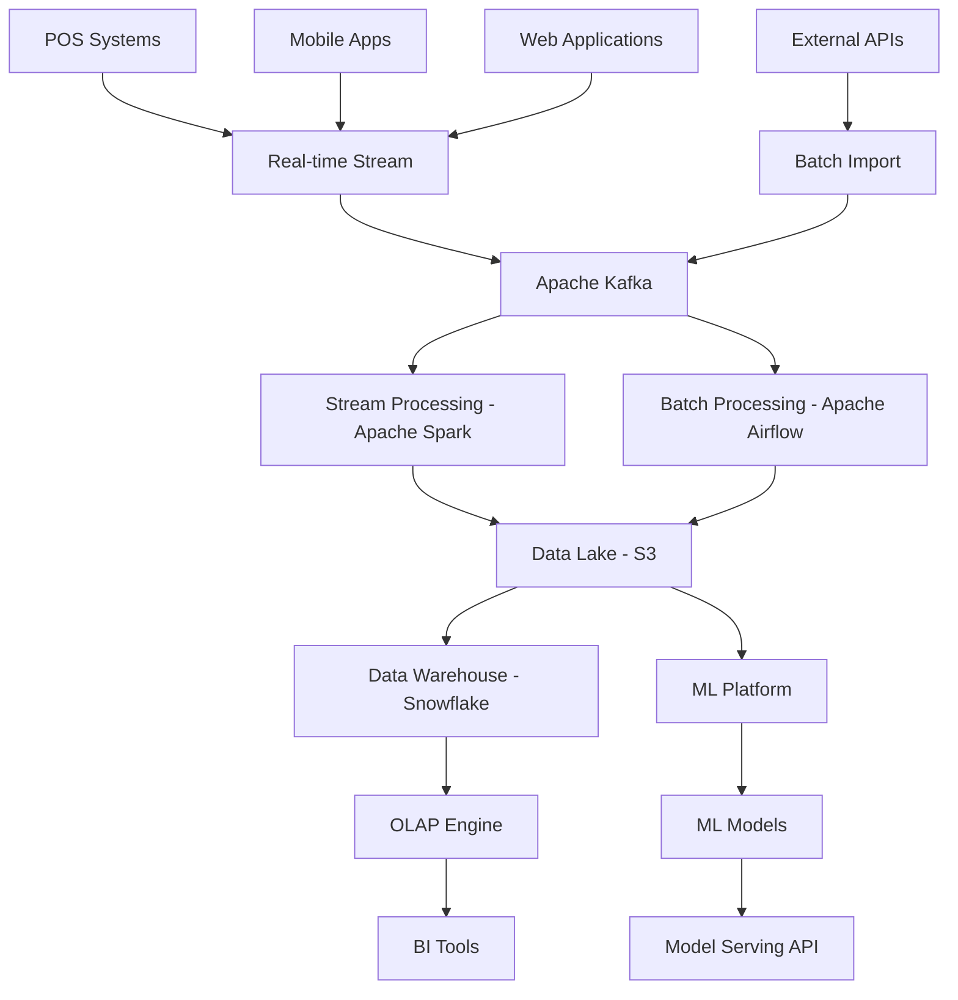
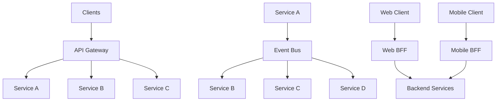
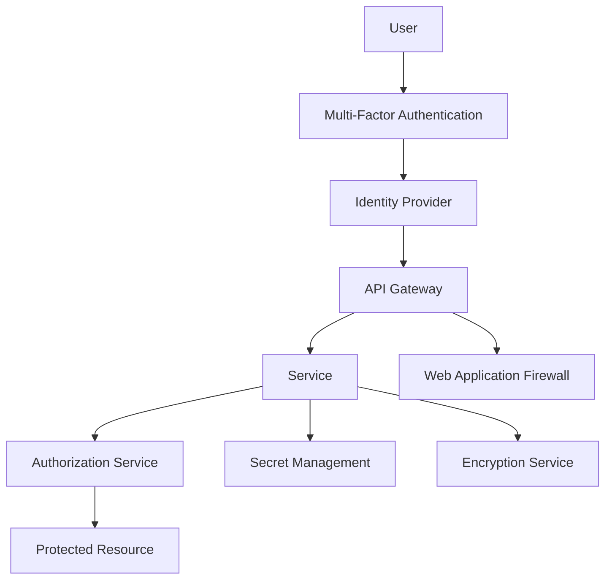
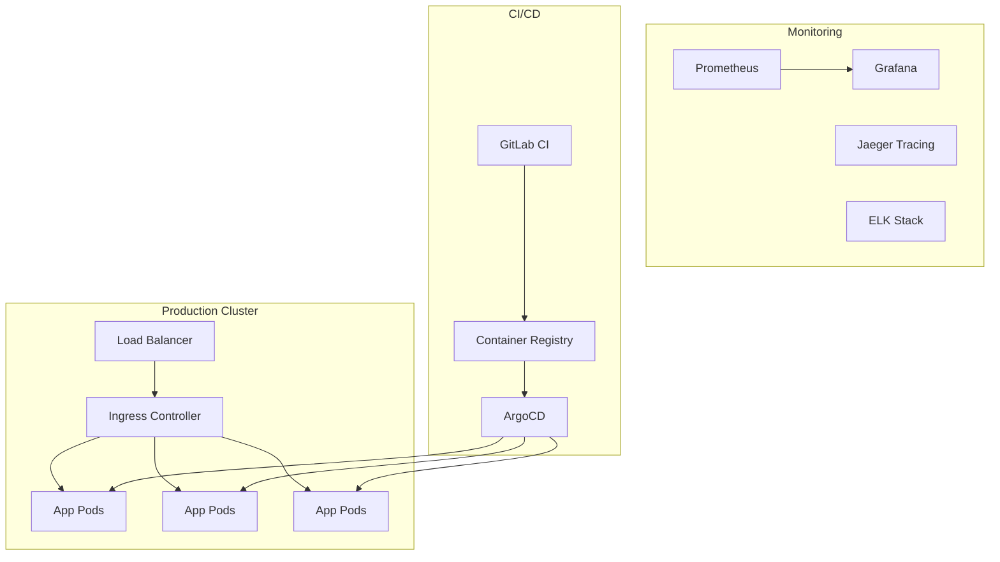
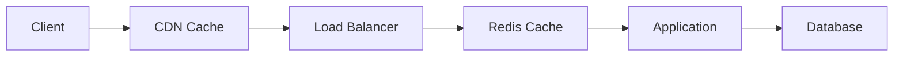
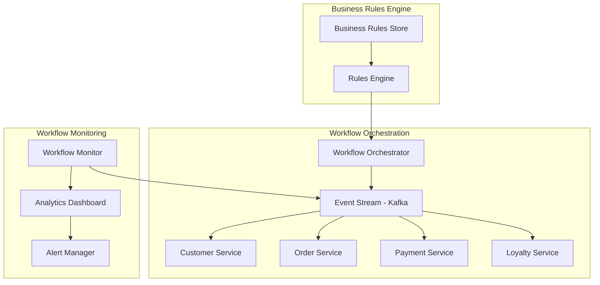

# System Architecture - Jian Cha Tea Unity Suite

## Executive Summary

The Jian Cha Tea Unity Suite is a cloud-native, microservices-based platform designed to power global franchise operations for 500+ locations, handling 1M+ daily transactions with multi-tenant, multi-region capabilities. The architecture emphasizes security-first design, scalability, and operational excellence while ensuring compliance with global regulations including PCI DSS, GDPR/PDPA.

## 1. High-Level Architecture Overview

### Architecture Principles
- **Cloud-Native Design**: Containerized microservices with Kubernetes orchestration
- **Security-First**: Zero-trust architecture with end-to-end encryption
- **Multi-Tenant**: Isolated tenant data with shared infrastructure
- **Event-Driven**: Asynchronous communication using event streaming
- **API-First**: RESTful and GraphQL APIs with comprehensive documentation
- **Domain-Driven**: Bounded contexts aligned with business domains

### Architecture Diagram (High Level)

## 2. Microservices Architecture

### Service Boundaries and Domains

#### 2.1 Customer Domain
**Customer Management Service**
- Customer profile management
- Preference management
- Customer journey tracking
- Privacy consent management

**Customer Mobile App Service**
- Order management
- Loyalty program integration
- Wallet integration
- Push notifications

#### 2.2 Operations Domain
**POS Service**
- Transaction processing
- Inventory integration
- Receipt generation
- Offline capability

**Inventory Management Service**
- Stock tracking
- Supplier management
- Purchase orders
- Waste tracking

**Store Operations Service**
- Store configuration
- Equipment management
- Quality control
- Compliance tracking

#### 2.3 Franchise Domain
**Franchise Management Service**
- Application processing
- Contract management
- Fee collection
- Performance tracking

**Store Management Service**
- Multi-store oversight
- Performance dashboards
- Reporting
- Communication

#### 2.4 Financial Domain
**Payment & Wallet Service**
- Payment processing
- Digital wallet
- Settlement
- Fraud detection

**Financial Reporting Service**
- Revenue reporting
- Cost analysis
- Profitability metrics
- Tax reporting

#### 2.5 Human Resources Domain
**HR Management Service**
- Employee lifecycle
- Payroll processing
- Performance management
- Compliance tracking

**Employee Mobile Service**
- Time & attendance
- Scheduling
- Task management
- Training access

#### 2.6 Marketing Domain
**CRM/CDP Service**
- Customer data platform
- Segmentation
- Campaign management
- Personalization engine

**Loyalty Service**
- Points management
- Tier progression
- Rewards catalog
- Redemption processing

#### 2.7 Analytics Domain
**Analytics Service**
- Real-time analytics
- Batch processing
- Reporting engine
- Predictive models

**Business Intelligence Service**
- Executive dashboards
- Operational reports
- Self-service analytics
- Data visualization

#### 2.8 Platform Services
**Identity & Access Management**
- Authentication
- Authorization
- User management
- Session management

**Notification Service**
- Push notifications
- Email notifications
- SMS notifications
- In-app messaging

**Document Management Service**
- File storage
- Document processing
- Version control
- Access control

### Service Communication Patterns

## 3. Data Architecture and Flow

### 3.1 Data Architecture Overview

### 3.2 Database Strategy

**Operational Databases (OLTP)**
- **PostgreSQL**: Primary transactional database for most services
- **MongoDB**: Document storage for flexible schemas (CRM, product catalog)
- **Redis**: Caching and session storage
- **Elasticsearch**: Search and logging

**Analytical Databases (OLAP)**
- **Snowflake**: Primary data warehouse for analytics
- **ClickHouse**: Real-time analytics for operational dashboards
- **Apache Pinot**: Sub-second analytics for user-facing features

**Data Distribution Strategy**
- Database per service pattern
- Shared databases only for reference data
- Event-driven data synchronization
- CQRS pattern for read/write separation

### 3.3 Data Flow Patterns

**Real-time Data Flow**
1. Transaction occurs in POS/Mobile App
2. Event published to Kafka topic
3. Stream processing updates materialized views
4. Real-time dashboards reflect changes
5. Alerts triggered if thresholds exceeded

**Batch Data Flow**
1. Daily ETL extracts data from operational systems
2. Data landed in staging area of data lake
3. Data quality checks and transformations applied
4. Clean data loaded to data warehouse
5. Aggregated tables built for reporting

## 4. Integration Architecture

### 4.1 Integration Patterns

### 4.2 External Integration Points

**Payment Processors**
- Stripe, Adyen for global card processing
- PayNow (Singapore), PromptPay (Thailand)
- Regional digital wallets
- Banking APIs for settlements

**Marketing Platforms**
- SendGrid for email marketing
- Twilio for SMS communications
- Social media APIs (Facebook, Instagram, TikTok)
- Google/Facebook Ads for attribution

**Business Tools**
- Accounting systems (QuickBooks, SAP)
- HR platforms (Workday, ADP)
- CRM platforms (Salesforce, HubSpot)
- Analytics tools (Tableau, Looker)

### 4.3 API Management Strategy

**API Gateway Features**
- Rate limiting and throttling
- Authentication and authorization
- Request/response transformation
- API versioning
- Circuit breakers
- Caching
- Analytics and monitoring

**API Standards**
- OpenAPI 3.0 specifications
- RESTful design principles
- GraphQL for complex queries
- Webhook notifications
- Standard error responses
- Consistent pagination

## 5. Security Architecture

### 5.1 Zero-Trust Security Model

### 5.2 Security Layers

**Network Security**
- VPC with private subnets
- Network ACLs and security groups
- Web Application Firewall (WAF)
- DDoS protection
- VPN for administrative access

**Application Security**
- OAuth 2.0 / OpenID Connect
- JWT tokens with short expiry
- API rate limiting
- Input validation and sanitization
- OWASP top 10 compliance

**Data Security**
- Encryption at rest (AES-256)
- Encryption in transit (TLS 1.3)
- Database encryption
- PII data masking
- Key rotation policies

### 5.3 Compliance Framework

**PCI DSS Level 1**
- Tokenization of card data
- Secure payment processing
- Network segmentation
- Regular security assessments
- Incident response procedures

**GDPR/PDPA Compliance**
- Data privacy by design
- Consent management
- Right to be forgotten
- Data portability
- Privacy impact assessments

## 6. Infrastructure Architecture

### 6.1 Cloud Architecture

**Multi-Cloud Strategy**
- Primary: AWS (Singapore, US, EU regions)
- Secondary: Azure (disaster recovery)
- Edge: CloudFlare for CDN and security

**Kubernetes Architecture**

### 6.2 Environment Strategy

**Development Environment**
- Developer laptops with local Kubernetes (minikube)
- Shared development cluster
- Feature branch deployments
- Mock external services

**Testing Environment**
- Automated testing pipelines
- Integration testing cluster
- Performance testing environment
- Security scanning tools

**Staging Environment**
- Production-like configuration
- User acceptance testing
- Load testing
- Final security validation

**Production Environment**
- Multi-region deployment
- Auto-scaling enabled
- High availability configuration
- Disaster recovery setup

### 6.3 Monitoring and Observability

**Application Performance Monitoring**
- Distributed tracing with Jaeger
- Metrics collection with Prometheus
- Log aggregation with ELK stack
- Custom dashboards with Grafana
- Alerting with PagerDuty

**Business Metrics Monitoring**
- Real-time transaction monitoring
- Revenue tracking
- Customer satisfaction metrics
- System health dashboards
- SLA monitoring

## 7. Technology Stack

### 7.1 Backend Technologies

**Programming Languages**
- Java (Spring Boot) - Primary for enterprise services
- Python (FastAPI) - Data processing and ML services
- Node.js (Express) - Real-time services and BFF
- Go - High-performance services

**Databases**
- PostgreSQL - Primary relational database
- MongoDB - Document database for flexible schemas
- Redis - Caching and session storage
- Elasticsearch - Search and analytics
- Snowflake - Data warehouse
- ClickHouse - Real-time analytics

**Message & Streaming**
- Apache Kafka - Event streaming platform
- Apache Pulsar - Alternative messaging system
- RabbitMQ - Simple message queuing
- Redis Pub/Sub - Real-time notifications

### 7.2 Frontend Technologies

**Web Applications**
- React with Next.js - Server-side rendering
- TypeScript - Type safety
- Tailwind CSS - Utility-first styling
- React Query - State management
- Micro-frontend architecture

**Mobile Applications**
- React Native - Cross-platform development
- Native modules for performance-critical features
- Offline-first architecture
- Push notifications
- Biometric authentication

**POS Applications**
- Progressive Web App (PWA)
- Offline-capable
- Touch-optimized UI
- Hardware integration APIs
- Real-time synchronization

### 7.3 DevOps & Infrastructure

**Containerization & Orchestration**
- Docker for containerization
- Kubernetes for orchestration
- Helm charts for deployments
- Istio service mesh (optional)

**CI/CD Pipeline**
- GitLab CI for build automation
- ArgoCD for GitOps deployments
- Terraform for infrastructure as code
- Ansible for configuration management

**Monitoring & Logging**
- Prometheus + Grafana for metrics
- ELK stack for logging
- Jaeger for distributed tracing
- PagerDuty for alerting

## 8. Scalability and Performance

### 8.1 Scalability Strategy

**Horizontal Scaling**
- Microservices can scale independently
- Kubernetes Horizontal Pod Autoscaler
- Database read replicas
- CDN for static content

**Vertical Scaling**
- Resource limits and requests in Kubernetes
- Vertical Pod Autoscaler for optimization
- Database scaling for compute-intensive workloads

**Data Scalability**
- Database sharding strategies
- Read/write splitting
- Caching layers (Redis, CDN)
- Data archiving policies

### 8.2 Performance Targets

**Response Times**
- API responses: < 200ms (95th percentile)
- Page load times: < 2 seconds
- POS transactions: < 500ms
- Real-time updates: < 1 second

**Throughput**
- 10,000+ transactions per second
- 100,000+ concurrent users
- 1TB+ data processing per day
- 99.99% uptime SLA

### 8.3 Caching Strategy

**Multi-Layer Caching**

**Cache Patterns**
- Cache-aside for application caching
- Write-through for critical data
- Write-behind for high-write scenarios
- Refresh-ahead for predictable access patterns

## 9. Disaster Recovery and High Availability

### 9.1 High Availability Design

**Multi-Region Architecture**
- Active-active deployment in primary regions
- Active-passive in disaster recovery regions
- Cross-region data replication
- Global load balancing

**Service Redundancy**
- Multiple instances per service
- Circuit breakers for fault tolerance
- Bulkhead pattern for isolation
- Graceful degradation

### 9.2 Disaster Recovery Plan

**Recovery Time Objectives (RTO)**
- Tier 1 services (POS, Payment): 15 minutes
- Tier 2 services (CRM, HR): 1 hour
- Tier 3 services (Analytics): 4 hours

**Recovery Point Objectives (RPO)**
- Financial data: 0 data loss
- Customer data: < 5 minutes data loss
- Analytics data: < 1 hour data loss

**Backup Strategy**
- Continuous replication for critical data
- Point-in-time recovery for databases
- Cross-region backup storage
- Regular restore testing

### 9.3 Business Continuity

**Offline Capabilities**
- POS systems can operate offline
- Mobile apps cache essential data
- Automatic sync when connectivity restored
- Manual fallback procedures documented

**Incident Response**
- 24/7 monitoring and alerting
- Escalation procedures defined
- Communication plan for stakeholders
- Post-incident review process

## 10. Compliance and Governance

### 10.1 Data Governance Framework

**Data Classification**
- Public data (marketing materials)
- Internal data (business metrics)
- Confidential data (customer PII)
- Restricted data (payment information)

**Data Lifecycle Management**
- Data retention policies
- Automated data purging
- Data archival strategies
- Compliance auditing

### 10.2 Security Governance

**Security Policies**
- Access control policies
- Password policies
- Encryption standards
- Incident response procedures

**Compliance Monitoring**
- Automated compliance scanning
- Regular security assessments
- Penetration testing
- Vulnerability management

## 11. Implementation Considerations

### 11.1 Migration Strategy

**Phased Migration Approach**
1. Infrastructure setup and core services
2. Identity and access management
3. Customer-facing applications
4. Internal operations systems
5. Analytics and reporting

**Risk Mitigation**
- Parallel run with legacy systems
- Gradual traffic migration
- Rollback procedures
- Data validation checkpoints

### 11.2 Operational Excellence

**DevOps Practices**
- Infrastructure as code
- Automated testing pipelines
- Continuous deployment
- Configuration management

**Site Reliability Engineering**
- Service level objectives (SLOs)
- Error budgets
- Capacity planning
- Performance optimization

## 12. Workflow Architecture Integration

### 12.1 Business Process Alignment

The technical architecture directly supports the comprehensive business workflows documented in the [Workflow Documentation](../workflows/README.md). Each microservice boundary aligns with specific workflow categories:

**Workflow-Service Mapping:**
- **Customer Journey Workflows** → Customer App Service, CRM/CDP Service, Loyalty Service
- **Store Operations Workflows** → POS Service, Inventory Management, Store Operations Service
- **Franchise Management Workflows** → Franchise Portal Service, Store Management Service
- **Employee Management Workflows** → HR Management Service, Employee Mobile Service
- **Financial Workflows** → Payment & Wallet Service, Financial Reporting Service
- **Marketing Workflows** → CRM/CDP Service, Marketing Automation Service

### 12.2 Workflow Integration Patterns

**Event-Driven Workflow Coordination**

**Workflow State Management:**
- **Saga Pattern**: Distributed transaction management across services
- **Event Sourcing**: Complete audit trail for all workflow activities
- **CQRS**: Optimized read models for workflow monitoring and reporting
- **State Machines**: Explicit workflow state transitions and validations

### 12.3 Performance Optimization for Workflows

**Critical Workflow Performance Targets:**
- **Customer Order Processing**: < 2 seconds end-to-end
- **Payment Transaction**: < 500ms authorization
- **Inventory Updates**: < 200ms synchronization
- **Staff Authentication**: < 1 second login
- **Franchise Reporting**: < 30 seconds generation

**Optimization Strategies:**
- **Workflow Caching**: Frequently accessed workflow data cached at multiple layers
- **Parallel Processing**: Independent workflow steps executed concurrently
- **Smart Routing**: Workflow requests routed to optimal service instances
- **Predictive Pre-loading**: Anticipatory data loading based on workflow patterns

## Conclusion

The Jian Cha Tea Unity Suite architecture provides a robust, scalable, and secure foundation for global franchise operations. The microservices-based approach enables independent scaling and development while maintaining system coherence. The emphasis on security, compliance, and operational excellence ensures the platform can meet the demands of a rapidly growing franchise network while maintaining the highest standards of data protection and system reliability.

The architecture is designed to evolve with the business, supporting both current requirements and future growth while maintaining operational efficiency and customer satisfaction across all touchpoints.

**Key Architectural Benefits:**
- **Workflow-Aligned Services**: Each microservice directly supports specific business processes
- **Event-Driven Coordination**: Loosely coupled services with high workflow flexibility
- **Scalable Performance**: Independent scaling based on workflow demands
- **Comprehensive Monitoring**: End-to-end visibility into business process execution
- **Regulatory Compliance**: Built-in support for global compliance requirements

For detailed workflow analysis, business rules, and process optimization recommendations, refer to the comprehensive [Workflow Documentation](../workflows/README.md).