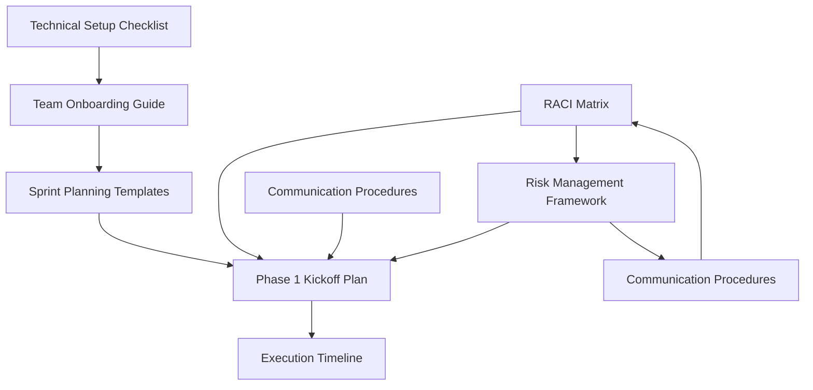

# Jian Cha Tea Unity Suite - CTO-Led Implementation Plan
## Phase 0: CTO Advisory (Q4 2025) + Phase 1: AI-Native Foundation (Q1-Q2 2026)

### 🎯 Overview

This comprehensive implementation documentation provides everything needed to successfully launch the CTO-led development of the Jian Cha Tea Unity Suite. Beginning with Phase 0 (CTO Advisory) in October 2025, followed by Phase 1: AI-Native Foundation in Q1-Q2 2026. The documentation is designed for an AI-augmented development team targeting 42% productivity improvement through mature 2026 AI development tools under expert CTO leadership.

**Documentation Version**: 1.1.0  
**Last Updated**: August 27, 2025  
**Phase 0 Timeline**: October 1 - December 31, 2025 (3 months)  
**Phase 1 Timeline**: January 6 - June 27, 2026 (26 weeks)  
**CTO Leadership Term**: October 2025 - December 2029 (4+ years)  
**Target Team Size**: 5-7 (Phase 0) → 17-23 with CTO (Phase 1)  
**Phase 0 Budget**: ฿1.125M THB (CTO Advisory)  
**Phase 1 Budget**: 27.9M THB + CTO Salary ($782K USD)  
**Total CTO Investment**: ฿19.7M THB over 4 years

---

## 👔 CTO Leadership & Onboarding

### Phase 0: CTO Advisory Period (October - December 2025)

**CTO Deliverables:**
- ✅ **System Architecture Blueprint**: Complete Unity Suite architecture design
- ✅ **Main Website Launch**: Corporate website development and deployment
- ✅ **Franchise Portal MVP**: Working prototype for franchise management
- ✅ **Development Environment Setup**: Full technical stack preparation
- ✅ **Team Hiring Strategy**: Q1 2026 team recruitment pipeline
- ✅ **Launch Readiness Preparation**: All Phase 1 prerequisites

**CTO Compensation**: ฿300K (฿100K/month)  
**Success Criteria**: All deliverables complete by December 31, 2025

### CTO Performance Milestones & Incentives

| Milestone | Target Date | Bonus Amount | Success Criteria |
|-----------|-------------|--------------|------------------|
| **100 Branches Live** | Q2 2026 | ฿500K | Thailand rollout complete |
| **Break-even Achieved** | Q3 2026 | ฿1M | Platform profitability |
| **500 Franchises** | Q4 2027 | ฿1.5M | Global expansion |
| **Series A Closed** | 2028 | ฿2M | Investment funding |

**Technical Performance Requirements:**
- 99.99% system uptime guarantee
- <100ms API response time (95th percentile)
- 5M+ daily transaction capacity
- 500,000+ concurrent user support

---

## 📁 Documentation Structure

### Core Planning Documents

#### [📋 Phase 1 Kickoff Plan](plans/phase1-kickoff-plan.md)
**Purpose**: Master planning document with comprehensive kickoff strategy  
**Scope**: Pre-kickoff preparation, kickoff week activities, Sprint 0 planning, technical deliverables  
**Key Sections**:
- Pre-Kickoff Preparation (January 2026)
- Kickoff Week Activities (Week 1, Q1 2026) 
- Sprint 0 Planning (Weeks 2-3)
- Phase 1 Delivery Schedule (Weeks 4-26)
- Technical Deliverables for Q1-Q2 2026

**Cross-References**:
- Links to [Execution Timeline](timelines/phase1-execution-timeline.md) for detailed scheduling
- References [Team Onboarding Guide](guides/team-onboarding-guide.md) for team preparation
- Connects with [Risk Management Framework](plans/risk-management-framework.md) for risk mitigation

#### [📅 Week-by-Week Execution Timeline](timelines/phase1-execution-timeline.md)
**Purpose**: Detailed 26-week implementation schedule with AI productivity tracking  
**Scope**: Week-by-week breakdowns, milestone checkpoints, resource allocation  
**Key Sections**:
- Pre-Setup Requirements Verification (December 2025 - January 2026)
- Phase 1 Execution Timeline (26 weeks detailed breakdown)
- Critical Checkpoints and Milestones (4 major gates)
- Team Productivity and AI Enhancement Tracking
- Resource Allocation Timeline

**Cross-References**:
- Supports [Phase 1 Kickoff Plan](plans/phase1-kickoff-plan.md) with detailed scheduling
- Aligns with [Sprint Planning Templates](templates/sprint-planning-templates.md) for execution
- References [RACI Matrix](matrices/phase1-raci-matrix.md) for accountability

### Team Preparation and Setup

#### [👥 Team Onboarding Guide](guides/team-onboarding-guide.md)
**Purpose**: Comprehensive 4-week onboarding program for AI-native development  
**Scope**: Pre-arrival preparation, AI tool mastery, team integration, performance assessment  
**Key Sections**:
- Pre-Arrival Preparation (account setup, pre-reading)
- Day 1: Welcome and Foundations
- Week 1: AI Development Mastery
- Week 2: Team Integration and Specialization
- Week 3: Advanced AI Workflows
- Week 4: Full Productivity Assessment
- AI Tool Reference Guide
- Continuous Learning Framework

**Cross-References**:
- Requires [Technical Setup Checklist](guides/technical-setup-checklist.md) completion
- Supports [Phase 1 Kickoff Plan](plans/phase1-kickoff-plan.md) team formation
- Links to [Sprint Planning Templates](templates/sprint-planning-templates.md) for AI workflows

#### [⚙️ Technical Setup Checklist](guides/technical-setup-checklist.md)
**Purpose**: Complete technical environment setup for 2026 AI development stack  
**Scope**: Hardware validation, software installation, AI tool integration, security configuration  
**Key Sections**:
- Pre-Setup Requirements Verification
- Phase 1: Core Development Environment
- Phase 2: AI Development Tools Integration
- Phase 3: Cloud-Native Development Environment
- Phase 4: IDE and Editor Configuration
- Phase 5: Database and Message Queue Setup
- Phase 6: Development Workflow Setup
- Phase 7: AI Development Workflow Validation
- Phase 8: Team Collaboration Setup

**Cross-References**:
- Prerequisites for [Team Onboarding Guide](guides/team-onboarding-guide.md)
- Supports [Phase 1 Kickoff Plan](plans/phase1-kickoff-plan.md) infrastructure setup
- Enables [Sprint Planning Templates](templates/sprint-planning-templates.md) AI workflows

### Process and Methodology

#### [🏃‍♂️ Sprint Planning Templates](templates/sprint-planning-templates.md)
**Purpose**: AI-augmented sprint planning templates with productivity optimization  
**Scope**: Sprint planning sessions, user stories, capacity planning, retrospectives  
**Key Sections**:
- Template 1: Sprint Planning Session Agenda
- Template 2: User Story Template with AI Integration
- Template 3: Sprint Capacity Planning with AI Factors
- Template 4: Sprint Retrospective with AI Focus
- AI Enhancement Tracking and Metrics
- Quality Gates and Success Criteria

**Cross-References**:
- Implements processes from [Phase 1 Kickoff Plan](plans/phase1-kickoff-plan.md)
- Uses timeline from [Execution Timeline](timelines/phase1-execution-timeline.md)
- Requires team skills from [Team Onboarding Guide](guides/team-onboarding-guide.md)

#### [📊 RACI Matrix](matrices/phase1-raci-matrix.md)
**Purpose**: Comprehensive responsibility assignment for all Phase 1 deliverables  
**Scope**: Role definitions, accountability matrix, decision authority, escalation paths  
**Key Sections**:
- Phase 1 Infrastructure Foundation (Sprint 0-1)
- Phase 1 Identity & Access Management (Sprint 3-4)
- Phase 1 Core Platform Services (Sprint 5-8)
- Phase 1 POS System Development (Sprint 9-12)
- Phase 1 Integration & Testing (Sprint 13)
- AI-Specific Deliverables
- Communication and Stakeholder Management
- Decision-Making Authority
- Escalation Matrix

**Cross-References**:
- Defines roles for [Phase 1 Kickoff Plan](plans/phase1-kickoff-plan.md) execution
- Supports [Communication Procedures](communication/communication-escalation-procedures.md)
- Aligns with [Risk Management Framework](plans/risk-management-framework.md)

### Risk and Communication Management

#### [🛡️ Risk Management Framework](plans/risk-management-framework.md)
**Purpose**: Comprehensive risk management for AI-native development challenges  
**Scope**: Risk identification, assessment, mitigation strategies, monitoring procedures  
**Key Sections**:
- Risk Assessment Methodology
- AI Technology and Tool Risks
- Technical Implementation Risks
- Security and Compliance Risks
- Team and Resource Risks
- Business and Stakeholder Risks
- Risk Monitoring and Response Plan
- Contingency Plans
- Risk Communication and Escalation

**Cross-References**:
- Protects [Phase 1 Kickoff Plan](plans/phase1-kickoff-plan.md) delivery
- Integrates with [Communication Procedures](communication/communication-escalation-procedures.md)
- References [RACI Matrix](matrices/phase1-raci-matrix.md) for escalation authority

#### [📞 Communication and Escalation Procedures](communication/communication-escalation-procedures.md)
**Purpose**: Structured communication protocols and escalation procedures  
**Scope**: Communication channels, stakeholder management, issue escalation, emergency procedures  
**Key Sections**:
- Communication Framework and Stakeholder Matrix
- Communication Channels and Protocols
- Escalation Procedures (4-Level Matrix)
- AI-Specific Communication Protocols
- Emergency Communication Procedures
- Communication Tools and Technology
- Communication Quality Metrics
- Continuous Improvement

**Cross-References**:
- Supports [Phase 1 Kickoff Plan](plans/phase1-kickoff-plan.md) stakeholder management
- Works with [RACI Matrix](matrices/phase1-raci-matrix.md) escalation paths
- Complements [Risk Management Framework](plans/risk-management-framework.md) response procedures

---

## 🔄 Cross-Document Dependencies

### Critical Path Dependencies

### Document Relationship Matrix
| Document | Pre-Kickoff | Kickoff | Execution | Ongoing |
|----------|------------|---------|-----------|---------|
| **Phase 1 Kickoff Plan** | Primary | Primary | Reference | Reference |
| **Execution Timeline** | Reference | Primary | Primary | Reference |
| **Team Onboarding Guide** | Primary | Primary | Reference | Reference |
| **Technical Setup Checklist** | Primary | Reference | Reference | Reference |
| **Sprint Planning Templates** | Reference | Reference | Primary | Primary |
| **RACI Matrix** | Reference | Reference | Primary | Primary |
| **Risk Management Framework** | Reference | Reference | Primary | Primary |
| **Communication Procedures** | Reference | Reference | Primary | Primary |

---

## 📖 Quick Start Guide

### For Project Managers
1. **Start Here**: [Phase 1 Kickoff Plan](plans/phase1-kickoff-plan.md) - Master planning document
2. **Detailed Schedule**: [Execution Timeline](timelines/phase1-execution-timeline.md) - Week-by-week breakdown
3. **Team Coordination**: [RACI Matrix](matrices/phase1-raci-matrix.md) - Role clarity
4. **Risk Management**: [Risk Management Framework](plans/risk-management-framework.md) - Proactive risk handling
5. **Communication**: [Communication Procedures](communication/communication-escalation-procedures.md) - Stakeholder management

### For Technical Leads
1. **Technical Setup**: [Technical Setup Checklist](guides/technical-setup-checklist.md) - Environment preparation
2. **Team Skills**: [Team Onboarding Guide](guides/team-onboarding-guide.md) - AI development mastery
3. **Development Process**: [Sprint Planning Templates](templates/sprint-planning-templates.md) - AI-augmented workflows
4. **Accountability**: [RACI Matrix](matrices/phase1-raci-matrix.md) - Technical responsibility
5. **Architecture Decisions**: [Phase 1 Kickoff Plan](plans/phase1-kickoff-plan.md) - Technical deliverables

### For Team Members
1. **Personal Setup**: [Technical Setup Checklist](guides/technical-setup-checklist.md) - Development environment
2. **Skill Development**: [Team Onboarding Guide](guides/team-onboarding-guide.md) - AI tool mastery
3. **Daily Work**: [Sprint Planning Templates](templates/sprint-planning-templates.md) - Sprint processes
4. **Communication**: [Communication Procedures](communication/communication-escalation-procedures.md) - Team coordination
5. **Timeline Understanding**: [Execution Timeline](timelines/phase1-execution-timeline.md) - Project roadmap

### For Stakeholders
1. **Project Overview**: [Phase 1 Kickoff Plan](plans/phase1-kickoff-plan.md) - Strategic context
2. **Timeline and Milestones**: [Execution Timeline](timelines/phase1-execution-timeline.md) - Progress tracking
3. **Communication Protocol**: [Communication Procedures](communication/communication-escalation-procedures.md) - Engagement model
4. **Risk Awareness**: [Risk Management Framework](plans/risk-management-framework.md) - Risk transparency
5. **Accountability Model**: [RACI Matrix](matrices/phase1-raci-matrix.md) - Decision authority

---

## 🎯 Key Success Metrics and Targets

### AI Development Productivity Targets
- **Week 1-4**: 15% productivity gain (learning phase)
- **Week 5-8**: 25% productivity gain (adoption phase)
- **Week 9-12**: 35% productivity gain (optimization phase)
- **Week 13-16**: 40% productivity gain (mastery phase)
- **Week 17-26**: 42% productivity gain (sustained peak)

### Quality and Security Targets
- **Code Quality**: >85% SonarQube score throughout project
- **Security Compliance**: 100% PCI DSS Level 1 compliance validation
- **Test Coverage**: >80% automated test coverage for all new code
- **Performance**: <200ms API response times (95th percentile)
- **Availability**: 99.5% system uptime during business hours

### Team and Process Targets
- **AI Tool Adoption**: >95% daily usage by week 8
- **Team Satisfaction**: >8.0/10 throughout project
- **Stakeholder Satisfaction**: >8.0/10 for all stakeholder groups
- **Sprint Velocity**: Maintain >80% planned story points delivery
- **Knowledge Sharing**: Weekly AI learning sessions with >90% participation

### Business Value Targets
- **Pilot Deployment**: 10 franchise stores operational by week 26
- **Transaction Processing**: 1,000+ daily transactions across pilot stores
- **User Training**: 100% staff trained and certified on new system
- **System Integration**: End-to-end business workflows operational
- **Budget Adherence**: <5% variance from approved Phase 1 budget

---

## 📝 Document Maintenance and Updates

### Version Control
- All documents maintained in GitLab with version control
- Major updates require review and approval process
- Change log maintained for all significant modifications
- Regular review schedule established for document currency

### Update Schedule
- **Weekly**: Sprint planning templates and execution tracking
- **Bi-weekly**: Risk assessments and mitigation updates
- **Monthly**: Communication procedures and stakeholder feedback
- **Quarterly**: Comprehensive review and lessons learned integration

### Feedback and Improvements
- Team feedback collected during retrospectives
- Stakeholder feedback integrated through regular reviews
- AI tool evolution tracked and documentation updated accordingly
- Process improvements captured and shared across documentation

---

## 📞 Support and Contact Information

### Documentation Support
- **Primary Contact**: Project Manager - [project-manager@jianchatea.com]
- **Technical Questions**: Technical Architect - [tech-architect@jianchatea.com]
- **Process Questions**: Scrum Master - [scrum-master@jianchatea.com]
- **AI Tool Support**: [#ai-assistance Slack channel]

### CTO Leadership Contacts
- **Chief Technology Officer**: [cto@jianchatea.com] - Full technical authority
- **CTO Technical Autonomy**: Direct CEO reporting, no intermediaries
- **CTO Emergency Line**: [Available 24/7 for Level 3+ technical issues]

### Emergency Contacts
- **Level 3 Escalation**: CTO - [Available 24/7 via PagerDuty]
- **Level 4 Escalation**: CEO - [Available for crisis situations]
- **Security Incidents**: CTO → Security Engineer - [security@jianchatea.com]
- **Infrastructure Issues**: CTO → DevOps Lead - [devops@jianchatea.com]

### External Vendor Contacts
- **AWS Support**: Enterprise Support (24/7) - [Account TAM assigned]
- **GitHub**: Enterprise Support - [Via GitHub Enterprise portal]
- **Auth0**: Enterprise Support - [Via Auth0 dashboard]
- **Anthropic**: Business Support - [Via Claude API dashboard]

---

## 🚀 Getting Started Checklist

### Phase 0: CTO Advisory Completion (December 2025)
- [ ] **CTO Architecture Deliverable**: Complete system architecture blueprint delivered
- [ ] **CTO Website Deliverable**: Main website launched and operational
- [ ] **CTO Portal Deliverable**: Franchise Portal MVP deployed and tested
- [ ] **CTO Environment Deliverable**: Development environment fully configured
- [ ] **CTO Hiring Deliverable**: Team hiring strategy and pipeline established
- [ ] **Budget Approval**: Executive approval for Phase 1 budget secured
- [ ] **Team Formation**: Core team members identified and hired per CTO strategy
- [ ] **Vendor Agreements**: All AI tool and infrastructure contracts signed
- [ ] **Infrastructure Planning**: AWS architecture design completed by CTO
- [ ] **Documentation Review**: All stakeholders have reviewed kickoff documentation

### Kickoff Preparation (January 2026)
- [ ] **Technical Setup**: All team members complete [Technical Setup Checklist](guides/technical-setup-checklist.md)
- [ ] **Onboarding Start**: Team members begin [Team Onboarding Guide](guides/team-onboarding-guide.md)
- [ ] **Infrastructure Deployment**: Core infrastructure provisioned per [Phase 1 Kickoff Plan](plans/phase1-kickoff-plan.md)
- [ ] **Process Training**: Team familiar with [Sprint Planning Templates](templates/sprint-planning-templates.md)
- [ ] **Communication Setup**: All communication channels operational per [Communication Procedures](communication/communication-escalation-procedures.md)

### Kickoff Week (Week 1, February 2026)
- [ ] **Kickoff Sessions**: Complete all sessions per [Phase 1 Kickoff Plan](plans/phase1-kickoff-plan.md)
- [ ] **Team Charter**: Working agreements established and signed
- [ ] **Sprint 0 Planning**: First sprint planned using [Sprint Planning Templates](templates/sprint-planning-templates.md)
- [ ] **Risk Assessment**: Initial risk assessment completed per [Risk Management Framework](plans/risk-management-framework.md)
- [ ] **Success Metrics**: Baseline measurements established for all key metrics

### Execution Readiness (Week 2-3, February 2026)
- [ ] **Development Environment**: All AI tools integrated and validated
- [ ] **Team Productivity**: Team achieving >90% AI tool adoption
- [ ] **Process Validation**: Sprint 0 completed successfully
- [ ] **Quality Gates**: All quality and security measures operational
- [ ] **Stakeholder Alignment**: All stakeholders engaged and informed

---

**Ready to revolutionize franchise management with AI-native development? Let's build the future together! 🚀**

---

*This documentation package represents the collective expertise and planning for a groundbreaking AI-augmented development project. Success depends on disciplined execution of these plans while maintaining the flexibility to adapt and improve based on real-world experience and AI tool evolution.*

**Document Package Version**: 1.1.0  
**Release Date**: August 27, 2025  
**Next Review**: October 1, 2025  
**Owner**: Jian Cha Tea Unity Suite CTO & Phase 1 Team  
**CTO Start Date**: October 1, 2025