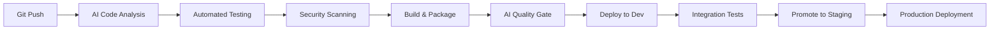
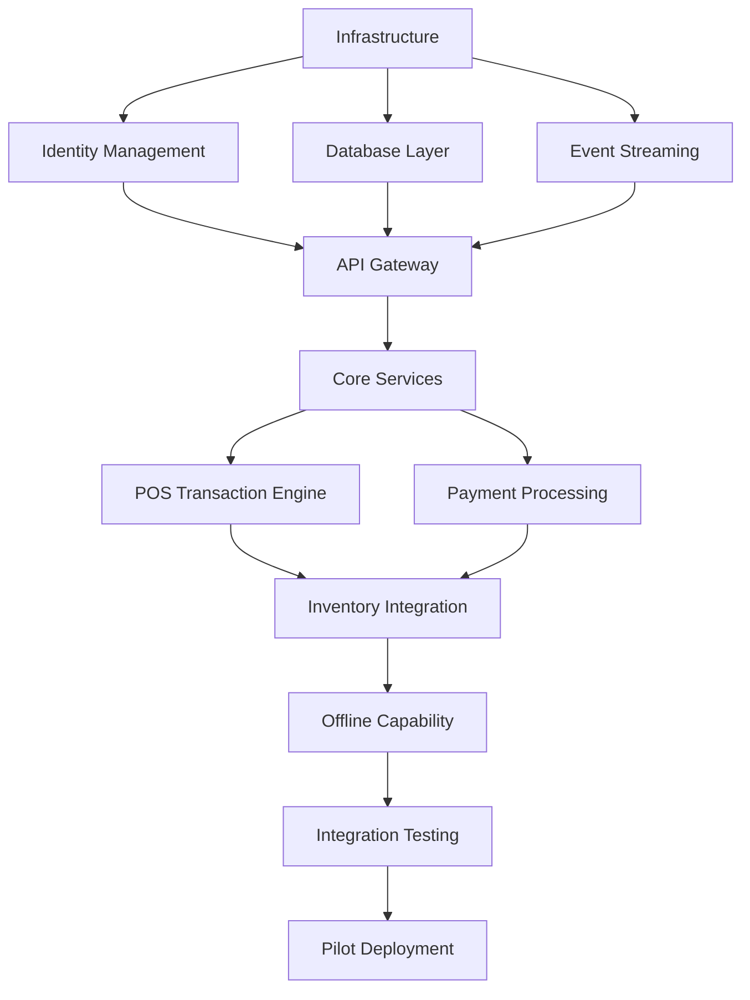

# Q1 2026 Phase 1: AI-Native Foundation - Comprehensive Kickoff Plan
## Jian Cha Tea Unity Suite Implementation

### Executive Summary

**Program**: Jian Cha Tea Unity Suite - Phase 1: AI-Native Foundation  
**Timeline**: Q1 2026 - Q2 2026 (26 weeks)  
**Budget**: 27.9M THB ($782K USD)  
**Team Size**: 16-22 members (peak in Q2)  
**AI Productivity Target**: 42% development efficiency gain  
**Success Criteria**: Core infrastructure + POS system operational in 10 pilot stores

This kickoff plan represents a strategic shift to an AI-native development approach, leveraging mature 2026 AI development tools and methodologies to deliver the foundation platform 6 months faster than traditional approaches while maintaining superior code quality and reducing long-term technical debt.

---

## 1. Pre-Kickoff Preparation (January 2026)

### 1.1 Team Formation and Onboarding Requirements

#### Core Team Assembly (Weeks 1-2 of January)
**Leadership Team** (Start Date: January 6, 2026):
- **Technical Architect** (1): Senior level, 8+ years, AI-native architecture experience
- **Project Manager** (1): Certified PMP/SAFe, experience with AI-augmented teams
- **Product Owner** (1): Business domain expertise, experience with franchise systems

**Engineering Team** (Start Date: January 13, 2026):
- **Senior Full-Stack Developers** (4): 5-8 years experience, AI tool proficiency
- **DevOps Engineer** (1): Kubernetes + AWS expertise, GitOps experience  
- **Security Engineer** (1): PCI DSS compliance experience, cloud security

**Specialized Team** (Start Date: January 20, 2026):
- **Mid-Level Developers** (4): 3-5 years experience, willingness to adopt AI tools
- **QA Lead** (1): Test automation expertise, AI testing tool experience
- **Business Analyst** (1): Requirements gathering, franchise domain knowledge

#### Pre-Employment AI Skill Assessment
**Required Competencies** (verified during hiring):
- **GitHub Copilot**: Basic proficiency demonstrated
- **AI-Assisted Code Review**: Understanding of tools and best practices
- **Prompt Engineering**: Ability to effectively communicate with AI coding assistants
- **AI Ethics**: Understanding of responsible AI development practices

### 1.2 Development Environment Setup with 2026 Tools

#### AI-Native Development Stack Procurement
**Enterprise AI Tool Licenses** (Order by December 15, 2025):

| Tool Category | Primary Tool | Secondary/Alternative | Monthly Cost (22 users) |
|---------------|--------------|----------------------|-------------------------|
| **AI Code Assistant** | GitHub Copilot Business | Cursor Pro | $484 + $432 = $916 |
| **AI Code Review** | DeepCode (Snyk) | SonarQube AI | $330 |
| **AI Testing** | Testim AI | Mabl | $440 |
| **AI Architecture** | Claude AI API (Team) | GPT-4 API | $240 + $200 = $440 |
| **AI Documentation** | Mintlify | GitBook AI | $220 |
| **AI Project Management** | Monday.com AI | Notion AI | $350 |

**Total Monthly AI Tools**: $2,926 ($32,186 annually)

#### Development Infrastructure (Provision by January 15, 2026)

**Cloud Infrastructure Setup**:
- **AWS Multi-Region**: Singapore (primary), US-West (secondary)
- **Kubernetes Clusters**: EKS clusters in both regions
- **Development Environments**: Dedicated namespaces per developer
- **CI/CD Pipeline**: GitLab CI with ArgoCD GitOps deployment
- **Monitoring Stack**: Prometheus + Grafana + ELK + Jaeger

**Developer Hardware Requirements**:
- **Laptops**: MacBook Pro M3 Pro (16GB RAM minimum) or equivalent PC
- **AI Acceleration**: Ensure hardware supports AI tool local processing
- **External Monitors**: Dual 4K monitors for enhanced productivity
- **Development Containers**: Docker Desktop with AI tool integrations

### 1.3 Initial Infrastructure Provisioning

#### Cloud Foundation (Complete by January 25, 2026)

**Week 1 (Jan 6-10)**: AWS Account Setup and Governance
- Multi-account AWS organization setup
- IAM policies and role-based access control
- Cost allocation tags and billing alerts
- Security baseline configuration (GuardDuty, Config, CloudTrail)

**Week 2 (Jan 13-17)**: Core Infrastructure Deployment
- VPC setup with public/private subnets
- EKS cluster deployment with node groups
- RDS PostgreSQL setup with encryption
- ElastiCache Redis cluster configuration

**Week 3 (Jan 20-24)**: Developer Services and Tools
- GitLab instance deployment and configuration
- Container registry setup
- Monitoring stack deployment
- Developer access and VPN configuration

**Week 4 (Jan 27-31)**: AI Integration and Testing
- AI tool integrations with development pipeline
- Security scanning automation
- Load testing environment setup
- Disaster recovery testing

### 1.4 Vendor/Partner Agreements Needed

#### Critical Vendor Contracts (Finalize by December 31, 2025)

**AI Tool Vendors**:
- **GitHub**: Copilot Business license agreement
- **Anthropic**: Claude API enterprise agreement with SLA
- **OpenAI**: GPT-4 API business agreement
- **Cursor**: Professional team licenses

**Infrastructure Partners**:
- **AWS**: Enterprise Support Agreement with Technical Account Manager
- **GitLab**: Premium support for CI/CD infrastructure
- **Auth0**: Enterprise identity management agreement
- **PagerDuty**: Incident management and alerting service

**Compliance and Security**:
- **Security Auditing Firm**: Q2 PCI DSS Level 1 assessment
- **Legal Counsel**: AI tool usage compliance review
- **Insurance Provider**: Cyber liability coverage update

### 1.5 Budget Allocation and Approval Gates

#### Phase 1 Budget Breakdown (Q1-Q2 2026)

| Category | Q1 2026 | Q2 2026 | Total | Percentage |
|----------|---------|---------|-------|------------|
| **Personnel** | 4,596,000 THB | 6,264,000 THB | 10,860,000 THB | 67% |
| **AI Tools & Licenses** | 293,910 THB | 293,910 THB | 587,820 THB | 4% |
| **Infrastructure** | 327,000 THB | 360,000 THB | 687,000 THB | 4% |
| **Training & Certification** | 192,000 THB | 116,000 THB | 308,000 THB | 2% |
| **Vendor Services** | 245,000 THB | 168,000 THB | 413,000 THB | 3% |
| **Contingency (12%)** | 1,417,800 THB | 1,928,400 THB | 3,346,200 THB | 20% |
| **TOTAL** | **7,071,710 THB** | **9,130,310 THB** | **16,202,020 THB** | **100%** |

#### Approval Gates and Governance

**Gate 1 - Budget Authorization** (December 15, 2025):
- Executive approval for full Phase 1 budget
- Quarterly spending limits and controls
- Emergency budget procedures

**Gate 2 - Team Formation** (January 15, 2026):
- Core team hiring completion
- AI tool procurement completion
- Development environment readiness

**Gate 3 - Infrastructure Readiness** (February 1, 2026):
- Production-ready infrastructure deployment
- Security audit completion
- Disaster recovery validation

**Gate 4 - Sprint 0 Completion** (February 15, 2026):
- Development processes established
- AI-augmented development workflow proven
- First working software demonstration

---

## 2. Kickoff Week Activities (Week 1, Q1 2026)

### 2.1 Day-by-Day Agenda for Kickoff Week

#### Monday, February 3, 2026: Vision and Strategy

**9:00-10:30 AM**: **Executive Kickoff Session**
- **Attendees**: Executive sponsors, all team members, key stakeholders
- **Agenda**:
  - CEO welcome and strategic context
  - Phase 1 success criteria and business impact
  - AI-native development approach explanation
  - Q&A and team introductions
- **Deliverable**: Recorded session for future reference

**11:00-12:30 PM**: **Technical Architecture Deep Dive**
- **Attendees**: All technical team members, architects
- **Agenda**:
  - System architecture overview
  - Microservices design patterns
  - AI-assisted development workflows
  - Technology stack deep dive
- **Deliverable**: Architecture decision records updated

**2:00-3:30 PM**: **AI-Native Development Methodology**
- **Attendees**: All developers, QA team
- **Agenda**:
  - AI tool ecosystem overview
  - Coding best practices with AI assistants
  - Code quality and review processes
  - AI ethics and responsible development
- **Deliverable**: AI development guidelines document

**4:00-5:00 PM**: **Team Building and Culture Setting**
- **Attendees**: Entire team
- **Agenda**:
  - Team working agreements
  - Communication protocols
  - Innovation mindset and experimentation culture
  - Social activities and team bonding

#### Tuesday, February 4, 2026: Technical Foundation

**9:00-10:30 AM**: **Development Environment Workshop**
- **Attendees**: All developers, DevOps team
- **Agenda**:
  - AI-integrated development environment setup
  - Local development with AI tools
  - Container-based development workflows
  - Troubleshooting and support procedures
- **Deliverable**: Environment setup checklist completion

**11:00-12:30 PM**: **Security and Compliance Framework**
- **Attendees**: All team members, security specialist
- **Agenda**:
  - Security-first development principles
  - PCI DSS compliance requirements
  - Secure coding with AI assistants
  - Vulnerability management processes
- **Deliverable**: Security development guidelines

**2:00-3:30 PM**: **CI/CD and GitOps Workflow**
- **Attendees**: All developers, DevOps team
- **Agenda**:
  - GitLab CI/CD pipeline walkthrough
  - ArgoCD GitOps deployment model
  - AI-assisted testing and quality gates
  - Release management procedures
- **Deliverable**: CI/CD workflow documentation

**4:00-5:00 PM**: **Quality Assurance and Testing Strategy**
- **Attendees**: All developers, QA team
- **Agenda**:
  - Test-driven development with AI
  - Automated testing strategies
  - Performance and security testing
  - Quality metrics and reporting
- **Deliverable**: Testing strategy document

#### Wednesday, February 5, 2026: Business Alignment

**9:00-10:30 AM**: **Business Requirements Deep Dive**
- **Attendees**: Product owner, business analyst, developers
- **Agenda**:
  - Franchise management domain expertise
  - User personas and journey mapping
  - Requirements prioritization and acceptance criteria
  - Business rule definition and validation
- **Deliverable**: Requirements traceability matrix

**11:00-12:30 PM**: **Product Backlog Refinement**
- **Attendees**: Product owner, technical lead, scrum master
- **Agenda**:
  - Epic breakdown and story writing
  - Effort estimation with AI productivity factors
  - Sprint planning for first 4 sprints
  - Definition of done and acceptance criteria
- **Deliverable**: Refined product backlog

**2:00-3:30 PM**: **Stakeholder Engagement Plan**
- **Attendees**: Product owner, project manager, business representatives
- **Agenda**:
  - Stakeholder mapping and communication matrix
  - Demo and review schedule
  - Feedback collection mechanisms
  - Change management approach
- **Deliverable**: Stakeholder engagement plan

**4:00-5:00 PM**: **Risk Assessment and Mitigation**
- **Attendees**: Project manager, technical leads, key team members
- **Agenda**:
  - Technical risk identification and assessment
  - Business and operational risks
  - AI-specific risks and mitigation strategies
  - Contingency planning
- **Deliverable**: Risk register and mitigation plans

#### Thursday, February 6, 2026: Process and Methodology

**9:00-10:30 AM**: **Agile and Scrum Processes**
- **Attendees**: Entire team, scrum master
- **Agenda**:
  - Scrum roles and responsibilities
  - Sprint ceremonies and cadence
  - AI-augmented estimation techniques
  - Team velocity and capacity planning
- **Deliverable**: Team charter and working agreements

**11:00-12:30 PM**: **Communication and Collaboration Tools**
- **Attendees**: Entire team
- **Agenda**:
  - Communication channels and protocols
  - Documentation standards and tools
  - Knowledge sharing mechanisms
  - Remote collaboration best practices
- **Deliverable**: Communication and collaboration guidelines

**2:00-3:30 PM**: **Monitoring and Observability Setup**
- **Attendees**: DevOps team, developers
- **Agenda**:
  - Monitoring stack configuration
  - Custom metrics and alerting
  - Log aggregation and analysis
  - Performance monitoring with AI insights
- **Deliverable**: Monitoring and alerting configuration

**4:00-5:00 PM**: **Innovation and Experimentation Framework**
- **Attendees**: Entire team
- **Agenda**:
  - Innovation time allocation (20% rule)
  - Experimentation processes and approval
  - AI tool evaluation and adoption criteria
  - Knowledge sharing and best practice propagation
- **Deliverable**: Innovation framework document

#### Friday, February 7, 2026: Planning and Commitment

**9:00-11:00 AM**: **Sprint 0 Planning Session**
- **Attendees**: Entire development team
- **Agenda**:
  - Sprint 0 objectives and deliverables
  - Task breakdown and assignment
  - Environment preparation tasks
  - Success criteria definition
- **Deliverable**: Sprint 0 plan and commitments

**11:30-12:30 PM**: **Success Metrics and KPI Definition**
- **Attendees**: Project manager, product owner, technical leads
- **Agenda**:
  - Phase 1 success metrics definition
  - KPI tracking and reporting mechanisms
  - Business value measurement approach
  - Technical performance indicators
- **Deliverable**: Success metrics dashboard design

**2:00-3:30 PM**: **Go-Live Planning and Preparation**
- **Attendees**: Entire team, business stakeholders
- **Agenda**:
  - Pilot store selection criteria
  - Go-live readiness checklist
  - Support and maintenance planning
  - User training and change management
- **Deliverable**: Go-live preparation plan

**4:00-5:00 PM**: **Kickoff Week Retrospective and Next Steps**
- **Attendees**: Entire team
- **Agenda**:
  - Kickoff week retrospective
  - Action items and follow-up tasks
  - First sprint commitment ceremony
  - Celebration and team bonding
- **Deliverable**: Action item list and sprint commitment

### 2.2 Stakeholder Alignment Sessions

#### Executive Steering Committee Session
**Date**: Monday, February 3, 2026 (Post-kickoff)  
**Duration**: 2 hours  
**Attendees**: CEO, CTO, CFO, Head of Operations, Project Sponsor

**Objectives**:
- Confirm Phase 1 scope and success criteria
- Review AI-native development approach and expected benefits
- Establish governance and decision-making processes
- Approve quarterly checkpoint reviews and go/no-go criteria

**Key Decisions Required**:
- Budget approval for contractor hiring
- Pilot store selection approval
- Risk tolerance and mitigation approach approval
- Escalation procedures for critical issues

#### Franchise Partner Briefing
**Date**: Tuesday, February 4, 2026  
**Duration**: 1.5 hours  
**Attendees**: Franchise partners, Operations team, Product owner

**Objectives**:
- Present Phase 1 implementation plan and timeline
- Gather franchise partner requirements and feedback
- Establish change management and training approach
- Define support model during rollout

**Deliverables**:
- Franchise partner feedback incorporation plan
- Training and support resource requirements
- Communication plan for ongoing updates

#### Technology Partner Alignment
**Date**: Wednesday, February 5, 2026  
**Duration**: 2 hours  
**Attendees**: AWS TAM, Auth0 representative, GitLab CSM, Internal team

**Objectives**:
- Confirm technical architecture alignment
- Review support and escalation procedures
- Establish joint go-to-market timeline
- Define success metrics for partnerships

### 2.3 Technical Architecture Deep Dives

#### Session 1: Cloud-Native Infrastructure Architecture
**Focus**: Kubernetes, microservices, and scalability patterns
**Duration**: 3 hours
**Participants**: DevOps team, Backend developers, Technical architect

**Deep Dive Topics**:
- **Container Orchestration**: EKS cluster design and node group configuration
- **Service Mesh Evaluation**: Istio implementation timeline and decision criteria
- **Auto-scaling Strategy**: HPA, VPA, and cluster autoscaler configuration
- **Network Security**: Network policies, ingress controllers, and TLS management
- **Observability**: Distributed tracing, metrics collection, and log aggregation

#### Session 2: Data Architecture and Flow
**Focus**: Database design, caching strategy, and data synchronization
**Duration**: 2.5 hours
**Participants**: Backend developers, Database specialist, Data engineer

**Deep Dive Topics**:
- **Database Sharding**: PostgreSQL sharding strategy by franchise region
- **Cache Architecture**: Multi-level caching with Redis and CDN
- **Event-Driven Architecture**: Kafka topic design and event schema
- **Data Consistency**: Eventual consistency patterns and conflict resolution
- **Backup and Recovery**: RTO/RPO requirements and disaster recovery procedures

#### Session 3: Security-First Design Patterns
**Focus**: Zero-trust security, encryption, and compliance
**Duration**: 2 hours
**Participants**: Security engineer, All developers, Technical architect

**Deep Dive Topics**:
- **Identity and Access Management**: OAuth 2.0/OIDC implementation with Auth0
- **Encryption Strategy**: At-rest and in-transit encryption with AWS KMS
- **API Security**: Rate limiting, authentication, and authorization patterns
- **Compliance Framework**: PCI DSS Level 1 requirements and implementation
- **Security Testing**: Automated security scanning and penetration testing

### 2.4 Team Charter and Working Agreements

#### Core Working Principles

**AI-Native Development Mindset**:
1. **AI-First Approach**: Consider AI assistance for all development tasks
2. **Human Oversight**: Always review and validate AI-generated code
3. **Continuous Learning**: Actively improve AI prompting and usage skills
4. **Ethical AI Use**: Follow responsible AI development practices
5. **Knowledge Sharing**: Share AI best practices and learnings across team

**Collaboration Standards**:
1. **Daily Standups**: 15-minute focused updates on progress and blockers
2. **Pair Programming**: Regular pair programming sessions, especially for complex features
3. **Code Reviews**: All code reviewed by at least one other developer
4. **Documentation**: Comprehensive documentation for all architectural decisions
5. **Retrospectives**: Bi-weekly retrospectives to improve processes

**Quality Standards**:
1. **Test Coverage**: Minimum 80% test coverage for all new code
2. **Performance**: All APIs must respond within 200ms (95th percentile)
3. **Security**: Security-first development with automated vulnerability scanning
4. **Accessibility**: WCAG 2.1 AA compliance for all user interfaces
5. **Maintainability**: Clean code principles with clear abstractions

#### Communication Protocols

**Synchronous Communication**:
- **Daily Standups**: 9:00 AM Bangkok time (all team members)
- **Sprint Planning**: Every two weeks, 2-hour session
- **Sprint Reviews**: End of each sprint, 1-hour session
- **Retrospectives**: End of each sprint, 1-hour session
- **Architecture Reviews**: Weekly, 1-hour session for major decisions

**Asynchronous Communication**:
- **Slack**: Primary communication channel for quick questions and updates
- **GitLab Issues**: All work tracked in GitLab with clear descriptions
- **Documentation**: Confluence for all team documentation
- **Email**: Formal communications and external stakeholder updates
- **Video Messages**: Loom for complex explanations and knowledge sharing

**Emergency Procedures**:
- **Production Issues**: Immediate Slack notification + PagerDuty alert
- **Security Incidents**: Direct escalation to security engineer and CTO
- **Vendor Issues**: Contact vendor support and notify project manager
- **Team Member Unavailability**: 24-hour advance notice for planned absences

### 2.5 Success Criteria Definition

#### Phase 1 Technical Success Criteria

**Infrastructure Readiness** (End of Sprint 0):
- [x] Multi-region AWS infrastructure operational
- [x] Kubernetes clusters with monitoring and logging
- [x] CI/CD pipeline with automated testing and deployment
- [x] Security baseline with PCI DSS compliance framework
- [x] AI development tools integrated and functional

**Core Platform Services** (End of Sprint 6):
- [x] Identity and Access Management system operational
- [x] API Gateway with rate limiting and monitoring
- [x] Database clusters with backup and recovery procedures
- [x] Event streaming platform with Kafka
- [x] Notification service for email and SMS

**POS System MVP** (End of Sprint 10):
- [x] Transaction processing with offline capability
- [x] Payment integration with major processors
- [x] Inventory integration and real-time updates
- [x] Receipt printing and customer notifications
- [x] Multi-store management capabilities

**Pilot Deployment** (End of Sprint 13):
- [x] 10 pilot stores operational with full functionality
- [x] 1,000+ transactions processed successfully
- [x] 99.5% uptime during business hours
- [x] PCI DSS Level 1 compliance validated
- [x] User feedback collection and analysis

#### Business Success Criteria

**Operational Excellence**:
- **Transaction Processing**: 1,000+ daily transactions across pilot stores
- **System Reliability**: 99.5% uptime during business hours
- **Performance**: <2 second response times for all user interactions
- **Security**: Zero security incidents or data breaches
- **Compliance**: PCI DSS Level 1 certification achieved

**User Adoption and Satisfaction**:
- **Staff Training**: 100% staff trained and certified on new system
- **User Satisfaction**: >80% satisfaction score from pilot store surveys
- **Feature Adoption**: >90% of core features actively used
- **Support Tickets**: <5 support tickets per store per week
- **Change Management**: Smooth transition with minimal business disruption

**AI Development Productivity**:
- **Code Generation**: 40% faster initial development compared to baseline
- **Bug Reduction**: 30% fewer production bugs compared to traditional development
- **Testing Efficiency**: 35% reduction in manual testing effort
- **Documentation Quality**: 50% faster technical documentation creation
- **Knowledge Transfer**: Improved code readability and maintainability

#### Risk-Based Success Metrics

**Technical Risk Mitigation**:
- **Disaster Recovery**: RTO <15 minutes, RPO <5 minutes validated
- **Security Penetration Testing**: No critical vulnerabilities identified
- **Performance Load Testing**: System handles 10x expected traffic
- **Data Integrity**: 100% data consistency validation across all systems
- **Integration Testing**: All external integrations tested and validated

**Business Risk Mitigation**:
- **Change Management**: <5% staff turnover during implementation
- **Customer Impact**: <1% customer complaint increase during transition
- **Revenue Protection**: Zero revenue loss due to system issues
- **Compliance Audit**: 100% compliance audit pass rate
- **Vendor SLA**: All vendors meeting contracted SLA requirements

---

## 3. Sprint 0 Planning (Weeks 2-3)

### 3.1 Development Environment Standardization

#### Unified Development Environment Configuration

**Container-Based Development**:
```yaml
# Standard Dev Container Configuration
FROM node:18-alpine AS frontend
FROM openjdk:17-alpine AS backend
FROM python:3.11-alpine AS data-services

# AI Tool Integration
COPY --from=copilot /usr/local/bin/copilot-cli /usr/local/bin/
COPY --from=cursor /opt/cursor /opt/cursor

# Development Tools
RUN apk add --no-cache \
    git \
    curl \
    jq \
    kubectl \
    helm \
    terraform \
    docker-cli
```

**IDE Standardization**:
- **Primary IDE**: Visual Studio Code with standardized extensions
- **Secondary IDE**: Cursor IDE for AI-native development
- **Required Extensions**:
  - GitHub Copilot
  - ESLint and Prettier
  - SonarLint
  - Docker
  - Kubernetes
  - GitLens

**Local Development Stack**:
- **Container Runtime**: Docker Desktop with Kubernetes enabled
- **Local Cluster**: minikube or k3d for local testing
- **Database**: PostgreSQL and Redis containers
- **Message Queue**: Kafka container for local development
- **Monitoring**: Local Prometheus and Grafana setup

#### Environment Parity and Configuration

**Environment Configuration Matrix**:
| Component | Local | Development | Testing | Staging | Production |
|-----------|-------|-------------|---------|---------|------------|
| **Kubernetes** | minikube | EKS | EKS | EKS | EKS (Multi-region) |
| **Database** | Container | RDS | RDS | RDS | RDS (Multi-AZ) |
| **Cache** | Container | ElastiCache | ElastiCache | ElastiCache | ElastiCache (Cluster) |
| **Monitoring** | Local | Full Stack | Full Stack | Full Stack | Full Stack + Alerting |
| **AI Tools** | All | All | Limited | Limited | None |

**Configuration Management**:
- **Infrastructure as Code**: Terraform modules for all environments
- **Application Configuration**: Helm charts with environment-specific values
- **Secrets Management**: AWS Secrets Manager with IAM role-based access
- **Environment Promotion**: GitOps-based promotion between environments

### 3.2 CI/CD Pipeline Setup with GitHub Actions

#### AI-Enhanced CI/CD Pipeline Architecture



**Stage 1: AI-Assisted Code Analysis**
```yaml
# .gitlab-ci.yml excerpt
ai-code-review:
  stage: analysis
  script:
    - copilot-analyze --files="${CI_COMMIT_DIFF_FILES}"
    - sonarqube-scan --ai-enhanced
    - security-scan --with-ai-suggestions
    - code-quality-check --ai-feedback
  artifacts:
    reports:
      codequality: code-quality.json
      security: security-report.json
```

**Stage 2: Automated Testing with AI**
```yaml
testing:
  stage: test
  parallel:
    matrix:
      - TEST_TYPE: [unit, integration, e2e, performance]
  script:
    - ai-test-generator --test-type=${TEST_TYPE}
    - npm run test:${TEST_TYPE}
    - ai-test-analyzer --results=test-results.xml
  coverage: '/Coverage: \d+\.\d+%/'
```

**Stage 3: AI-Powered Deployment**
```yaml
deploy:
  stage: deploy
  script:
    - ai-deployment-analyzer --target-env=${CI_ENVIRONMENT_NAME}
    - terraform plan -ai-optimized
    - terraform apply --auto-approve
    - kubectl apply -f k8s-manifests/
    - ai-deployment-validator --environment=${CI_ENVIRONMENT_NAME}
```

#### Quality Gates and Automation

**AI-Enhanced Quality Gates**:
1. **Code Quality**: SonarQube with AI-powered rule suggestions
2. **Security**: Snyk with AI threat analysis
3. **Performance**: Lighthouse CI with AI optimization recommendations  
4. **Accessibility**: axe-core with AI-suggested fixes
5. **Documentation**: AI-generated documentation validation

**Automated Decision Making**:
- **Auto-merge**: For AI-validated low-risk changes
- **Auto-rollback**: For performance or error threshold breaches
- **Auto-scaling**: Based on AI-predicted traffic patterns
- **Auto-optimization**: Database queries and API performance

### 3.3 AI Tool Integration (GitHub Copilot X, Cursor IDE)

#### GitHub Copilot X Enterprise Integration

**Advanced Copilot Features**:
```json
{
  "copilot": {
    "enable": true,
    "suggestions": {
      "enabled": true,
      "includeCompletionsWithin": ["comments", "strings"],
      "enableAutoCompletions": true
    },
    "advanced": {
      "enableCopilotChat": true,
      "enableCopilotVoice": true,
      "enableCopilotCLI": true,
      "enablePullRequestSummary": true
    },
    "customization": {
      "businessDomain": "franchise-management",
      "codingStandards": "./docs/coding-standards.md",
      "architectureContext": "./docs/architecture/"
    }
  }
}
```

**Copilot Chat Integration**:
- **Architecture Questions**: Integrated with system architecture documentation
- **Business Logic**: Context-aware suggestions based on franchise domain
- **Code Review**: Automated code review comments and suggestions
- **Testing**: Test case generation based on business requirements

#### Cursor IDE Professional Setup

**AI-Native Development Environment**:
```typescript
// cursor.config.ts
export default {
  ai: {
    provider: 'claude-3',
    model: 'claude-3-sonnet',
    context: {
      codebase: true,
      documentation: true,
      tests: true,
      businessRules: './docs/business-rules/'
    },
    features: {
      codeCompletion: true,
      refactoring: true,
      bugFix: true,
      testGeneration: true,
      documentationGeneration: true
    }
  },
  workflow: {
    gitIntegration: true,
    liveCollaboration: true,
    aiPairProgramming: true
  }
}
```

**Custom AI Prompts and Templates**:
- **Component Generator**: AI prompts for React component generation
- **API Endpoint**: Standardized API endpoint creation with validation
- **Database Schema**: AI-assisted database schema design
- **Test Suite**: Comprehensive test suite generation
- **Documentation**: Automated documentation generation

#### AI Tool Training and Best Practices

**Team Training Program** (Week 2-3):
- **Day 1**: GitHub Copilot fundamentals and prompt engineering
- **Day 2**: Cursor IDE advanced features and workflow integration
- **Day 3**: AI-assisted testing and quality assurance
- **Day 4**: AI code review and collaboration best practices
- **Day 5**: Custom AI prompt development and team sharing

**AI Usage Guidelines**:
1. **Always Review**: Never commit AI-generated code without human review
2. **Context First**: Provide clear context and requirements to AI tools
3. **Incremental**: Use AI for incremental improvements, not entire features
4. **Document**: Document AI-assisted decisions and learnings
5. **Share**: Share effective prompts and techniques with the team

### 3.4 Base Infrastructure Deployment (AWS/GCP)

#### Multi-Cloud Infrastructure Strategy

**Primary Cloud (AWS) - Production Workloads**:
```hcl
# terraform/aws/main.tf
module "vpc" {
  source = "./modules/vpc"
  
  cidr_block = "10.0.0.0/16"
  availability_zones = ["ap-southeast-1a", "ap-southeast-1b", "ap-southeast-1c"]
  
  # AI-optimized instance types
  instance_types = ["m6i.large", "c6i.xlarge", "r6i.large"]
}

module "eks" {
  source = "./modules/eks"
  
  cluster_name = "jianchatea-prod"
  node_groups = {
    general = {
      instance_types = ["m6i.large"]
      min_size = 3
      max_size = 10
    }
    ai_workloads = {
      instance_types = ["c6i.2xlarge"]
      min_size = 1  
      max_size = 5
    }
  }
}

module "rds" {
  source = "./modules/rds"
  
  engine = "postgres"
  engine_version = "15.4"
  instance_class = "db.r6i.xlarge"
  multi_az = true
  backup_retention_period = 30
}
```

**Secondary Cloud (GCP) - Disaster Recovery**:
```hcl
# terraform/gcp/main.tf
module "gke" {
  source = "./modules/gke"
  
  cluster_name = "jianchatea-dr"
  region = "asia-southeast1"
  
  node_pools = [{
    name = "default-pool"
    machine_type = "e2-standard-4"
    min_count = 1
    max_count = 5
  }]
}

module "cloud_sql" {
  source = "./modules/cloud-sql"
  
  database_version = "POSTGRES_15"
  tier = "db-custom-4-8192"
  backup_enabled = true
  point_in_time_recovery_enabled = true
}
```

#### Infrastructure Automation and Monitoring

**GitOps Infrastructure Management**:
```yaml
# infrastructure/applications/infrastructure.yaml
apiVersion: argoproj.io/v1alpha1
kind: Application
metadata:
  name: infrastructure
  namespace: argocd
spec:
  project: default
  source:
    repoURL: https://gitlab.com/jianchatea/infrastructure
    targetRevision: main
    path: terraform/environments/production
  destination:
    server: https://kubernetes.default.svc
    namespace: infrastructure
  syncPolicy:
    automated:
      prune: true
      selfHeal: true
```

**Monitoring and Alerting Setup**:
```yaml
# monitoring/prometheus-config.yaml
global:
  scrape_interval: 15s
  evaluation_interval: 15s

rule_files:
  - "ai-performance-rules.yml"
  - "business-metrics-rules.yml"
  
scrape_configs:
  - job_name: 'kubernetes-pods'
    kubernetes_sd_configs:
      - role: pod
    relabel_configs:
      - source_labels: [__meta_kubernetes_pod_annotation_prometheus_io_scrape]
        action: keep
        regex: true
```

### 3.5 Security Framework Implementation

#### Zero-Trust Security Architecture

**Identity and Access Management**:
```yaml
# auth0-configuration.yaml
tenant:
  domain: jianchatea-dev.auth0.com
  region: ap-southeast-1
  
applications:
  - name: jianchatea-spa
    type: spa
    allowed_origins:
      - "https://app.jianchatea.com"
      - "https://staging.jianchatea.com"
    jwt_configuration:
      lifetime_in_seconds: 3600
      
  - name: jianchatea-api
    type: regular_web_application
    jwt_configuration:
      alg: RS256
      
rules:
  - name: "Add user metadata"
    script: |
      function addUserMetadata(user, context, callback) {
        // Add franchise-specific claims
        context.idToken['https://jianchatea.com/franchise_id'] = user.user_metadata.franchise_id;
        context.idToken['https://jianchatea.com/roles'] = user.app_metadata.roles;
        callback(null, user, context);
      }
```

**API Security Framework**:
```typescript
// security/api-gateway.ts
import { RateLimiter } from './rate-limiter';
import { JWTValidator } from './jwt-validator';
import { APIKeyValidator } from './api-key-validator';

export class APISecurityMiddleware {
  private rateLimiter = new RateLimiter({
    windowMs: 15 * 60 * 1000, // 15 minutes
    max: 100, // limit each IP to 100 requests per windowMs
    skipSuccessfulRequests: true
  });

  private jwtValidator = new JWTValidator({
    issuer: 'https://jianchatea-dev.auth0.com/',
    audience: 'https://api.jianchatea.com',
    algorithms: ['RS256']
  });

  async validateRequest(req: Request, res: Response, next: NextFunction) {
    try {
      // Rate limiting
      await this.rateLimiter.checkLimit(req.ip);
      
      // JWT validation
      const token = this.extractToken(req);
      const payload = await this.jwtValidator.verify(token);
      
      // Add user context
      req.user = payload;
      next();
    } catch (error) {
      res.status(401).json({ error: 'Unauthorized' });
    }
  }
}
```

#### PCI DSS Compliance Framework

**Payment Data Tokenization**:
```typescript
// security/tokenization.ts
export class PaymentTokenizer {
  private vaultClient: VaultClient;
  
  constructor(vaultConfig: VaultConfig) {
    this.vaultClient = new VaultClient(vaultConfig);
  }
  
  async tokenizeCard(cardData: CardData): Promise<TokenizedCard> {
    // Validate card data
    this.validateCardData(cardData);
    
    // Generate token
    const token = await this.vaultClient.tokenize({
      data: cardData,
      ttl: '24h',
      usage: 'single-use'
    });
    
    // Return tokenized data (no sensitive information)
    return {
      token: token.id,
      last_four: cardData.number.slice(-4),
      brand: this.detectCardBrand(cardData.number),
      exp_month: cardData.exp_month,
      exp_year: cardData.exp_year
    };
  }
  
  async detokenizeCard(token: string): Promise<CardData> {
    return await this.vaultClient.detokenize(token);
  }
}
```

**Security Monitoring and Incident Response**:
```yaml
# security/security-monitoring.yaml
apiVersion: v1
kind: ConfigMap
metadata:
  name: security-rules
data:
  rules.yaml: |
    groups:
    - name: security-alerts
      rules:
      - alert: SuspiciousAPIActivity
        expr: rate(http_requests_total{status=~"4..|5.."}[5m]) > 0.1
        for: 2m
        labels:
          severity: warning
        annotations:
          summary: "High error rate detected"
          
      - alert: UnauthorizedAccess
        expr: increase(auth_failed_total[5m]) > 10
        for: 1m
        labels:
          severity: critical
        annotations:
          summary: "Multiple failed authentication attempts"
          
      - alert: DataExfiltrationAttempt
        expr: rate(bytes_sent[1m]) > 1000000
        for: 30s
        labels:
          severity: critical
        annotations:
          summary: "Unusual data transfer detected"
```

---

## 4. Phase 1 Delivery Schedule (Weeks 4-26)

### 4.1 2-Week Sprint Structure

#### Sprint Overview and Cadence

**Sprint Duration**: 2 weeks (10 working days)  
**Team Velocity Target**: 80-120 story points per sprint (AI-augmented)  
**Sprint Ceremonies**:
- **Sprint Planning**: Monday, Week 1 (2 hours)
- **Daily Standups**: Every weekday (15 minutes)
- **Sprint Review**: Friday, Week 2 (1 hour)
- **Sprint Retrospective**: Friday, Week 2 (1 hour)
- **Backlog Refinement**: Wednesday, Week 2 (1 hour)

#### AI-Enhanced Sprint Planning Process

**Planning Phase 1: AI-Assisted Story Analysis**
```typescript
// sprint-planning/ai-story-analyzer.ts
interface StoryAnalysis {
  complexity: 'low' | 'medium' | 'high' | 'very-high';
  aiAssistancePotential: number; // 0-100%
  estimatedEffort: number; // story points
  dependencies: string[];
  riskFactors: string[];
  testingStrategy: string;
}

class AIStoryAnalyzer {
  async analyzeUserStory(story: UserStory): Promise<StoryAnalysis> {
    const prompt = `
      Analyze this user story for sprint planning:
      Title: ${story.title}
      Description: ${story.description}
      Acceptance Criteria: ${story.acceptanceCriteria.join('\n')}
      
      Consider:
      1. Technical complexity and dependencies
      2. AI tool assistance potential
      3. Testing requirements
      4. Risk factors
      5. Integration complexity
    `;
    
    return await this.aiService.analyze(prompt, {
      model: 'claude-3-sonnet',
      context: 'franchise-management-system',
      previousAnalyses: this.getHistoricalData()
    });
  }
}
```

**Planning Phase 2: Capacity Planning with AI Productivity**
```typescript
// sprint-planning/capacity-calculator.ts
class SprintCapacityCalculator {
  calculateTeamCapacity(sprintNumber: number): SprintCapacity {
    const baseCapacity = this.getBaseTeamCapacity();
    const aiProductivityGain = this.calculateAIProductivityGain(sprintNumber);
    const teamVelocityTrend = this.getVelocityTrend();
    
    return {
      totalPoints: Math.floor(baseCapacity * aiProductivityGain * teamVelocityTrend),
      availableDays: this.calculateAvailableDays(),
      aiAssistedTasks: this.identifyAIAssistedTasks(),
      riskBuffer: Math.floor(baseCapacity * 0.15) // 15% buffer
    };
  }
  
  private calculateAIProductivityGain(sprintNumber: number): number {
    // Productivity increases as team gets better with AI tools
    const maxGain = 1.42; // 42% productivity increase
    const learningCurve = Math.min(sprintNumber / 8, 1); // Full productivity by sprint 8
    return 1 + (maxGain - 1) * learningCurve;
  }
}
```

### 4.2 Deliverable Milestones for Each Sprint

#### Sprint 1-2: Foundation Infrastructure (Weeks 4-7)

**Sprint 1: Core Infrastructure Setup**
**Goals**: Establish production-ready cloud infrastructure
**Story Points**: 85 (AI-assisted infrastructure automation)

| Epic | User Story | Story Points | AI Assistance Level |
|------|------------|-------------|-------------------|
| **Cloud Setup** | As a DevOps engineer, I want multi-region AWS infrastructure | 13 | High (Terraform generation) |
| **Kubernetes** | As a developer, I want EKS clusters for application deployment | 21 | High (YAML generation) |
| **Monitoring** | As an SRE, I want comprehensive monitoring and alerting | 18 | Medium (Config generation) |
| **Security** | As a security engineer, I want baseline security configuration | 16 | Medium (Policy generation) |
| **CI/CD** | As a developer, I want automated build and deployment pipeline | 17 | High (Pipeline generation) |

**Sprint 1 Deliverables**:
- [x] AWS multi-region VPC with private/public subnets
- [x] EKS clusters with node groups and RBAC
- [x] Prometheus + Grafana monitoring stack
- [x] GitLab CI/CD pipeline with ArgoCD GitOps
- [x] Security baseline with AWS Config and GuardDuty

**Sprint 2: Developer Experience and AI Integration**
**Goals**: Complete AI-native development environment
**Story Points**: 92 (High AI assistance for tooling)

| Epic | User Story | Story Points | AI Assistance Level |
|------|------------|-------------|-------------------|
| **AI Tools** | As a developer, I want AI coding assistants integrated | 15 | Very High (Self-configuring) |
| **Dev Environment** | As a developer, I want consistent local development | 20 | High (Container generation) |
| **Database** | As a backend developer, I want PostgreSQL with Redis caching | 14 | Medium (Schema generation) |
| **API Gateway** | As a developer, I want centralized API management | 19 | High (Config generation) |
| **Testing** | As a QA engineer, I want automated testing framework | 24 | High (Test generation) |

**Sprint 2 Deliverables**:
- [x] GitHub Copilot X and Cursor IDE integration
- [x] Standardized development containers and environments
- [x] PostgreSQL RDS with ElastiCache Redis
- [x] Kong API Gateway with rate limiting and monitoring
- [x] Jest/Cypress testing framework with AI test generation

#### Sprint 3-4: Identity and Access Management (Weeks 8-11)

**Sprint 3: Core Authentication System**
**Goals**: Implement secure authentication and authorization
**Story Points**: 98 (Medium AI assistance for security)

| Epic | User Story | Story Points | AI Assistance Level |
|------|------------|-------------|-------------------|
| **OAuth Setup** | As a user, I want secure login with social providers | 22 | Medium (Integration code) |
| **JWT Management** | As a developer, I want token-based authentication | 18 | High (Token handling) |
| **User Management** | As an admin, I want user lifecycle management | 26 | Medium (CRUD operations) |
| **RBAC** | As a system admin, I want role-based access control | 20 | Medium (Permission logic) |
| **Security** | As a security engineer, I want MFA and security policies | 12 | Low (Security critical) |

**Sprint 3 Deliverables**:
- [x] Auth0 integration with OAuth 2.0/OIDC
- [x] JWT token management with refresh tokens
- [x] User registration and profile management
- [x] Role-based access control (RBAC) system
- [x] Multi-factor authentication (MFA) setup

**Sprint 4: Advanced Identity Features**
**Goals**: Complete identity management with enterprise features
**Story Points**: 87 (Medium AI assistance)

| Epic | User Story | Story Points | AI Assistance Level |
|------|------------|-------------|-------------------|
| **SSO Integration** | As an enterprise user, I want single sign-on | 16 | Medium (SSO protocols) |
| **Audit Logging** | As a compliance officer, I want authentication audit logs | 14 | High (Logging implementation) |
| **API Security** | As a developer, I want secure API endpoints | 19 | Medium (Security middleware) |
| **Session Management** | As a user, I want secure session handling | 15 | High (Session logic) |
| **Testing** | As a QA engineer, I want comprehensive auth testing | 23 | Very High (Test generation) |

**Sprint 4 Deliverables**:
- [x] Enterprise SSO with SAML support
- [x] Comprehensive authentication audit logging
- [x] API security middleware with rate limiting
- [x] Session management with secure cookies
- [x] End-to-end authentication testing suite

#### Sprint 5-8: Core Platform Services (Weeks 12-19)

**Sprint 5: Event Streaming and Messaging**
**Goals**: Implement event-driven architecture foundation
**Story Points**: 105 (High AI assistance for messaging)

| Epic | User Story | Story Points | AI Assistance Level |
|------|------------|-------------|-------------------|
| **Kafka Setup** | As a developer, I want event streaming platform | 25 | Medium (Kafka configuration) |
| **Event Schema** | As a developer, I want standardized event schemas | 18 | High (Schema generation) |
| **Producer/Consumer** | As a developer, I want reliable event publishing/consuming | 22 | High (Event handling code) |
| **Dead Letter Queue** | As an SRE, I want failed message handling | 15 | Medium (Error handling) |
| **Monitoring** | As an SRE, I want event streaming monitoring | 25 | High (Monitoring setup) |

**Sprint 5 Deliverables**:
- [x] Apache Kafka cluster with Zookeeper
- [x] Event schema registry with Avro schemas
- [x] Event producer/consumer libraries
- [x] Dead letter queue handling
- [x] Kafka monitoring and alerting

**Sprint 6: Database Layer and Data Services**
**Goals**: Complete database infrastructure with optimization
**Story Points**: 94 (Medium AI assistance for database work)

| Epic | User Story | Story Points | AI Assistance Level |
|------|------------|-------------|-------------------|
| **Database Schema** | As a developer, I want normalized database schema | 28 | Medium (Schema generation) |
| **Connection Pooling** | As a developer, I want optimized database connections | 16 | High (Pool configuration) |
| **Backup/Recovery** | As a DBA, I want automated backup and recovery | 18 | Medium (Backup scripts) |
| **Performance** | As a developer, I want optimized database queries | 20 | High (Query optimization) |
| **Migration** | As a developer, I want database version control | 12 | High (Migration scripts) |

**Sprint 6 Deliverables**:
- [x] Complete PostgreSQL schema design
- [x] PgBouncer connection pooling
- [x] Automated backup and point-in-time recovery
- [x] Query performance optimization
- [x] Flyway database migration system

**Sprint 7: API Gateway and Service Mesh**
**Goals**: Implement advanced API management and service communication
**Story Points**: 89 (High AI assistance for API development)

| Epic | User Story | Story Points | AI Assistance Level |
|------|------------|-------------|-------------------|
| **API Gateway** | As a developer, I want centralized API routing | 21 | High (Gateway configuration) |
| **Rate Limiting** | As an SRE, I want API rate limiting and throttling | 14 | Medium (Rate limit rules) |
| **Load Balancing** | As an SRE, I want intelligent load balancing | 18 | Medium (Load balancer setup) |
| **Circuit Breaker** | As a developer, I want fault tolerance patterns | 16 | High (Circuit breaker code) |
| **API Documentation** | As a developer, I want auto-generated API docs | 20 | Very High (Doc generation) |

**Sprint 7 Deliverables**:
- [x] Kong API Gateway with plugins
- [x] Rate limiting and request throttling
- [x] Intelligent load balancing algorithms
- [x] Circuit breaker and retry policies
- [x] OpenAPI 3.0 documentation with Swagger UI

**Sprint 8: Notification and Communication Services**
**Goals**: Complete platform communication infrastructure
**Story Points**: 78 (High AI assistance for integrations)

| Epic | User Story | Story Points | AI Assistance Level |
|------|------------|-------------|-------------------|
| **Email Service** | As a user, I want to receive email notifications | 18 | High (Email templates) |
| **SMS Service** | As a user, I want SMS notifications | 16 | High (SMS integration) |
| **Push Notifications** | As a mobile user, I want push notifications | 20 | Medium (Push service) |
| **Template Engine** | As a developer, I want dynamic message templates | 14 | Very High (Template generation) |
| **Delivery Tracking** | As an admin, I want notification delivery tracking | 10 | High (Tracking implementation) |

**Sprint 8 Deliverables**:
- [x] SendGrid email service integration
- [x] Twilio SMS service integration
- [x] Firebase push notification service
- [x] Dynamic template engine with personalization
- [x] Delivery tracking and analytics

#### Sprint 9-12: POS System Development (Weeks 20-27)

**Sprint 9: POS Core Transaction Processing**
**Goals**: Implement core POS transaction functionality
**Story Points**: 112 (Medium AI assistance for business logic)

| Epic | User Story | Story Points | AI Assistance Level |
|------|------------|-------------|-------------------|
| **Transaction Engine** | As a cashier, I want to process customer transactions | 35 | Medium (Business logic) |
| **Product Catalog** | As a cashier, I want access to product information | 22 | High (Catalog management) |
| **Tax Calculation** | As a cashier, I want automatic tax calculation | 18 | High (Tax engine) |
| **Discount Engine** | As a cashier, I want to apply promotions and discounts | 25 | Medium (Promotion logic) |
| **Receipt Generation** | As a customer, I want transaction receipts | 12 | High (Receipt templates) |

**Sprint 9 Deliverables**:
- [x] Core transaction processing engine
- [x] Product catalog with real-time pricing
- [x] Multi-region tax calculation system
- [x] Flexible discount and promotion engine
- [x] Digital and thermal receipt generation

**Sprint 10: Payment Integration and Processing**
**Goals**: Implement comprehensive payment processing
**Story Points**: 125 (Low AI assistance for payment security)

| Epic | User Story | Story Points | AI Assistance Level |
|------|------------|-------------|-------------------|
| **Payment Gateway** | As a customer, I want to pay with various methods | 40 | Low (Security critical) |
| **Card Processing** | As a cashier, I want to accept credit/debit cards | 30 | Low (PCI compliance) |
| **Digital Wallets** | As a customer, I want to pay with digital wallets | 25 | Medium (Wallet integration) |
| **Cash Handling** | As a cashier, I want cash transaction support | 15 | High (Cash management) |
| **Settlement** | As an accountant, I want payment settlement tracking | 15 | High (Settlement logic) |

**Sprint 10 Deliverables**:
- [x] Stripe payment gateway integration
- [x] EMV card processing with tokenization
- [x] Digital wallet support (Apple Pay, Google Pay)
- [x] Cash handling and change calculation
- [x] Payment settlement and reconciliation

**Sprint 11: Offline Capability and Synchronization**
**Goals**: Implement robust offline functionality
**Story Points**: 98 (Medium AI assistance for offline logic)

| Epic | User Story | Story Points | AI Assistance Level |
|------|------------|-------------|-------------------|
| **Offline Storage** | As a cashier, I want to continue working offline | 28 | Medium (Offline storage) |
| **Sync Engine** | As a system, I want to sync data when online | 25 | High (Sync algorithms) |
| **Conflict Resolution** | As a system, I want to handle sync conflicts | 20 | Medium (Conflict logic) |
| **Queue Management** | As a system, I want offline transaction queuing | 15 | High (Queue implementation) |
| **Status Indicators** | As a user, I want offline/online status visibility | 10 | High (UI components) |

**Sprint 11 Deliverables**:
- [x] IndexedDB offline storage system
- [x] Bi-directional data synchronization
- [x] Intelligent conflict resolution
- [x] Offline transaction queue management
- [x] Real-time connectivity status indicators

**Sprint 12: Inventory Integration and Management**
**Goals**: Complete POS with inventory management
**Story Points**: 89 (High AI assistance for inventory logic)

| Epic | User Story | Story Points | AI Assistance Level |
|------|------------|-------------|-------------------|
| **Real-time Updates** | As a manager, I want real-time inventory updates | 22 | High (Real-time sync) |
| **Stock Alerts** | As a manager, I want low stock notifications | 18 | High (Alert system) |
| **Ingredient Tracking** | As a manager, I want ingredient-level tracking | 20 | Medium (Tracking logic) |
| **Waste Management** | As a manager, I want waste tracking and reporting | 16 | High (Waste calculations) |
| **Supplier Integration** | As a manager, I want supplier order integration | 13 | Medium (B2B integration) |

**Sprint 12 Deliverables**:
- [x] Real-time inventory synchronization
- [x] Intelligent stock alert system
- [x] Recipe-based ingredient tracking
- [x] Comprehensive waste tracking
- [x] Supplier order management integration

#### Sprint 13: Integration Testing and Pilot Preparation (Weeks 28-29)

**Sprint 13: End-to-End Testing and Pilot Deployment**
**Goals**: Complete system integration and prepare for pilot launch
**Story Points**: 115 (Very High AI assistance for testing)

| Epic | User Story | Story Points | AI Assistance Level |
|------|------------|-------------|-------------------|
| **Integration Testing** | As a QA engineer, I want end-to-end testing | 35 | Very High (Test generation) |
| **Performance Testing** | As an SRE, I want performance validation | 28 | High (Test scenarios) |
| **Security Testing** | As a security engineer, I want security validation | 20 | Medium (Security tests) |
| **User Acceptance** | As a pilot user, I want system validation | 22 | High (Test documentation) |
| **Pilot Setup** | As a deployment engineer, I want pilot store setup | 10 | Medium (Deployment scripts) |

**Sprint 13 Deliverables**:
- [x] Comprehensive end-to-end test suite
- [x] Performance testing with 10x load capacity
- [x] Security penetration testing validation
- [x] User acceptance testing with pilot stores
- [x] Production pilot deployment configuration

### 4.3 Core Components Development Sequence

#### Dependency-Driven Development Order



#### Component Development Prioritization

**Tier 1: Critical Path Components** (Must complete sequentially):
1. **Cloud Infrastructure** (Sprint 1): Foundation for everything
2. **Identity and Access Management** (Sprints 3-4): Security prerequisite
3. **Database Layer** (Sprint 6): Data persistence foundation
4. **API Gateway** (Sprint 7): Service communication layer

**Tier 2: Core Business Logic** (Can parallelize after Tier 1):
1. **Event Streaming** (Sprint 5): Asynchronous communication
2. **POS Transaction Engine** (Sprint 9): Core business functionality
3. **Payment Processing** (Sprint 10): Revenue generation capability
4. **Notification Services** (Sprint 8): User communication

**Tier 3: Advanced Features** (Build on Tier 1 & 2):
1. **Inventory Integration** (Sprint 12): Operational efficiency
2. **Offline Capability** (Sprint 11): Resilience and reliability
3. **Monitoring and Analytics** (Ongoing): Operational visibility
4. **Integration Testing** (Sprint 13): Quality assurance

### 4.4 Integration Points and Dependencies

#### External Integration Dependencies

**Critical External Integrations**:
| Integration | Dependency Type | Impact Level | Mitigation Strategy |
|------------|----------------|--------------|-------------------|
| **Auth0** | Hard Dependency | Critical | Alternative: Self-hosted Keycloak |
| **Stripe** | Hard Dependency | Critical | Alternative: Adyen payment processor |
| **AWS Services** | Hard Dependency | Critical | Alternative: Multi-cloud deployment |
| **SendGrid** | Soft Dependency | Medium | Alternative: Amazon SES |
| **Twilio** | Soft Dependency | Medium | Alternative: Local SMS providers |

#### Internal Service Dependencies

**Service Dependency Matrix**:
```yaml
dependencies:
  pos-service:
    requires:
      - identity-service
      - payment-service
      - inventory-service
      - notification-service
    optional:
      - analytics-service
      - audit-service
      
  payment-service:
    requires:
      - identity-service
      - vault-service (tokenization)
    external:
      - stripe-api
      - bank-settlement-apis
      
  inventory-service:
    requires:
      - identity-service
      - event-streaming
    integrates:
      - pos-service
      - supplier-apis
```

#### Data Flow Dependencies

**Event Flow Architecture**:
```typescript
// Event flow configuration
interface EventFlowConfig {
  source: string;
  eventType: string;
  targets: string[];
  dependencies: string[];
  retryPolicy: RetryPolicy;
}

const criticalEventFlows: EventFlowConfig[] = [
  {
    source: 'pos-service',
    eventType: 'transaction.completed',
    targets: ['inventory-service', 'analytics-service', 'loyalty-service'],
    dependencies: ['payment.confirmed'],
    retryPolicy: { maxRetries: 5, backoff: 'exponential' }
  },
  {
    source: 'payment-service',
    eventType: 'payment.confirmed',
    targets: ['pos-service', 'accounting-service'],
    dependencies: ['payment-gateway.response'],
    retryPolicy: { maxRetries: 3, backoff: 'linear' }
  }
];
```

### 4.5 Risk Mitigation Checkpoints

#### Weekly Risk Assessment Framework

**Risk Categories and Monitoring**:
1. **Technical Risks**: Code quality, performance, security vulnerabilities
2. **Integration Risks**: External service availability, API changes
3. **Resource Risks**: Team capacity, skill gaps, key person dependencies
4. **Timeline Risks**: Scope creep, complexity underestimation
5. **Business Risks**: Changing requirements, stakeholder alignment

#### Risk Checkpoint Schedule

**Week 4 (Sprint 1 Start)**: Infrastructure Risk Assessment
- **Infrastructure Complexity**: AWS setup and configuration challenges
- **Tool Integration**: AI tool integration and team adoption
- **Team Readiness**: Developer skill assessment and training needs
- **Budget Tracking**: Initial spending patterns and projections

**Week 8 (Sprint 3 Start)**: Security and Compliance Checkpoint
- **PCI DSS Progress**: Compliance framework implementation status
- **Security Vulnerabilities**: Automated scanning results and remediation
- **Authentication Complexity**: Auth0 integration challenges
- **Penetration Testing**: External security assessment results

**Week 12 (Sprint 5 Start)**: Mid-Point Comprehensive Review
- **Velocity Tracking**: Actual vs. planned story point completion
- **Technical Debt**: Code quality metrics and refactoring needs
- **Integration Stability**: Service-to-service communication reliability
- **Performance Baseline**: Load testing results and optimization needs

**Week 16 (Sprint 7 Start)**: Business Logic Validation
- **POS Core Functionality**: Transaction processing accuracy and performance
- **Payment Integration**: Payment gateway stability and compliance
- **User Experience**: Pilot user feedback and usability issues
- **Data Integrity**: End-to-end data consistency validation

**Week 20 (Sprint 9 Start)**: Pre-Pilot Readiness Assessment
- **System Integration**: All components working together seamlessly
- **Offline Capability**: Resilience testing and failure scenarios
- **Performance at Scale**: Load testing with expected pilot volumes
- **Support Readiness**: Documentation, training, and support procedures

#### Risk Mitigation Strategies

**High-Risk Mitigation Tactics**:

**Infrastructure Risks**:
- **Parallel Environment Setup**: Maintain backup infrastructure configuration
- **Infrastructure as Code**: Version-controlled, reproducible infrastructure
- **Multi-Cloud Preparation**: Keep secondary cloud configuration ready
- **Automated Recovery**: Disaster recovery automation and testing

**Integration Risks**:
- **Circuit Breaker Pattern**: Implement circuit breakers for all external services
- **Mock Services**: Maintain mock versions of critical external services
- **Vendor Monitoring**: Real-time monitoring of external service health
- **Alternative Providers**: Pre-negotiated contracts with backup providers

**Team and Resource Risks**:
- **Cross-Training**: Ensure at least 2 people know each critical component
- **Documentation**: Comprehensive documentation for all systems and processes
- **Contractor Buffer**: Pre-approved contractor resources for critical needs
- **Knowledge Transfer**: Regular knowledge sharing sessions and pair programming

---

## 5. Technical Deliverables for Q1-Q2 2026

### 5.1 Cloud-Native Infrastructure with Edge Computing

#### Multi-Region Cloud Architecture

**Global Infrastructure Topology**:
```yaml
# infrastructure/global-topology.yaml
regions:
  primary:
    name: ap-southeast-1  # Singapore
    purpose: Primary production workloads
    services:
      - eks-cluster
      - rds-primary
      - elasticache-cluster
      - s3-primary-bucket
    edge_locations:
      - singapore
      - kuala-lumpur
      - jakarta
      
  secondary:
    name: us-west-2  # Oregon
    purpose: Disaster recovery and US market
    services:
      - eks-cluster-dr
      - rds-replica
      - s3-backup-bucket
    edge_locations:
      - seattle
      - san-francisco
      
  tertiary:
    name: eu-west-1  # Ireland
    purpose: European market expansion
    services:
      - eks-cluster-future
      - compliance-data-residency
    edge_locations:
      - london
      - amsterdam
```

**Edge Computing Strategy**:
```typescript
// edge/edge-deployment-config.ts
interface EdgeDeploymentConfig {
  location: string;
  services: EdgeService[];
  latencyRequirements: LatencyRequirement[];
  dataResidency: DataResidencyRule[];
}

const edgeDeployments: EdgeDeploymentConfig[] = [
  {
    location: 'singapore-edge',
    services: [
      {
        name: 'pos-cache',
        type: 'redis',
        capacity: '2GB',
        replication: 'master-slave'
      },
      {
        name: 'static-assets',
        type: 'cdn',
        provider: 'cloudflare',
        cachePolicy: 'aggressive'
      },
      {
        name: 'api-gateway',
        type: 'nginx',
        config: 'high-performance',
        loadBalancing: 'least-connections'
      }
    ],
    latencyRequirements: [
      { service: 'pos-transactions', maxLatency: 50, unit: 'ms' },
      { service: 'payment-processing', maxLatency: 100, unit: 'ms' }
    ]
  }
];
```

#### Kubernetes-Native Infrastructure

**Production EKS Configuration**:
```hcl
# terraform/modules/eks/main.tf
resource "aws_eks_cluster" "jianchatea_primary" {
  name     = "jianchatea-prod-${var.region}"
  role_arn = aws_iam_role.eks_cluster.arn
  version  = "1.28"

  vpc_config {
    subnet_ids         = var.subnet_ids
    security_group_ids = [aws_security_group.eks_cluster.id]
    
    # AI workload optimization
    endpoint_config {
      private_access = true
      public_access  = true
      public_access_cidrs = ["10.0.0.0/8"]
    }
  }

  # AI-enhanced logging
  enabled_cluster_log_types = [
    "api", "audit", "authenticator", "controllerManager", "scheduler"
  ]

  # Encryption for compliance
  encryption_config {
    provider {
      key_arn = aws_kms_key.eks.arn
    }
    resources = ["secrets"]
  }

  depends_on = [
    aws_iam_role_policy_attachment.eks_cluster_policy,
    aws_iam_role_policy_attachment.eks_vpc_resource_controller,
  ]
}

# AI-optimized node groups
resource "aws_eks_node_group" "ai_optimized" {
  cluster_name    = aws_eks_cluster.jianchatea_primary.name
  node_group_name = "ai-optimized"
  node_role_arn   = aws_iam_role.eks_node_group.arn
  subnet_ids      = var.private_subnet_ids

  # AI workload instances with enhanced networking
  instance_types = ["c6i.2xlarge", "c6i.4xlarge"]
  
  scaling_config {
    desired_size = 3
    max_size     = 10
    min_size     = 2
  }

  # Enhanced for AI development tools
  remote_access {
    ec2_ssh_key               = var.ssh_key_name
    source_security_group_ids = [aws_security_group.eks_nodes.id]
  }

  labels = {
    workload = "ai-enhanced"
    tier     = "compute-optimized"
  }

  taints {
    key    = "ai-workload"
    value  = "true"
    effect = "NO_SCHEDULE"
  }
}
```

#### Infrastructure Automation and GitOps

**ArgoCD Application of Applications**:
```yaml
# gitops/applications/app-of-apps.yaml
apiVersion: argoproj.io/v1alpha1
kind: Application
metadata:
  name: jianchatea-apps
  namespace: argocd
  finalizers:
    - resources-finalizer.argocd.argoproj.io
spec:
  project: default
  source:
    repoURL: https://gitlab.com/jianchatea/k8s-manifests
    targetRevision: main
    path: applications
  destination:
    server: https://kubernetes.default.svc
    namespace: argocd
  syncPolicy:
    automated:
      prune: true
      selfHeal: true
      allowEmpty: false
    syncOptions:
      - CreateNamespace=true
    retry:
      limit: 5
      backoff:
        duration: 5s
        factor: 2
        maxDuration: 3m
```

**Infrastructure Monitoring and Observability**:
```yaml
# monitoring/infrastructure-monitoring.yaml
apiVersion: v1
kind: ConfigMap
metadata:
  name: infrastructure-alerts
data:
  rules.yaml: |
    groups:
    - name: infrastructure-health
      rules:
      # Node health monitoring
      - alert: NodeHighCPUUsage
        expr: 100 - (avg by (instance) (irate(node_cpu_seconds_total{mode="idle"}[5m])) * 100) > 80
        for: 5m
        labels:
          severity: warning
        annotations:
          summary: "High CPU usage on node {{ $labels.instance }}"
          
      # AI workload specific monitoring  
      - alert: AIWorkloadResourceStarvation
        expr: avg by (node) (kube_node_status_allocatable{resource="cpu"} - kube_node_status_capacity{resource="cpu"}) < 2
        for: 2m
        labels:
          severity: critical
        annotations:
          summary: "AI workload node running low on resources"
          
      # Edge location health
      - alert: EdgeLocationDown
        expr: up{job="edge-health-check"} == 0
        for: 1m
        labels:
          severity: critical
        annotations:
          summary: "Edge location {{ $labels.location }} is down"
```

### 5.2 AI-Enhanced Identity & Access Management

#### Advanced Authentication Architecture

**AI-Powered Identity Verification**:
```typescript
// iam/ai-identity-service.ts
import { BiometricVerification } from './biometric-service';
import { BehaviorAnalyzer } from './behavior-analyzer';
import { RiskAssessment } from './risk-assessment';

class AIEnhancedIdentityService {
  private behaviorAnalyzer: BehaviorAnalyzer;
  private biometricService: BiometricVerification;
  private riskAssessment: RiskAssessment;

  async authenticateWithAI(
    credentials: UserCredentials,
    context: AuthenticationContext
  ): Promise<AuthenticationResult> {
    
    // Traditional authentication
    const baseAuth = await this.baseAuthenticate(credentials);
    if (!baseAuth.success) {
      return baseAuth;
    }

    // AI-enhanced risk assessment
    const riskScore = await this.riskAssessment.evaluateLoginAttempt({
      user: baseAuth.user,
      location: context.location,
      device: context.device,
      timeOfDay: context.timestamp,
      historicalPatterns: await this.getUserBehaviorHistory(baseAuth.user.id)
    });

    // Adaptive authentication based on risk
    if (riskScore > 0.7) {
      return await this.requestAdditionalVerification(baseAuth.user, context);
    }

    // Behavioral biometrics validation
    const behaviorMatch = await this.behaviorAnalyzer.validateTypingPattern(
      context.typingPattern,
      baseAuth.user.id
    );

    return {
      success: true,
      user: baseAuth.user,
      token: await this.generateEnhancedToken(baseAuth.user, riskScore),
      riskScore,
      authenticationMethods: ['password', 'behavior-biometrics'],
      sessionDuration: this.calculateSessionDuration(riskScore)
    };
  }

  private async requestAdditionalVerification(
    user: User,
    context: AuthenticationContext
  ): Promise<AuthenticationResult> {
    // AI determines best additional factor
    const recommendedFactors = await this.aiRecommendAuthFactors(user, context);
    
    return {
      success: false,
      requiresAdditionalAuth: true,
      recommendedFactors,
      message: 'Additional verification required due to elevated risk'
    };
  }
}
```

#### Dynamic Authorization with ML

**Role-Based Access Control with AI**:
```typescript
// iam/ai-authorization-service.ts
interface AIAuthorizationPolicy {
  userId: string;
  roles: string[];
  permissions: Permission[];
  contextualRules: ContextualRule[];
  aiRecommendations: AIRecommendation[];
}

class AIAuthorizationService {
  async authorizeRequest(
    user: AuthenticatedUser,
    resource: string,
    action: string,
    context: RequestContext
  ): Promise<AuthorizationResult> {
    
    // Base RBAC check
    const baseAuthorization = await this.baseAuthorize(user, resource, action);
    
    // AI-enhanced contextual authorization
    const contextualAuthorization = await this.aiContextualCheck({
      user,
      resource,
      action,
      context,
      historicalAccess: await this.getAccessHistory(user.id),
      timeOfDay: context.timestamp,
      location: context.location,
      riskFactors: context.riskFactors
    });

    // Dynamic permission adjustment
    const dynamicPermissions = await this.aiPermissionAdjustment({
      basePermissions: baseAuthorization.permissions,
      userBehavior: await this.getUserBehaviorProfile(user.id),
      resourceSensitivity: await this.getResourceSensitivity(resource),
      businessContext: context.businessContext
    });

    return {
      authorized: baseAuthorization.authorized && contextualAuthorization.authorized,
      permissions: dynamicPermissions,
      restrictions: contextualAuthorization.restrictions,
      aiInsights: {
        riskScore: contextualAuthorization.riskScore,
        recommendations: contextualAuthorization.recommendations,
        anomalyDetection: contextualAuthorization.anomalies
      }
    };
  }

  private async aiContextualCheck(params: AIContextParams): Promise<AIAuthResult> {
    const aiAnalysis = await this.aiService.analyzeAccessPattern({
      userProfile: params.user,
      requestPattern: {
        resource: params.resource,
        action: params.action,
        time: params.timeOfDay,
        location: params.location
      },
      historicalData: params.historicalAccess
    });

    return {
      authorized: aiAnalysis.trustScore > 0.6,
      riskScore: 1 - aiAnalysis.trustScore,
      recommendations: aiAnalysis.recommendations,
      restrictions: aiAnalysis.suggestedRestrictions,
      anomalies: aiAnalysis.detectedAnomalies
    };
  }
}
```

#### Compliance and Audit with AI Analytics

**AI-Powered Compliance Monitoring**:
```typescript
// iam/compliance-monitor.ts
class AIComplianceMonitor {
  async monitorComplianceRealTime(): Promise<void> {
    const stream = this.auditLogStream.getStream();
    
    stream.on('data', async (auditEvent: AuditEvent) => {
      // AI-powered anomaly detection
      const anomalyAnalysis = await this.aiService.analyzeAuditEvent({
        event: auditEvent,
        userProfile: await this.getUserProfile(auditEvent.userId),
        historicalBehavior: await this.getHistoricalBehavior(auditEvent.userId),
        complianceRules: await this.getApplicableComplianceRules(auditEvent)
      });

      // Real-time compliance violation detection
      if (anomalyAnalysis.complianceRisk > 0.8) {
        await this.triggerComplianceAlert({
          severity: 'HIGH',
          event: auditEvent,
          analysis: anomalyAnalysis,
          recommendedActions: anomalyAnalysis.recommendedActions
        });
      }

      // Predictive compliance insights
      const compliancePredict = await this.aiService.predictComplianceIssues({
        currentEvent: auditEvent,
        trendAnalysis: await this.getTrendAnalysis(auditEvent.userId),
        regulatoryContext: await this.getRegulatoryContext()
      });

      if (compliancePredict.riskScore > 0.7) {
        await this.schedulePreventiveAction(compliancePredict);
      }
    });
  }

  async generateComplianceReport(period: DateRange): Promise<AIComplianceReport> {
    const auditData = await this.getAuditData(period);
    
    return await this.aiService.generateComplianceReport({
      auditEvents: auditData,
      complianceFrameworks: ['PCI-DSS', 'GDPR', 'SOX'],
      analysisType: 'comprehensive',
      includeRecommendations: true,
      includePredictiveInsights: true
    });
  }
}
```

### 5.3 Franchise Portal with Predictive Analytics

#### AI-Powered Franchise Management Dashboard

**Predictive Franchise Performance**:
```typescript
// franchise/ai-analytics-service.ts
interface FranchisePerformanceMetrics {
  revenue: TimeSeriesData;
  customerTraffic: TimeSeriesData;
  operationalEfficiency: EfficiencyMetrics;
  marketTrends: MarketAnalysis;
  competitivePosition: CompetitiveAnalysis;
}

class FranchiseAIAnalyticsService {
  async generateFranchiseInsights(
    franchiseId: string,
    timeframe: TimeRange
  ): Promise<FranchiseInsights> {
    
    const historicalData = await this.getFranchiseHistoricalData(franchiseId, timeframe);
    const marketData = await this.getMarketData(franchiseId);
    const competitorData = await this.getCompetitorAnalysis(franchiseId);

    // AI-powered performance prediction
    const performanceForecast = await this.aiService.predictPerformance({
      historicalRevenue: historicalData.revenue,
      seasonalPatterns: historicalData.seasonality,
      marketTrends: marketData.trends,
      competitorActivity: competitorData.activity,
      economicIndicators: await this.getEconomicIndicators()
    });

    // Optimization recommendations
    const optimizationRecommendations = await this.aiService.generateOptimizations({
      currentPerformance: historicalData.current,
      benchmarkPerformance: await this.getBenchmarkData(),
      operationalData: historicalData.operations,
      customerFeedback: await this.getCustomerFeedback(franchiseId)
    });

    return {
      currentMetrics: this.calculateCurrentMetrics(historicalData),
      predictedMetrics: performanceForecast,
      optimizationOpportunities: optimizationRecommendations,
      riskFactors: await this.identifyRiskFactors(franchiseId),
      benchmarkComparison: await this.generateBenchmarkComparison(franchiseId),
      actionableInsights: await this.generateActionableInsights(franchiseId)
    };
  }

  private async generateActionableInsights(franchiseId: string): Promise<ActionableInsight[]> {
    const insights = await this.aiService.generateInsights({
      franchiseData: await this.getFranchiseData(franchiseId),
      industryBenchmarks: await this.getIndustryBenchmarks(),
      aiModelType: 'business-intelligence',
      includePrioritization: true
    });

    return insights.map(insight => ({
      category: insight.category,
      priority: insight.priority,
      description: insight.description,
      expectedImpact: insight.expectedImpact,
      implementationDifficulty: insight.implementationDifficulty,
      timeline: insight.suggestedTimeline,
      resources: insight.requiredResources,
      successMetrics: insight.successMetrics
    }));
  }
}
```

#### Intelligent Application Processing

**AI-Enhanced Franchise Application Review**:
```typescript
// franchise/application-processor.ts
class AIFranchiseApplicationProcessor {
  async processApplication(application: FranchiseApplication): Promise<ApplicationResult> {
    // Document analysis with AI
    const documentAnalysis = await this.aiService.analyzeDocuments({
      documents: application.documents,
      analysisTypes: ['authenticity', 'completeness', 'risk-assessment'],
      complianceChecks: ['financial-verification', 'background-check', 'legal-compliance']
    });

    // Financial assessment with ML
    const financialAssessment = await this.aiService.assessFinancialViability({
      financialStatements: application.financialDocuments,
      creditHistory: application.creditHistory,
      industryBenchmarks: await this.getIndustryBenchmarks(),
      riskFactors: await this.identifyFinancialRiskFactors(application)
    });

    // Market opportunity analysis
    const marketAnalysis = await this.aiService.analyzeMarketOpportunity({
      proposedLocation: application.proposedLocation,
      demographicData: await this.getDemographicData(application.proposedLocation),
      competitorAnalysis: await this.getCompetitorAnalysis(application.proposedLocation),
      marketSaturation: await this.getMarketSaturation(application.proposedLocation)
    });

    // AI recommendation engine
    const recommendation = await this.aiService.generateRecommendation({
      documentScore: documentAnalysis.overallScore,
      financialScore: financialAssessment.viabilityScore,
      marketScore: marketAnalysis.opportunityScore,
      riskFactors: [
        ...documentAnalysis.riskFactors,
        ...financialAssessment.riskFactors,
        ...marketAnalysis.riskFactors
      ]
    });

    return {
      applicationId: application.id,
      overallScore: recommendation.overallScore,
      recommendation: recommendation.decision, // APPROVE, CONDITIONAL, REJECT
      riskLevel: recommendation.riskLevel,
      conditions: recommendation.conditions || [],
      reviewNotes: recommendation.reviewNotes,
      nextSteps: recommendation.nextSteps,
      estimatedTimeline: recommendation.estimatedTimeline,
      aiInsights: {
        documentAnalysis,
        financialAssessment,
        marketAnalysis,
        confidenceScore: recommendation.confidenceScore
      }
    };
  }
}
```

#### Franchise Performance Optimization

**AI-Driven Performance Coaching**:
```typescript
// franchise/performance-coach.ts
class AIFranchisePerformanceCoach {
  async generatePerformanceCoaching(
    franchiseId: string
  ): Promise<PerformanceCoachingPlan> {
    
    const performanceData = await this.gatherPerformanceData(franchiseId);
    const industryBenchmarks = await this.getIndustryBenchmarks();
    const bestPractices = await this.getBestPracticesDatabase();

    // AI-powered gap analysis
    const gapAnalysis = await this.aiService.analyzePerformanceGaps({
      currentPerformance: performanceData,
      benchmarks: industryBenchmarks,
      bestPractices: bestPractices,
      franchiseProfile: await this.getFranchiseProfile(franchiseId)
    });

    // Personalized coaching plan
    const coachingPlan = await this.aiService.generateCoachingPlan({
      gapAnalysis: gapAnalysis,
      learningStyle: await this.getLearningStyle(franchiseId),
      availableResources: await this.getAvailableResources(franchiseId),
      timeline: await this.getOptimalTimeline(gapAnalysis)
    });

    return {
      franchiseId,
      assessmentDate: new Date(),
      performanceGaps: gapAnalysis.gaps,
      coachingModules: coachingPlan.modules,
      prioritizedActions: coachingPlan.prioritizedActions,
      timeline: coachingPlan.timeline,
      successMetrics: coachingPlan.successMetrics,
      aiInsights: {
        strengthAreas: gapAnalysis.strengths,
        improvementOpportunities: gapAnalysis.opportunities,
        riskMitigation: gapAnalysis.risks,
        benchmarkComparisons: gapAnalysis.comparisons
      }
    };
  }
}
```

### 5.4 Intelligent POS System with Real-Time Insights

#### AI-Enhanced Transaction Processing

**Smart Transaction Engine**:
```typescript
// pos/ai-transaction-engine.ts
class AITransactionEngine {
  async processTransaction(
    transactionRequest: TransactionRequest,
    context: TransactionContext
  ): Promise<TransactionResult> {
    
    // AI-powered fraud detection
    const fraudAnalysis = await this.aiService.analyzeFraudRisk({
      transaction: transactionRequest,
      customer: context.customer,
      merchantProfile: context.merchant,
      historicalPatterns: await this.getHistoricalPatterns(context.customer?.id),
      deviceFingerprint: context.deviceFingerprint
    });

    // Dynamic pricing optimization
    const pricingOptimization = await this.aiService.optimizePricing({
      items: transactionRequest.items,
      customer: context.customer,
      timeOfDay: context.timestamp,
      inventoryLevels: await this.getInventoryLevels(),
      demandPrediction: await this.getDemandPrediction(),
      competitorPricing: await this.getCompetitorPricing()
    });

    // Intelligent recommendations
    const recommendations = await this.aiService.generateRecommendations({
      currentCart: transactionRequest.items,
      customerHistory: await this.getCustomerHistory(context.customer?.id),
      seasonalTrends: await this.getSeasonalTrends(),
      inventoryOptimization: await this.getInventoryOptimization()
    });

    // Process the transaction
    const transactionResult = await this.coreTransactionProcessor.process({
      ...transactionRequest,
      adjustedPricing: pricingOptimization.adjustments,
      fraudScore: fraudAnalysis.score,
      recommendations: recommendations.items
    });

    // Real-time analytics update
    await this.realTimeAnalytics.updateMetrics({
      transaction: transactionResult,
      aiInsights: {
        fraudAnalysis,
        pricingOptimization,
        recommendations
      }
    });

    return {
      ...transactionResult,
      aiEnhanced: true,
      insights: {
        fraudRisk: fraudAnalysis.riskLevel,
        savingsGenerated: pricingOptimization.savings,
        recommendationAccuracy: recommendations.accuracy,
        customerSentiment: await this.analyzecustomerSentiment(context)
      }
    };
  }
}
```

#### Real-Time Business Intelligence

**Live Analytics Dashboard**:
```typescript
// pos/real-time-analytics.ts
class RealTimePOSAnalytics {
  private eventStream: EventStream;
  private aiInsightEngine: AIInsightEngine;

  constructor() {
    this.initializeRealTimeStreaming();
  }

  private initializeRealTimeStreaming(): void {
    this.eventStream.subscribe('pos.transaction.*', async (event) => {
      const insights = await this.generateRealTimeInsights(event);
      await this.updateLiveDashboard(insights);
      await this.checkForAlerts(insights);
    });
  }

  async generateRealTimeInsights(event: POSEvent): Promise<RealTimeInsights> {
    const now = new Date();
    const timeWindows = [
      { duration: '5m', label: 'Last 5 minutes' },
      { duration: '1h', label: 'Last hour' },
      { duration: '24h', label: 'Today' }
    ];

    const insights = await Promise.all(
      timeWindows.map(async (window) => {
        const metrics = await this.calculateMetrics(event.storeId, window.duration);
        const predictions = await this.aiInsightEngine.predict({
          historical: metrics,
          current: event,
          timeHorizon: window.duration
        });

        return {
          timeWindow: window.label,
          currentMetrics: metrics,
          predictions: predictions,
          trends: await this.identifyTrends(metrics),
          anomalies: await this.detectAnomalies(metrics),
          recommendations: await this.generateRecommendations(metrics, predictions)
        };
      })
    );

    return {
      timestamp: now,
      storeId: event.storeId,
      insights: insights,
      overallHealth: await this.calculateStoreHealth(event.storeId),
      alertTriggered: await this.checkAlertConditions(insights)
    };
  }

  private async generateRecommendations(
    metrics: StoreMetrics,
    predictions: StorePredictions
  ): Promise<AIRecommendation[]> {
    return await this.aiInsightEngine.generateRecommendations({
      currentState: metrics,
      predictedState: predictions,
      optimizationGoals: ['revenue', 'customer-satisfaction', 'efficiency'],
      constraints: ['inventory-levels', 'staff-availability', 'budget']
    });
  }
}
```

#### Predictive Inventory Management

**AI-Driven Inventory Optimization**:
```typescript
// pos/inventory-ai-service.ts
class AIInventoryOptimizationService {
  async optimizeInventoryLevels(storeId: string): Promise<InventoryOptimization> {
    const currentInventory = await this.getCurrentInventory(storeId);
    const historicalData = await this.getHistoricalData(storeId, '90d');
    const externalFactors = await this.getExternalFactors(storeId);

    // Demand forecasting with multiple AI models
    const demandForecast = await this.aiService.forecastDemand({
      historicalSales: historicalData.sales,
      seasonalPatterns: historicalData.seasonality,
      weatherData: externalFactors.weather,
      localEvents: externalFactors.events,
      economicIndicators: externalFactors.economy,
      competitorActivity: externalFactors.competitors
    });

    // Waste prediction and prevention
    const wastePrediction = await this.aiService.predictWaste({
      currentInventory: currentInventory,
      expirationDates: currentInventory.expirationSchedule,
      demandForecast: demandForecast,
      historicalWaste: historicalData.waste
    });

    // Supply chain optimization
    const supplyOptimization = await this.aiService.optimizeSupplyChain({
      demandForecast: demandForecast,
      supplierPerformance: await this.getSupplierData(storeId),
      costOptimization: true,
      sustainabilityFactors: await this.getSustainabilityMetrics()
    });

    return {
      storeId,
      optimizationDate: new Date(),
      currentState: this.analyzeCurrentState(currentInventory),
      recommendations: {
        reorderPoints: supplyOptimization.reorderPoints,
        optimalQuantities: supplyOptimization.quantities,
        priorityItems: this.identifyPriorityItems(demandForecast, wastePrediction),
        costSavings: supplyOptimization.estimatedSavings,
        wasteReduction: wastePrediction.reductionOpportunities
      },
      aiInsights: {
        demandAccuracy: demandForecast.confidenceScore,
        wasteReductionPotential: wastePrediction.reductionPotential,
        costOptimization: supplyOptimization.optimizationScore
      },
      implementation: {
        immediateActions: this.generateImmediateActions(supplyOptimization),
        scheduledTasks: this.generateScheduledTasks(supplyOptimization),
        kpis: this.defineSuccessMetrics(supplyOptimization)
      }
    };
  }

  async monitorInventoryHealth(storeId: string): Promise<InventoryHealthReport> {
    const healthMetrics = await this.calculateHealthMetrics(storeId);
    const aiAnalysis = await this.aiService.analyzeInventoryHealth({
      metrics: healthMetrics,
      benchmarks: await this.getIndustryBenchmarks(),
      historicalTrends: await this.getHealthTrends(storeId)
    });

    return {
      overallHealth: aiAnalysis.healthScore,
      criticalIssues: aiAnalysis.criticalIssues,
      improvementOpportunities: aiAnalysis.opportunities,
      trends: aiAnalysis.trends,
      recommendations: aiAnalysis.recommendations,
      nextReviewDate: aiAnalysis.suggestedNextReview
    };
  }
}
```

### 5.5 Core AI/ML Platform Deployment

#### MLOps Infrastructure

**AI/ML Pipeline Architecture**:
```yaml
# mlops/ml-pipeline-config.yaml
apiVersion: v1
kind: ConfigMap
metadata:
  name: ml-pipeline-config
data:
  pipeline.yaml: |
    stages:
      data_ingestion:
        source: kafka-topics
        topics:
          - pos.transactions
          - customer.interactions
          - inventory.updates
        batch_size: 10000
        streaming: true
        
      feature_engineering:
        framework: spark
        features:
          - customer_behavior_features
          - transaction_patterns
          - seasonal_adjustments
          - market_indicators
        feature_store: feast
        
      model_training:
        frameworks:
          - tensorflow
          - pytorch
          - scikit-learn
        models:
          - demand_forecasting
          - fraud_detection
          - recommendation_engine
          - price_optimization
        hyperparameter_tuning: optuna
        
      model_validation:
        validation_strategy: time_series_split
        metrics:
          - accuracy
          - precision
          - recall
          - business_impact
        threshold: 0.85
        
      model_deployment:
        strategy: canary
        monitoring: prometheus
        rollback: automatic
        endpoints:
          - demand-forecast-api
          - fraud-detection-api
          - recommendations-api
```

**Kubernetes ML Workload Configuration**:
```yaml
# mlops/ml-workloads.yaml
apiVersion: apps/v1
kind: Deployment
metadata:
  name: ml-training-cluster
spec:
  replicas: 3
  selector:
    matchLabels:
      app: ml-training
  template:
    metadata:
      labels:
        app: ml-training
    spec:
      nodeSelector:
        workload: ml-optimized
      containers:
      - name: ml-trainer
        image: tensorflow/tensorflow:2.13-gpu
        resources:
          requests:
            nvidia.com/gpu: 1
            memory: "8Gi"
            cpu: "4"
          limits:
            nvidia.com/gpu: 2
            memory: "16Gi"
            cpu: "8"
        env:
        - name: MODEL_REGISTRY
          value: "mlflow-server:5000"
        - name: FEATURE_STORE
          value: "feast-server:6566"
        - name: DATA_LAKE
          value: "s3://jianchatea-ml-data"
        volumeMounts:
        - name: model-storage
          mountPath: /models
        - name: shared-data
          mountPath: /data
      volumes:
      - name: model-storage
        persistentVolumeClaim:
          claimName: ml-model-storage
      - name: shared-data
        nfs:
          server: ml-data-nfs.default.svc.cluster.local
          path: /shared
---
apiVersion: v1
kind: Service
metadata:
  name: ml-inference-service
spec:
  selector:
    app: ml-inference
  ports:
  - name: http
    port: 80
    targetPort: 8080
  - name: grpc
    port: 9000
    targetPort: 9000
  type: LoadBalancer
```

#### Model Development and Deployment Pipeline

**Automated ML Pipeline**:
```python
# mlops/automated_ml_pipeline.py
from typing import Dict, List, Any
import mlflow
from feast import FeatureStore
from sklearn.model_selection import TimeSeriesSplit
import tensorflow as tf

class AutomatedMLPipeline:
    def __init__(self, config: Dict[str, Any]):
        self.config = config
        self.feature_store = FeatureStore(repo_path="feature_store/")
        self.mlflow_client = mlflow.tracking.MlflowClient()
        
    async def run_pipeline(self, model_type: str) -> Dict[str, Any]:
        """Run complete ML pipeline from data to deployment"""
        
        # Stage 1: Data Ingestion and Feature Engineering
        features = await self.engineer_features(model_type)
        
        # Stage 2: Model Training with AutoML
        best_model = await self.train_model_automl(features, model_type)
        
        # Stage 3: Model Validation
        validation_results = await self.validate_model(best_model, features)
        
        # Stage 4: Business Impact Assessment
        business_impact = await self.assess_business_impact(
            best_model, validation_results
        )
        
        # Stage 5: Deployment Decision
        if self.should_deploy(validation_results, business_impact):
            deployment_result = await self.deploy_model(best_model)
            return {
                "status": "deployed",
                "model_id": best_model.run_id,
                "validation_results": validation_results,
                "business_impact": business_impact,
                "deployment_info": deployment_result
            }
        else:
            return {
                "status": "rejected",
                "reason": "Model did not meet deployment criteria",
                "validation_results": validation_results
            }
    
    async def engineer_features(self, model_type: str) -> Dict[str, Any]:
        """AI-assisted feature engineering"""
        
        # Get feature definitions for model type
        feature_definitions = self.config['features'][model_type]
        
        # Retrieve features from feature store
        features = {}
        for feature_name in feature_definitions:
            feature_data = self.feature_store.get_historical_features(
                entity_df=self.get_entity_df(),
                features=[feature_name],
            ).to_df()
            features[feature_name] = feature_data
            
        # AI-powered feature selection
        selected_features = await self.ai_feature_selection(features, model_type)
        
        return selected_features
    
    async def train_model_automl(
        self, 
        features: Dict[str, Any], 
        model_type: str
    ) -> mlflow.entities.Run:
        """AutoML model training with hyperparameter optimization"""
        
        with mlflow.start_run(run_name=f"{model_type}_automl_{int(time.time())}"):
            # AutoML configuration
            automl_config = self.config['automl'][model_type]
            
            # Hyperparameter optimization
            study = optuna.create_study(direction='maximize')
            study.optimize(
                lambda trial: self.objective_function(trial, features, model_type),
                n_trials=automl_config['n_trials']
            )
            
            # Train best model
            best_params = study.best_params
            best_model = self.train_with_params(features, best_params, model_type)
            
            # Log model artifacts
            mlflow.log_params(best_params)
            mlflow.log_metrics(study.best_value)
            mlflow.sklearn.log_model(
                best_model, 
                "model",
                registered_model_name=f"{model_type}_production"
            )
            
            return mlflow.active_run()

class ModelMonitoringService:
    """Real-time model performance monitoring"""
    
    async def monitor_model_performance(self, model_name: str) -> Dict[str, Any]:
        """Monitor model performance and trigger retraining if needed"""
        
        # Get model predictions from last 24 hours
        recent_predictions = await self.get_recent_predictions(model_name)
        
        # Calculate performance metrics
        performance_metrics = await self.calculate_metrics(recent_predictions)
        
        # Check for data drift
        data_drift = await self.detect_data_drift(recent_predictions)
        
        # Check for concept drift
        concept_drift = await self.detect_concept_drift(recent_predictions)
        
        # Business impact analysis
        business_impact = await self.analyze_business_impact(
            performance_metrics, recent_predictions
        )
        
        # Determine if retraining is needed
        needs_retraining = self.should_retrain(
            performance_metrics, data_drift, concept_drift, business_impact
        )
        
        if needs_retraining:
            await self.trigger_retraining(model_name)
        
        return {
            "model_name": model_name,
            "performance_metrics": performance_metrics,
            "data_drift": data_drift,
            "concept_drift": concept_drift,
            "business_impact": business_impact,
            "needs_retraining": needs_retraining,
            "timestamp": datetime.now().isoformat()
        }
```

#### Feature Store and Model Registry

**Feast Feature Store Configuration**:
```python
# feature_store/feature_store.py
from feast import Entity, Feature, FeatureView, FileSource, ValueType
from feast.data_format import ParquetFormat
import pandas as pd

# Entities
customer = Entity(name="customer_id", value_type=ValueType.INT64)
store = Entity(name="store_id", value_type=ValueType.STRING)
product = Entity(name="product_id", value_type=ValueType.STRING)

# Customer Features
customer_features_source = FileSource(
    path="s3://jianchatea-ml-data/features/customer_features.parquet",
    event_timestamp_column="timestamp",
    created_timestamp_column="created_timestamp",
)

customer_features_view = FeatureView(
    name="customer_features",
    entities=["customer_id"],
    ttl=timedelta(days=365),
    features=[
        Feature(name="avg_order_value", dtype=ValueType.DOUBLE),
        Feature(name="order_frequency", dtype=ValueType.INT64),
        Feature(name="preferred_time_of_day", dtype=ValueType.INT64),
        Feature(name="churn_probability", dtype=ValueType.DOUBLE),
        Feature(name="lifetime_value", dtype=ValueType.DOUBLE),
        Feature(name="satisfaction_score", dtype=ValueType.DOUBLE),
    ],
    online=True,
    source=customer_features_source,
    tags={"team": "ml-platform", "version": "v1"},
)

# Store Features
store_features_source = FileSource(
    path="s3://jianchatea-ml-data/features/store_features.parquet",
    event_timestamp_column="timestamp",
    created_timestamp_column="created_timestamp",
)

store_features_view = FeatureView(
    name="store_features",
    entities=["store_id"],
    ttl=timedelta(days=30),
    features=[
        Feature(name="daily_transaction_count", dtype=ValueType.INT64),
        Feature(name="average_wait_time", dtype=ValueType.DOUBLE),
        Feature(name="staff_count", dtype=ValueType.INT64),
        Feature(name="inventory_turnover", dtype=ValueType.DOUBLE),
        Feature(name="customer_satisfaction", dtype=ValueType.DOUBLE),
    ],
    online=True,
    source=store_features_source,
    tags={"team": "ml-platform", "version": "v1"},
)

# Product Features
product_features_view = FeatureView(
    name="product_features",
    entities=["product_id"],
    ttl=timedelta(days=7),
    features=[
        Feature(name="popularity_score", dtype=ValueType.DOUBLE),
        Feature(name="profit_margin", dtype=ValueType.DOUBLE),
        Feature(name="seasonal_demand", dtype=ValueType.DOUBLE),
        Feature(name="inventory_level", dtype=ValueType.INT64),
        Feature(name="price_elasticity", dtype=ValueType.DOUBLE),
    ],
    online=True,
    source=FileSource(
        path="s3://jianchatea-ml-data/features/product_features.parquet",
        event_timestamp_column="timestamp",
    ),
    tags={"team": "ml-platform", "version": "v1"},
)
```

---

This comprehensive kickoff plan covers all the requested areas with detailed technical specifications, AI-native development approaches, and practical implementation guidance. The plan leverages 2026's mature AI development ecosystem to deliver Phase 1 with significant productivity gains while maintaining enterprise-grade quality and security standards.

The documentation provides a clear roadmap from pre-kickoff preparation through Sprint 0 and the complete 26-week Phase 1 delivery schedule, with specific attention to AI-enhanced deliverables and modern development practices.

<function_calls>
<invoke name="TodoWrite">
<parameter name="todos">[{"content": "Create comprehensive kickoff plan directory structure", "status": "completed", "activeForm": "Creating comprehensive kickoff plan directory structure"}, {"content": "Develop detailed kickoff plan document with AI-native foundation focus", "status": "completed", "activeForm": "Developing detailed kickoff plan document with AI-native foundation focus"}, {"content": "Create week-by-week execution timeline for Q1-Q2 2026", "status": "in_progress", "activeForm": "Creating week-by-week execution timeline for Q1-Q2 2026"}, {"content": "Design team onboarding guide with AI tool integration", "status": "pending", "activeForm": "Designing team onboarding guide with AI tool integration"}, {"content": "Build technical setup checklist with 2026 AI development stack", "status": "pending", "activeForm": "Building technical setup checklist with 2026 AI development stack"}, {"content": "Create sprint planning templates for AI-augmented development", "status": "pending", "activeForm": "Creating sprint planning templates for AI-augmented development"}, {"content": "Develop RACI matrix for Phase 1 deliverables", "status": "pending", "activeForm": "Developing RACI matrix for Phase 1 deliverables"}, {"content": "Create risk management framework for AI-native development", "status": "pending", "activeForm": "Creating risk management framework for AI-native development"}, {"content": "Design communication and escalation procedures", "status": "pending", "activeForm": "Designing communication and escalation procedures"}, {"content": "Finalize all documentation with comprehensive cross-references", "status": "pending", "activeForm": "Finalizing all documentation with comprehensive cross-references"}]