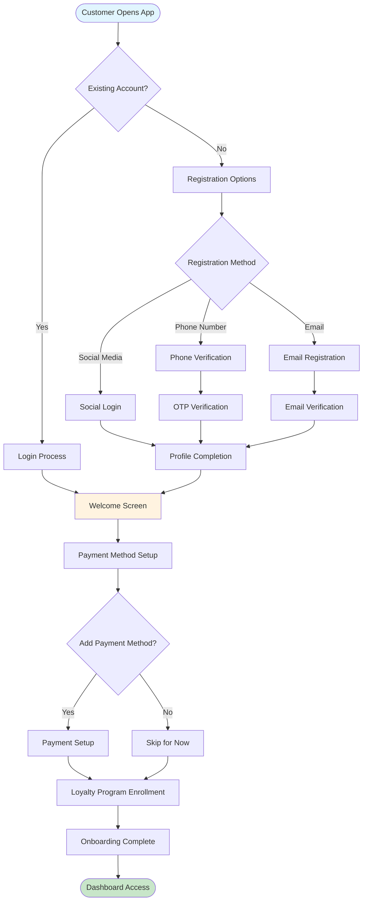
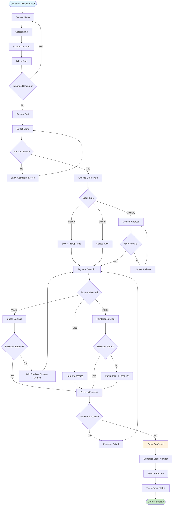
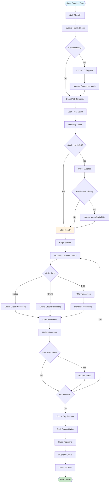
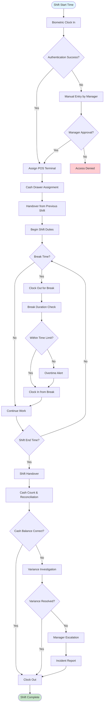
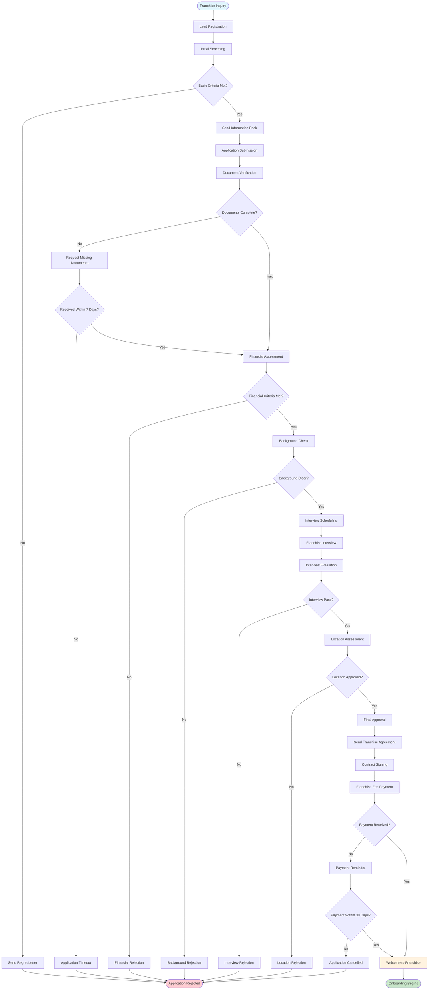
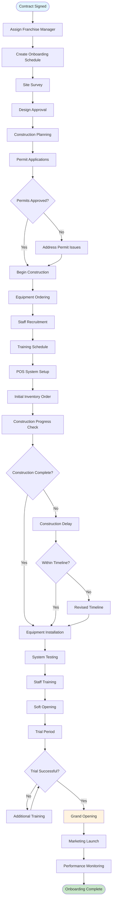
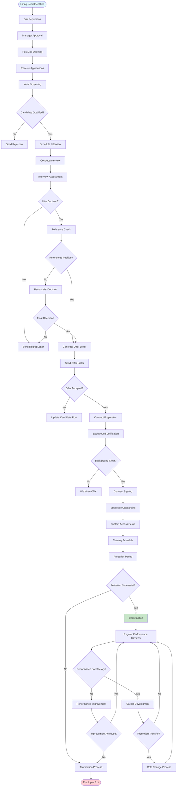
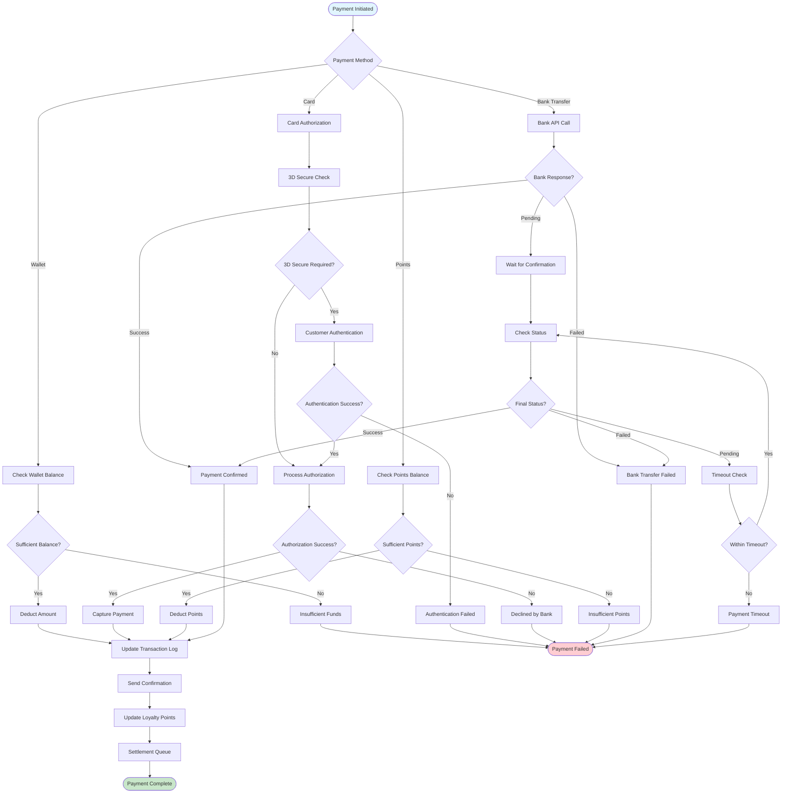
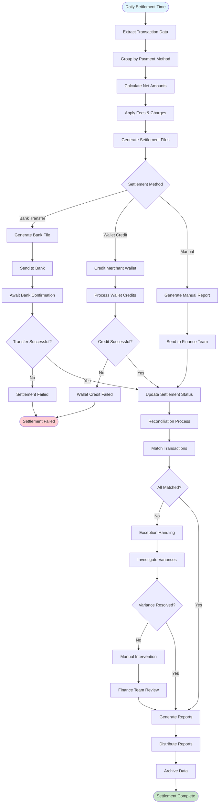
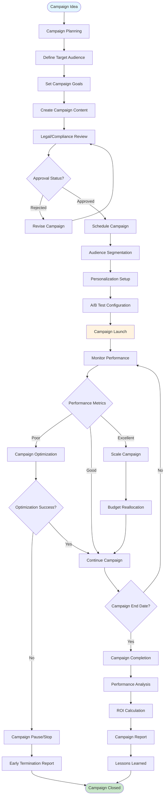

# Role-Based Workflow Diagrams - Jian Cha Tea Unity Suite

## Overview
This document contains detailed workflow diagrams for each user role within the Jian Cha Tea Unity Suite, showing process flows, decision points, rules, and system interactions.

## 1. Customer Workflows

### 1.1 Customer Registration & Onboarding Workflow

**Business Rules:**
- Phone verification required for wallet features
- Social login must still collect phone number
- Payment method optional during registration
- Loyalty enrollment automatic for verified accounts

### 1.2 Order Placement & Processing Workflow

**Business Rules:**
- Maximum 10 items per order for mobile app
- Order modification allowed until kitchen preparation starts
- Automatic store selection based on GPS location
- Payment retry limit: 3 attempts
- Order timeout: 15 minutes if not confirmed

## 2. Store Operations Workflows

### 2.1 Daily Store Operations Workflow

**Business Rules:**
- Minimum 2 staff required for store opening
- Float amount varies by store size (₹5,000-₹20,000)
- Critical items: signature drinks and bestsellers
- Low stock threshold: 20% of daily average
- Daily cash variance tolerance: ₹100

### 2.2 Staff Shift Management Workflow

**Business Rules:**
- Maximum 8 hours per shift
- Mandatory 30-minute break for shifts > 6 hours
- Cash variance > ₹500 requires investigation
- 3 consecutive late clock-ins trigger warning
- Overtime requires manager approval

## 3. Franchise Management Workflows

### 3.1 Franchise Application & Approval Workflow

**Business Rules:**
- Minimum investment: $150,000 USD
- Location must be within approved zones
- Background check includes credit score > 650
- Application expires after 90 days if incomplete
- Maximum 2 interview attempts allowed

### 3.2 Franchisee Onboarding Workflow

**Business Rules:**
- Onboarding timeline: 90-120 days
- Soft opening requires 7 days minimum
- Staff training: 40 hours minimum
- Quality audit score > 85% required
- Marketing support for first 30 days

## 4. Employee Management Workflows

### 4.1 Employee Lifecycle Management Workflow

**Business Rules:**
- Probation period: 3-6 months depending on role
- Background check must be clear before start date
- Minimum 2 interviewers for all positions
- Performance reviews: quarterly for first year, then annually
- Notice period: 1-3 months depending on seniority

## 5. Payment & Financial Workflows

### 5.1 Payment Processing Workflow

**Business Rules:**
- Payment timeout: 5 minutes for card, 24 hours for bank transfer
- Maximum 3 retry attempts for failed payments
- Fraud detection triggers for amounts > $500
- Automatic refund for timeout scenarios
- Settlement batched daily at 11:59 PM

### 5.2 Settlement & Reconciliation Workflow

**Business Rules:**
- Settlement cut-off time: 11:59 PM daily
- Variance threshold: 0.1% of daily volume
- Failed settlements retry automatically for 3 days
- Manual settlements require dual approval
- Reconciliation must complete within 24 hours

## 6. Marketing & Engagement Workflows

### 6.1 Campaign Management Workflow

**Business Rules:**
- Minimum campaign duration: 7 days
- Budget approval required for campaigns > $10,000
- A/B test minimum sample size: 1,000 customers
- Performance review every 48 hours during active campaign
- ROI calculation includes all attributable revenue

## Workflow Integration Points

### Critical Integration Dependencies
1. **Customer Registration → CRM → Loyalty → Marketing**: Customer data flows through all systems for personalized experiences
2. **Order Processing → POS → Payment → Inventory**: Real-time updates across all transaction systems  
3. **Staff Management → Payroll → Performance → Training**: HR data integration for complete employee lifecycle
4. **Franchise Application → Financial → Legal → Operations**: Multi-departmental approval workflow
5. **Campaign Management → Customer Segmentation → Personalization → Analytics**: Marketing automation pipeline

### Data Consistency Requirements
- Customer profile synchronization across all touchpoints
- Real-time inventory updates to prevent overselling
- Financial transaction integrity across all payment methods
- Employee access rights consistency across all systems
- Campaign performance data accuracy for decision making

These workflows represent the core business processes and their interdependencies within the Jian Cha Tea Unity Suite, providing a comprehensive foundation for system design and implementation.