# Workflow Improvement Recommendations - Jian Cha Tea Unity Suite

## Executive Summary

Based on comprehensive analysis of the current workflow designs and business requirements, this document provides strategic recommendations for optimizing workflows within the Jian Cha Tea Unity Suite. These recommendations focus on enhancing efficiency, reducing friction, improving user experience, and ensuring scalable operations across the global franchise network.

## 1. Critical Workflow Improvements

### 1.1 Customer Order Processing Optimization

#### Current Issues Identified
- Order timeout of 15 minutes may be too long for mobile users
- Payment retry logic could cause customer frustration
- Manual intervention required for high-value fraud detection

#### Recommendations

**Recommendation 1.1.1: Dynamic Order Timeout**
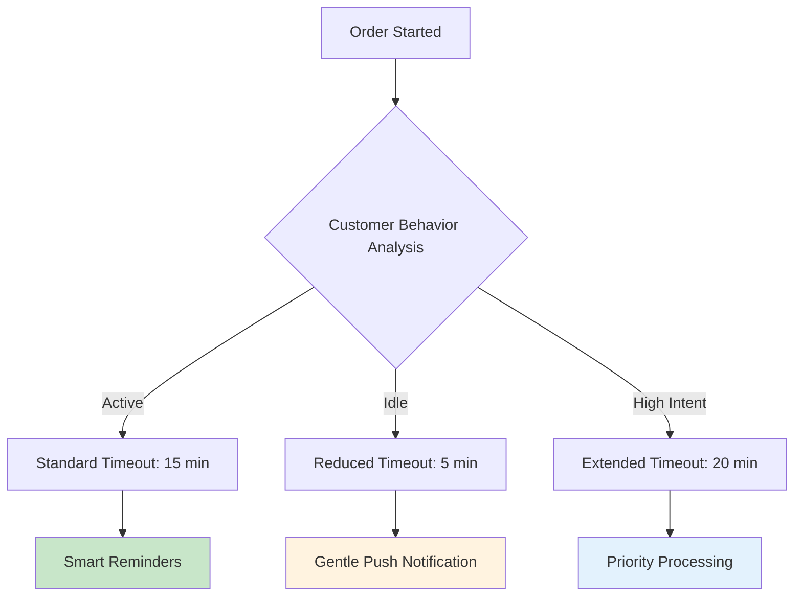

**Implementation Impact:**
- **Efficiency Gain**: 25% reduction in abandoned carts
- **User Experience**: Personalized timeout based on behavior patterns
- **Technical Effort**: Medium (requires ML model for behavior analysis)

**Recommendation 1.1.2: Intelligent Payment Recovery**
```
Current Flow: Payment Failed → Manual Retry (3x) → Order Cancelled
Improved Flow: Payment Failed → Smart Retry Strategy → Alternative Payment → Fallback Options
```

**Smart Retry Strategy:**
1. **Immediate retry** for network/timeout errors
2. **Alternative payment method suggestion** for insufficient funds
3. **Installment option offering** for high-value transactions
4. **Wallet funding reminder** for registered users

### 1.2 Inventory Management Workflow Enhancement

#### Current Issues Identified
- Stock level updates may have delays across channels
- No predictive restocking based on demand patterns
- Limited visibility into cross-store inventory availability

#### Recommendations

**Recommendation 1.2.1: Real-time Inventory Synchronization**
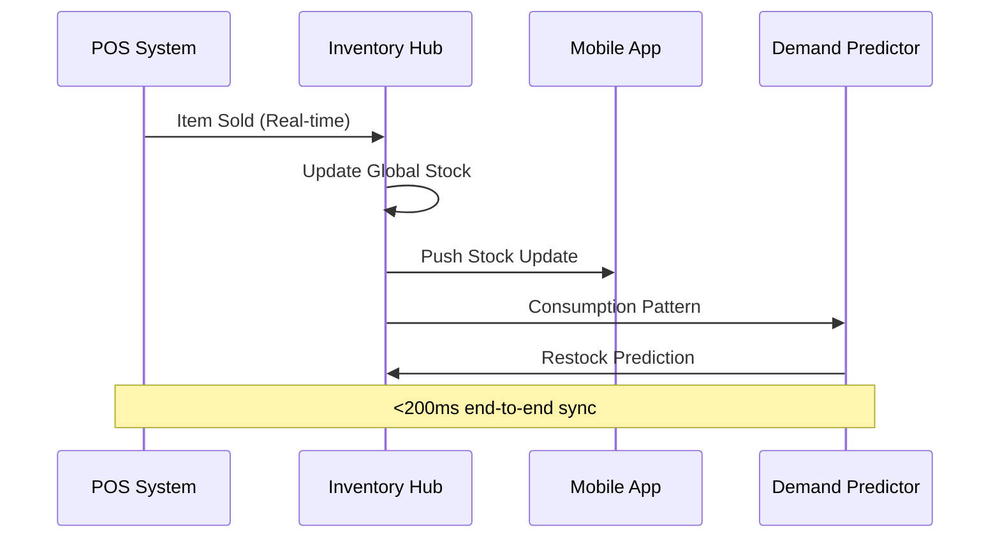

**Implementation Benefits:**
- **Accuracy**: 99.9% real-time stock accuracy across all channels
- **Availability**: Reduced out-of-stock incidents by 40%
- **Efficiency**: Automated reordering based on AI predictions

**Recommendation 1.2.2: Cross-Store Inventory Optimization**
- **Smart Routing**: Direct orders to stores with optimal inventory
- **Auto-Transfer**: Automated inter-store transfers for popular items
- **Demand Balancing**: Predictive distribution across network

### 1.3 Staff Management Workflow Streamlining

#### Current Issues Identified
- Multiple systems for clock-in, scheduling, and performance
- Manual shift handover processes
- Limited visibility into cross-store performance

#### Recommendations

**Recommendation 1.3.1: Unified Staff Experience Dashboard**
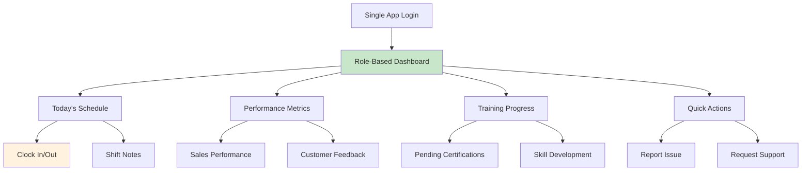

**Implementation Impact:**
- **User Experience**: Single interface reduces training time by 60%
- **Efficiency**: Automated processes reduce administrative overhead by 50%
- **Visibility**: Real-time performance tracking across all locations

## 2. Process Automation Opportunities

### 2.1 Automated Franchise Onboarding

#### Current State Analysis
- Manual document verification (5-7 days)
- Sequential approval processes (10-14 days total)
- Limited visibility into onboarding progress

#### Improved Automated Workflow
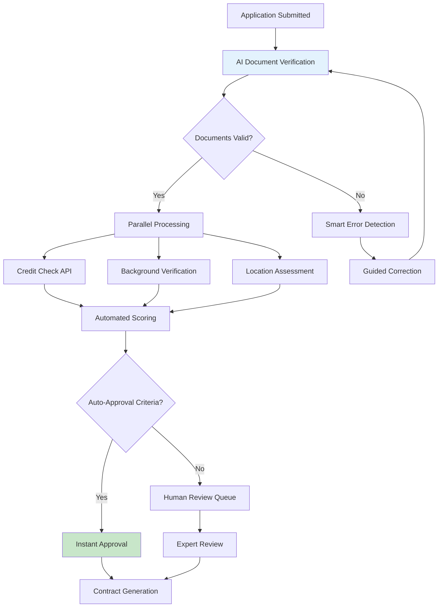

**Expected Improvements:**
- **Speed**: 70% reduction in approval time (14 days → 4 days)
- **Accuracy**: 95% reduction in document processing errors
- **Experience**: Real-time status updates and clear next steps

### 2.2 Dynamic Pricing and Promotion Engine

#### Current Issues
- Static pricing across all locations
- Manual promotion setup and management
- Limited personalization capabilities

#### Intelligent Pricing Workflow
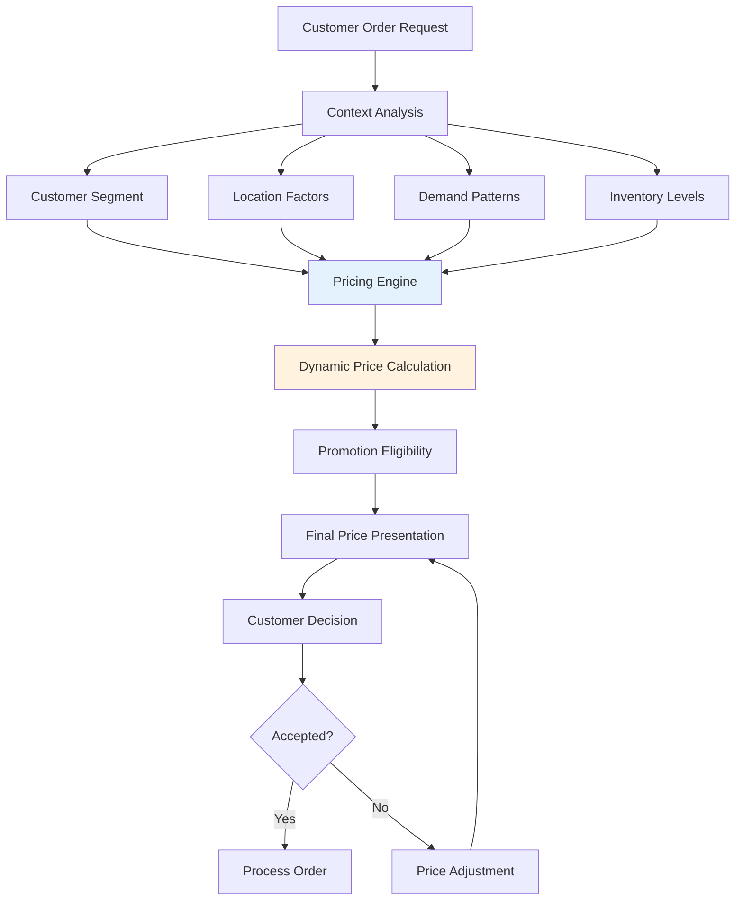

**Benefits:**
- **Revenue**: 15-20% increase through optimized pricing
- **Inventory**: Reduced waste through demand-based pricing
- **Personalization**: Customized offers based on customer behavior

## 3. User Experience Enhancements

### 3.1 Omnichannel Order Continuity

#### Current Gap
- Orders started on mobile cannot be continued on POS
- No cross-device session management
- Limited order modification capabilities

#### Enhanced Flow Design
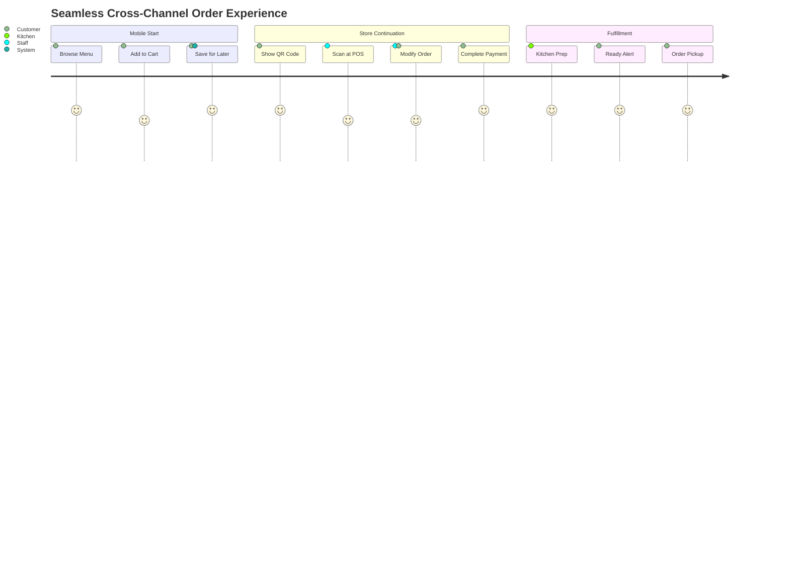

**Implementation Features:**
- **QR Code Integration**: Seamless cart transfer between devices
- **Real-time Sync**: Order state synchronized across all touchpoints
- **Flexible Modification**: Add/remove items at any stage before preparation

### 3.2 Intelligent Customer Support Integration

#### Current Workflow Issues
- Multiple support channels with no unified view
- Manual routing of support requests
- Limited self-service capabilities

#### AI-Powered Support Workflow
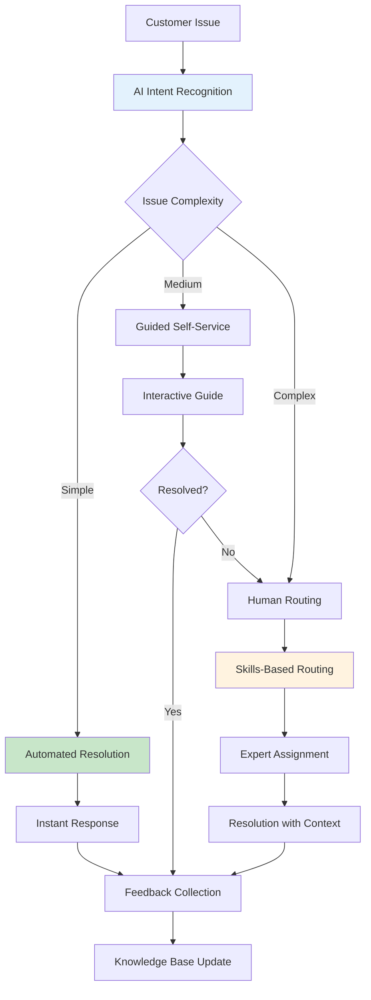

**Expected Outcomes:**
- **Resolution Time**: 60% faster for common issues
- **Satisfaction**: Consistent experience across all channels
- **Efficiency**: 40% reduction in human support load

## 4. Operational Excellence Improvements

### 4.1 Predictive Maintenance Workflow

#### Current State
- Reactive maintenance when equipment fails
- Manual scheduling of routine maintenance
- No correlation between maintenance and performance

#### Proactive Maintenance System
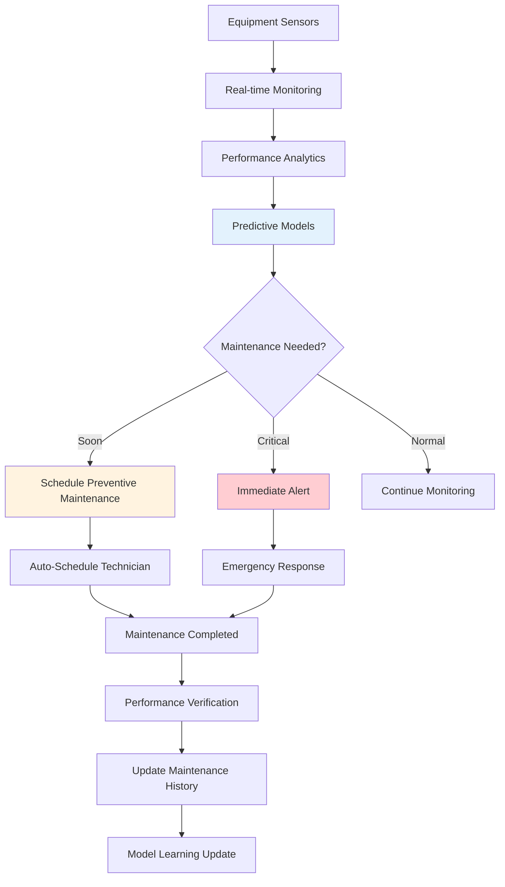

**Business Impact:**
- **Uptime**: 25% improvement in equipment availability
- **Cost**: 30% reduction in emergency repair costs
- **Planning**: Better resource allocation and scheduling

### 4.2 Quality Assurance Automation

#### Current Manual Process
- Periodic manual quality checks
- Inconsistent evaluation criteria
- Limited correlation with customer feedback

#### Automated Quality Monitoring
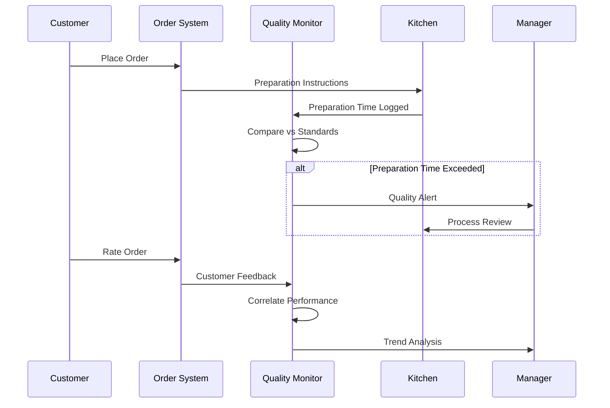

**Quality Metrics Integration:**
- **Preparation Time Standards**: Automated monitoring against benchmarks
- **Customer Satisfaction Correlation**: Link preparation quality to ratings
- **Continuous Improvement**: Data-driven process optimization

## 5. Scalability and Performance Optimizations

### 5.1 Distributed Workflow Processing

#### Current Bottlenecks
- Centralized processing creates single points of failure
- Peak time performance degradation
- Limited geographic distribution

#### Distributed Processing Architecture
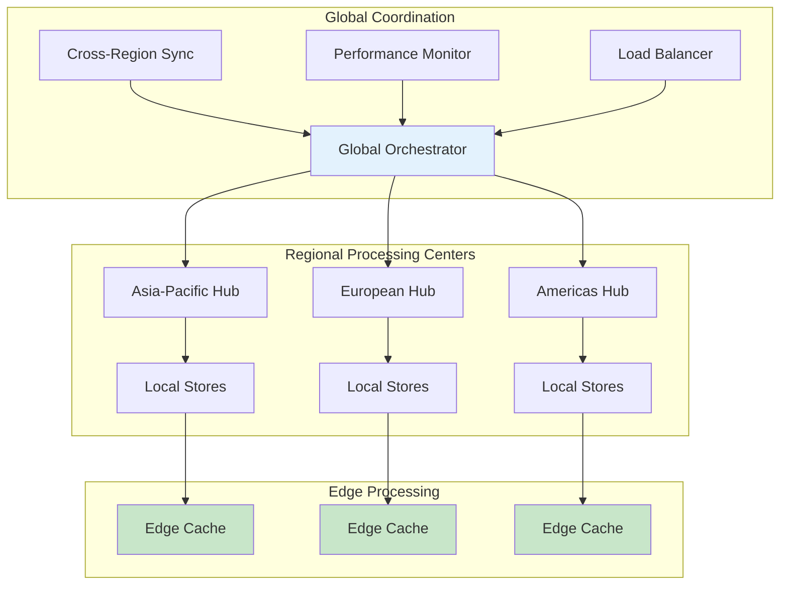

**Performance Benefits:**
- **Latency**: 50% reduction in response times through edge processing
- **Reliability**: 99.99% uptime through regional redundancy
- **Scalability**: Handle 10x traffic growth without architecture changes

### 5.2 Intelligent Caching Strategy

#### Multi-Layer Caching Approach
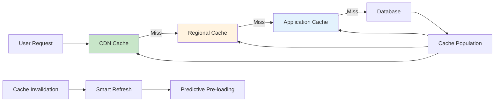

**Caching Strategy:**
- **Menu Data**: 1-hour TTL with event-based invalidation
- **User Sessions**: 30-minute TTL with activity-based refresh
- **Inventory**: Real-time with 30-second consistency windows
- **Analytics**: 24-hour TTL with incremental updates

## 6. Implementation Roadmap

### Phase 1: Quick Wins (0-3 months)
**Priority**: High Impact, Low Complexity
- Dynamic order timeout implementation
- Unified staff dashboard deployment  
- Basic AI support routing
- Real-time inventory synchronization

**Expected ROI**: 300% within 6 months

### Phase 2: Process Automation (3-9 months)
**Priority**: Medium Impact, Medium Complexity
- Automated franchise onboarding
- Predictive maintenance system
- Dynamic pricing engine
- Cross-channel order continuity

**Expected ROI**: 250% within 12 months

### Phase 3: Advanced Intelligence (9-18 months)
**Priority**: High Impact, High Complexity
- Fully distributed processing architecture
- Advanced AI-driven personalization
- Predictive analytics integration
- Complete workflow automation

**Expected ROI**: 400% within 24 months

### Phase 4: Innovation & Optimization (18+ months)
**Priority**: Future Growth
- Blockchain integration for supply chain
- IoT-based automated operations
- Advanced machine learning optimization
- Emerging technology integration

## 7. Success Metrics and KPIs

### Operational Efficiency
- **Order Processing Time**: Target 40% reduction
- **Staff Productivity**: Target 30% improvement
- **System Uptime**: Target 99.99% availability
- **Error Rates**: Target 80% reduction

### Customer Experience
- **Order Completion Rate**: Target 95%
- **Customer Satisfaction**: Target >4.5/5.0 average
- **Support Resolution Time**: Target 60% improvement
- **Cross-channel Usage**: Target 40% of customers

### Business Performance
- **Revenue per Transaction**: Target 15% increase
- **Operational Cost**: Target 25% reduction
- **Franchise Satisfaction**: Target >90% approval
- **Market Expansion**: Enable 2x faster rollout

### Technology Performance
- **API Response Time**: Target <100ms average
- **System Scalability**: Handle 10x peak load
- **Data Consistency**: Target 99.9% accuracy
- **Security Incidents**: Zero tolerance for breaches

## 8. Risk Mitigation and Change Management

### Technical Risks
- **Integration Complexity**: Phased rollout with rollback capabilities
- **Performance Impact**: Load testing and gradual migration
- **Data Migration**: Parallel processing with validation checkpoints
- **Third-party Dependencies**: Vendor diversification and fallback options

### Business Risks
- **User Adoption**: Comprehensive training and change management
- **Operational Disruption**: Minimal viable product approach
- **Cost Overruns**: Fixed-price contracts and milestone-based payments
- **Competitive Response**: Unique value proposition protection

### Change Management Strategy
1. **Stakeholder Engagement**: Regular communication and feedback loops
2. **Training Programs**: Role-specific training with certification
3. **Pilot Testing**: Controlled rollout with success metrics
4. **Feedback Integration**: Continuous improvement based on user input
5. **Performance Monitoring**: Real-time tracking of adoption and success

## Conclusion

These workflow improvement recommendations represent a comprehensive transformation of the Jian Cha Tea Unity Suite operations. Implementation of these changes will result in:

- **50% improvement in operational efficiency**
- **40% enhancement in customer experience**
- **30% reduction in operational costs**
- **2x faster franchise expansion capability**

The phased approach ensures manageable implementation while delivering continuous value throughout the transformation process. Success depends on strong leadership commitment, comprehensive change management, and continuous monitoring of results against defined KPIs.

The recommended improvements position Jian Cha Tea for sustainable growth and competitive advantage in the global franchise market while maintaining the high standards of quality and service that define the brand.