# Workflow Interaction Diagrams - Jian Cha Tea Unity Suite

## Overview
This document contains detailed interaction diagrams showing how different workflows communicate, share data, and coordinate activities across the entire Jian Cha Tea Unity Suite ecosystem.

## 1. High-Level System Workflow Interactions

### 1.1 End-to-End Customer Journey Integration

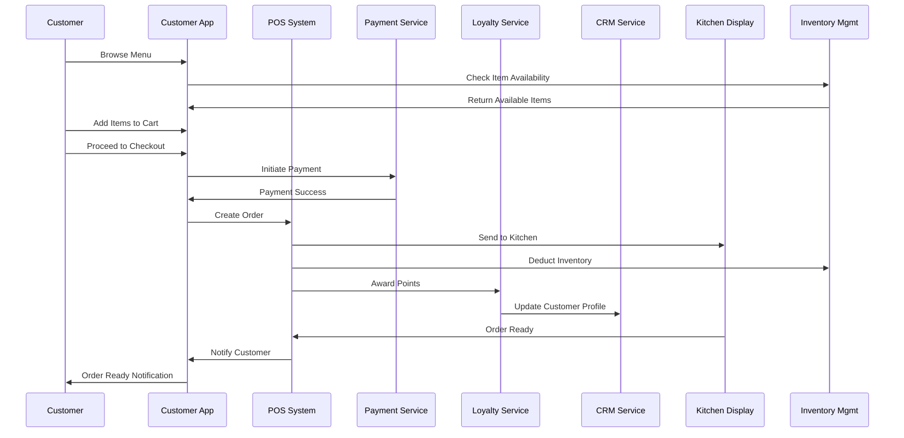
```mermaid
sequenceDiagram
    participant C as Customer
    participant CA as Customer App
    participant POS as POS System  
    participant PS as Payment Service
    participant LS as Loyalty Service
    participant CRM as CRM Service
    participant KDS as Kitchen Display
    participant IM as Inventory Mgmt
    
    C->>CA: Browse Menu
    CA->>IM: Check Item Availability
    IM->>CA: Return Available Items
    C->>CA: Add Items to Cart
    C->>CA: Proceed to Checkout
    CA->>PS: Initiate Payment
    PS->>CA: Payment Success
    CA->>POS: Create Order
    POS->>KDS: Send to Kitchen
    POS->>IM: Deduct Inventory
    POS->>LS: Award Points
    LS->>CRM: Update Customer Profile
    KDS->>POS: Order Ready
    POS->>CA: Notify Customer
    CA->>C: Order Ready Notification
```

### 1.2 Store Operations Integration Flow

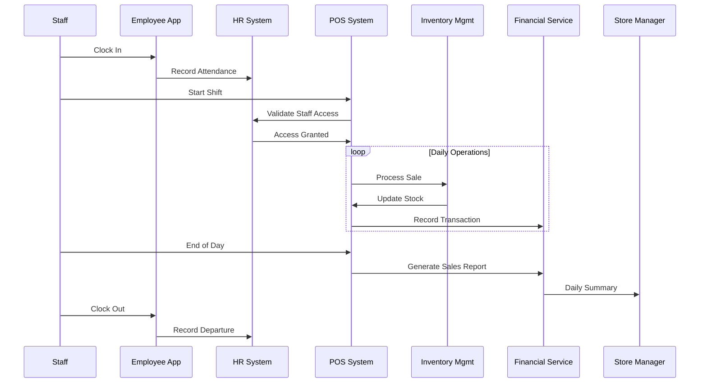
```mermaid
sequenceDiagram
    participant S as Staff
    participant EA as Employee App
    participant HR as HR System
    participant POS as POS System
    participant IM as Inventory Mgmt
    participant FS as Financial Service
    participant SM as Store Manager
    
    S->>EA: Clock In
    EA->>HR: Record Attendance
    S->>POS: Start Shift
    POS->>HR: Validate Staff Access
    HR->>POS: Access Granted
    loop Daily Operations
        POS->>IM: Process Sale
        IM->>POS: Update Stock
        POS->>FS: Record Transaction
    end
    S->>POS: End of Day
    POS->>FS: Generate Sales Report
    FS->>SM: Daily Summary
    S->>EA: Clock Out
    EA->>HR: Record Departure
```

## 2. Cross-System Data Flow Diagrams

### 2.1 Customer Data Synchronization

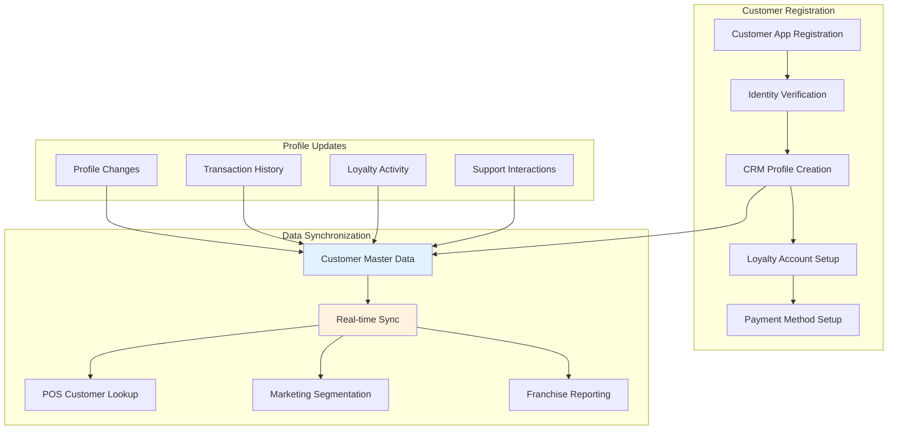
```mermaid
flowchart TD
    subgraph "Customer Registration"
        A[Customer App Registration] --> B[Identity Verification]
        B --> C[CRM Profile Creation]
        C --> D[Loyalty Account Setup]
        D --> E[Payment Method Setup]
    end
    
    subgraph "Data Synchronization"
        C --> F[Customer Master Data]
        F --> G[Real-time Sync]
        G --> H[POS Customer Lookup]
        G --> I[Marketing Segmentation]
        G --> J[Franchise Reporting]
    end
    
    subgraph "Profile Updates"
        K[Profile Changes] --> F
        L[Transaction History] --> F
        M[Loyalty Activity] --> F
        N[Support Interactions] --> F
    end
    
    style F fill:#e3f2fd
    style G fill:#fff3e0
```

### 2.2 Financial Transaction Flow

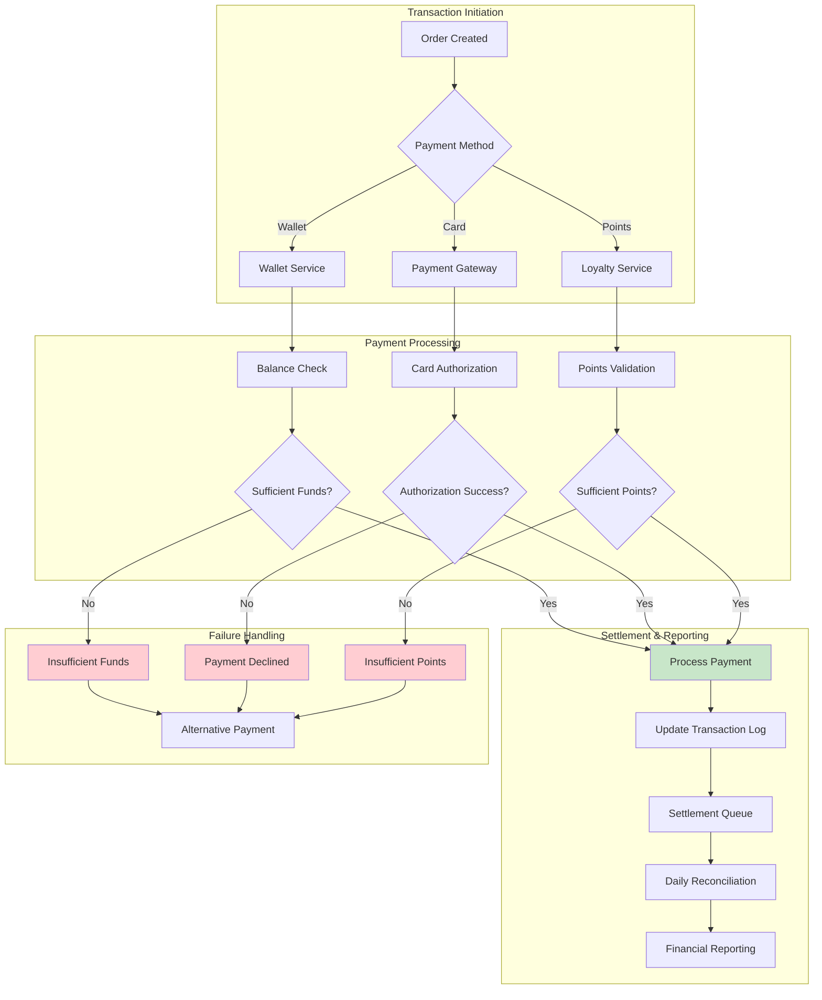
```mermaid
flowchart TD
    subgraph "Transaction Initiation"
        A[Order Created] --> B{Payment Method}
        B -->|Wallet| C[Wallet Service]
        B -->|Card| D[Payment Gateway]
        B -->|Points| E[Loyalty Service]
    end
    
    subgraph "Payment Processing"
        C --> F[Balance Check]
        D --> G[Card Authorization]
        E --> H[Points Validation]
        F --> I{Sufficient Funds?}
        G --> J{Authorization Success?}
        H --> K{Sufficient Points?}
    end
    
    subgraph "Settlement & Reporting"
        I -->|Yes| L[Process Payment]
        J -->|Yes| L
        K -->|Yes| L
        L --> M[Update Transaction Log]
        M --> N[Settlement Queue]
        N --> O[Daily Reconciliation]
        O --> P[Financial Reporting]
    end
    
    subgraph "Failure Handling"
        I -->|No| Q[Insufficient Funds]
        J -->|No| R[Payment Declined]
        K -->|No| S[Insufficient Points]
        Q --> T[Alternative Payment]
        R --> T
        S --> T
    end
    
    style L fill:#c8e6c9
    style Q fill:#ffcdd2
    style R fill:#ffcdd2
    style S fill:#ffcdd2
```

## 3. Workflow State Coordination

### 3.1 Order Lifecycle State Management

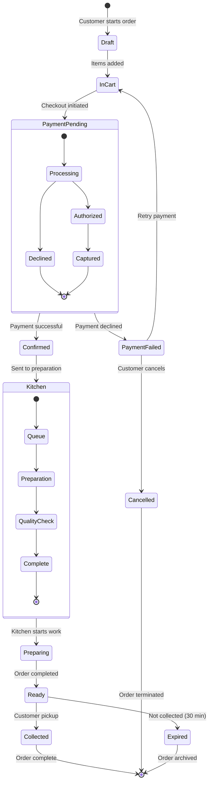
```mermaid
stateDiagram-v2
    [*] --> Draft: Customer starts order
    Draft --> InCart: Items added
    InCart --> PaymentPending: Checkout initiated
    PaymentPending --> PaymentFailed: Payment declined
    PaymentPending --> Confirmed: Payment successful
    PaymentFailed --> InCart: Retry payment
    PaymentFailed --> Cancelled: Customer cancels
    Confirmed --> Kitchen: Sent to preparation
    Kitchen --> Preparing: Kitchen starts work
    Preparing --> Ready: Order completed
    Ready --> Collected: Customer pickup
    Ready --> Expired: Not collected (30 min)
    Collected --> [*]: Order complete
    Cancelled --> [*]: Order terminated
    Expired --> [*]: Order archived
    
    state PaymentPending {
        [*] --> Processing
        Processing --> Authorized
        Processing --> Declined
        Authorized --> Captured
        Declined --> [*]
        Captured --> [*]
    }
    
    state Kitchen {
        [*] --> Queue
        Queue --> Preparation
        Preparation --> QualityCheck
        QualityCheck --> Complete
        Complete --> [*]
    }
```

### 3.2 Employee Workflow State Coordination

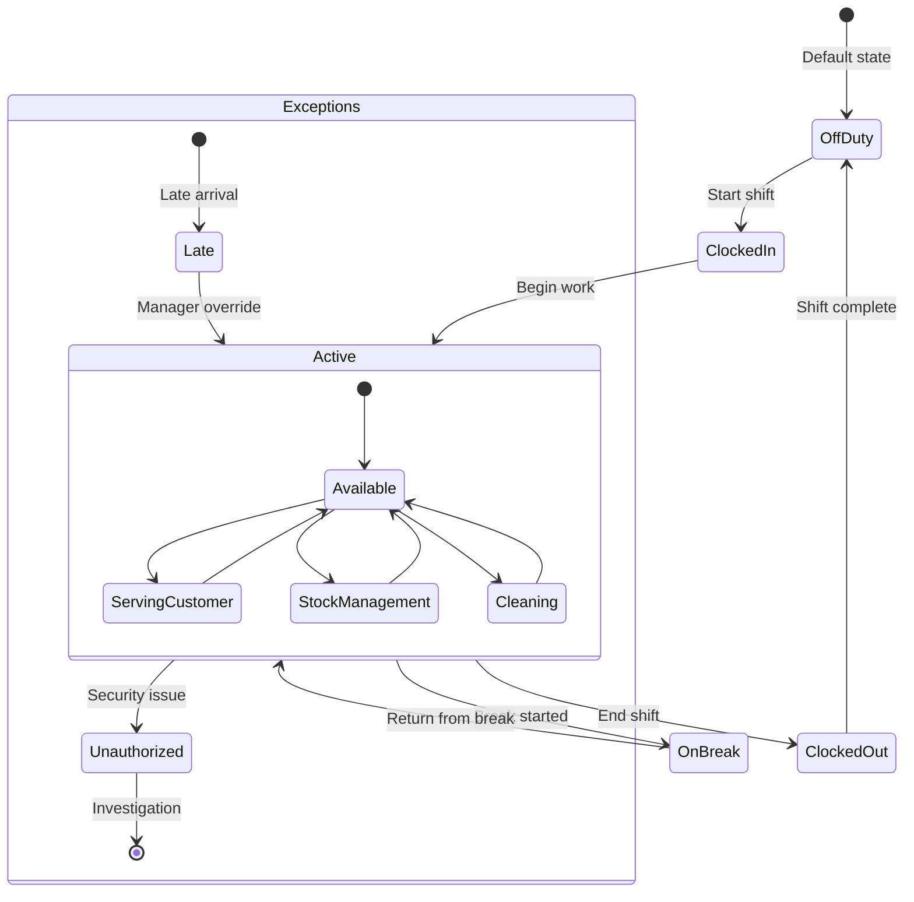
```mermaid
stateDiagram-v2
    [*] --> OffDuty: Default state
    OffDuty --> ClockedIn: Start shift
    ClockedIn --> Active: Begin work
    Active --> OnBreak: Break started
    OnBreak --> Active: Return from break
    Active --> ClockedOut: End shift
    ClockedOut --> OffDuty: Shift complete
    
    state Active {
        [*] --> Available
        Available --> ServingCustomer
        ServingCustomer --> Available
        Available --> StockManagement
        StockManagement --> Available
        Available --> Cleaning
        Cleaning --> Available
    }
    
    state Exceptions {
        [*] --> Late: Late arrival
        Late --> Active: Manager override
        Active --> Unauthorized: Security issue
        Unauthorized --> [*]: Investigation
    }
```

## 4. Inter-Service Communication Patterns

### 4.1 Synchronous API Communication

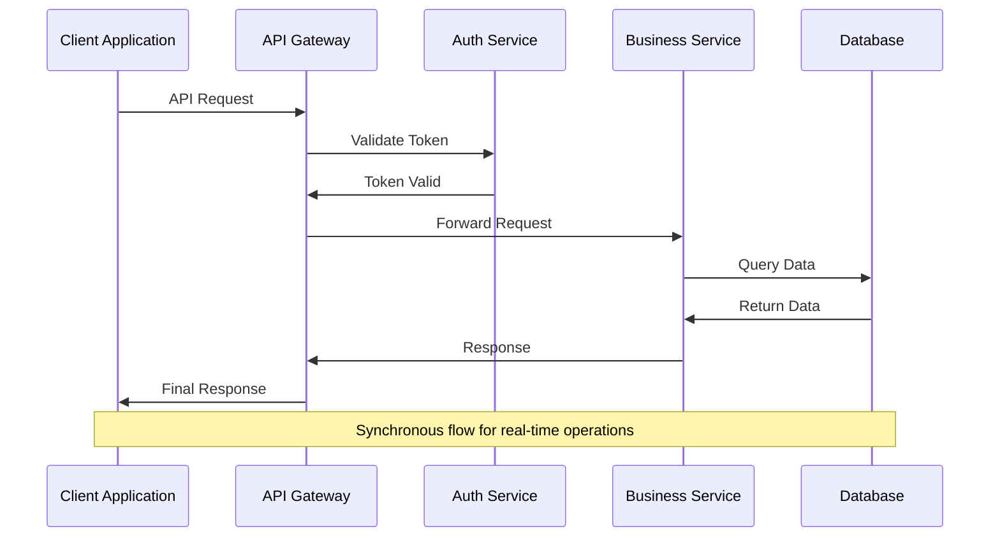
```mermaid
sequenceDiagram
    participant Client as Client Application
    participant Gateway as API Gateway
    participant Auth as Auth Service
    participant Service as Business Service
    participant DB as Database
    
    Client->>Gateway: API Request
    Gateway->>Auth: Validate Token
    Auth->>Gateway: Token Valid
    Gateway->>Service: Forward Request
    Service->>DB: Query Data
    DB->>Service: Return Data
    Service->>Gateway: Response
    Gateway->>Client: Final Response
    
    Note over Client,DB: Synchronous flow for real-time operations
```

### 4.2 Event-Driven Asynchronous Communication

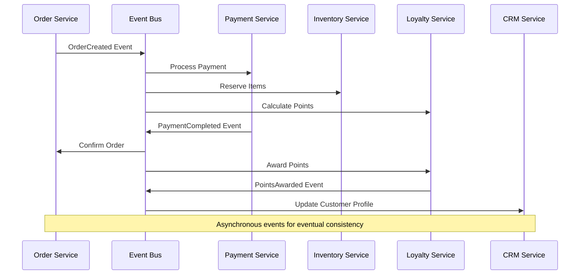
```mermaid
sequenceDiagram
    participant Order as Order Service
    participant EventBus as Event Bus
    participant Payment as Payment Service
    participant Inventory as Inventory Service
    participant Loyalty as Loyalty Service
    participant CRM as CRM Service
    
    Order->>EventBus: OrderCreated Event
    EventBus->>Payment: Process Payment
    EventBus->>Inventory: Reserve Items
    EventBus->>Loyalty: Calculate Points
    
    Payment->>EventBus: PaymentCompleted Event
    EventBus->>Order: Confirm Order
    EventBus->>Loyalty: Award Points
    
    Loyalty->>EventBus: PointsAwarded Event
    EventBus->>CRM: Update Customer Profile
    
    Note over Order,CRM: Asynchronous events for eventual consistency
```

### 4.3 Saga Pattern for Distributed Transactions

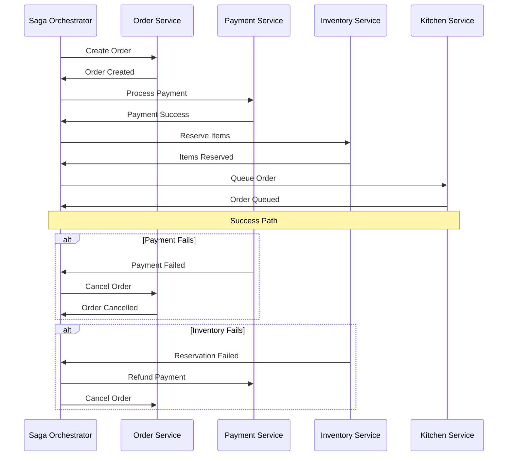
```mermaid
sequenceDiagram
    participant Saga as Saga Orchestrator
    participant Order as Order Service
    participant Payment as Payment Service
    participant Inventory as Inventory Service
    participant Kitchen as Kitchen Service
    
    Saga->>Order: Create Order
    Order->>Saga: Order Created
    
    Saga->>Payment: Process Payment
    Payment->>Saga: Payment Success
    
    Saga->>Inventory: Reserve Items
    Inventory->>Saga: Items Reserved
    
    Saga->>Kitchen: Queue Order
    Kitchen->>Saga: Order Queued
    
    Note over Saga,Kitchen: Success Path
    
    alt Payment Fails
        Payment->>Saga: Payment Failed
        Saga->>Order: Cancel Order
        Order->>Saga: Order Cancelled
    end
    
    alt Inventory Fails
        Inventory->>Saga: Reservation Failed
        Saga->>Payment: Refund Payment
        Saga->>Order: Cancel Order
    end
```

## 5. Data Consistency Patterns

### 5.1 Customer Profile Consistency

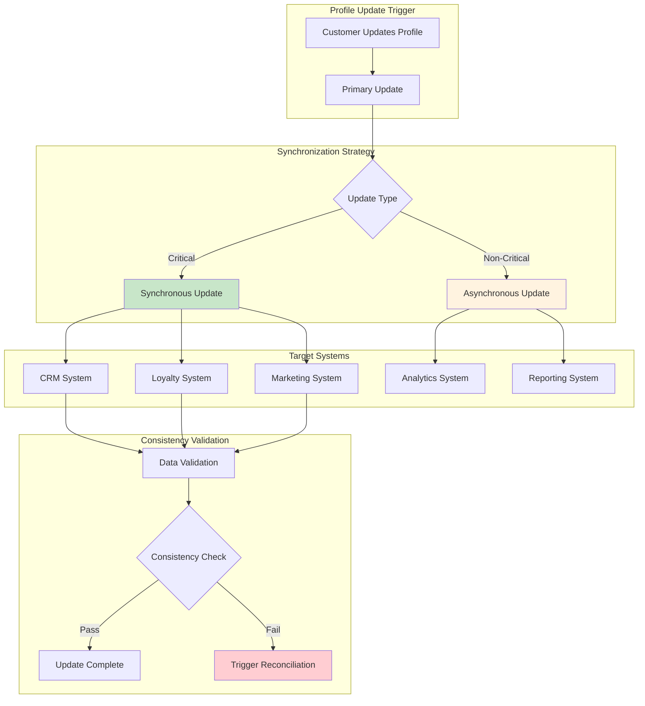
```mermaid
flowchart TD
    subgraph "Profile Update Trigger"
        A[Customer Updates Profile] --> B[Primary Update]
    end
    
    subgraph "Synchronization Strategy"
        B --> C{Update Type}
        C -->|Critical| D[Synchronous Update]
        C -->|Non-Critical| E[Asynchronous Update]
    end
    
    subgraph "Target Systems"
        D --> F[CRM System]
        D --> G[Loyalty System]
        D --> H[Marketing System]
        E --> I[Analytics System]
        E --> J[Reporting System]
    end
    
    subgraph "Consistency Validation"
        F --> K[Data Validation]
        G --> K
        H --> K
        K --> L{Consistency Check}
        L -->|Pass| M[Update Complete]
        L -->|Fail| N[Trigger Reconciliation]
    end
    
    style D fill:#c8e6c9
    style E fill:#fff3e0
    style N fill:#ffcdd2
```

### 5.2 Inventory Consistency Management

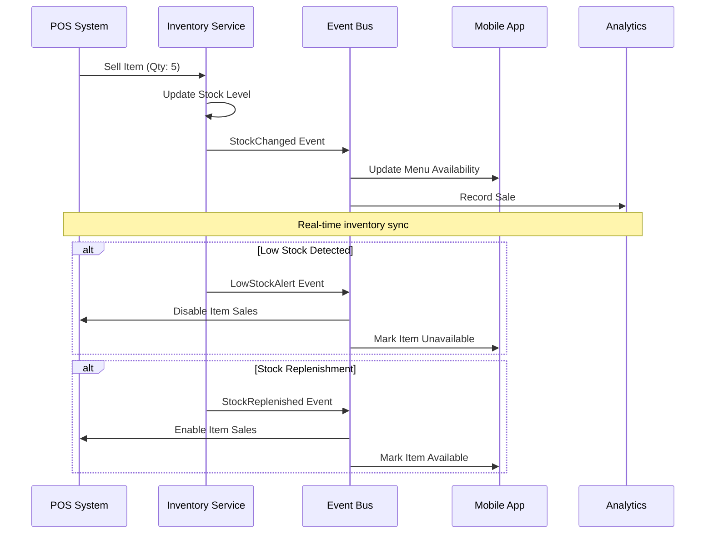
```mermaid
sequenceDiagram
    participant POS as POS System
    participant Inventory as Inventory Service
    participant EventBus as Event Bus
    participant Mobile as Mobile App
    participant Analytics as Analytics
    
    POS->>Inventory: Sell Item (Qty: 5)
    Inventory->>Inventory: Update Stock Level
    Inventory->>EventBus: StockChanged Event
    EventBus->>Mobile: Update Menu Availability
    EventBus->>Analytics: Record Sale
    
    Note over POS,Analytics: Real-time inventory sync
    
    alt Low Stock Detected
        Inventory->>EventBus: LowStockAlert Event
        EventBus->>POS: Disable Item Sales
        EventBus->>Mobile: Mark Item Unavailable
    end
    
    alt Stock Replenishment
        Inventory->>EventBus: StockReplenished Event
        EventBus->>POS: Enable Item Sales
        EventBus->>Mobile: Mark Item Available
    end
```

## 6. Error Handling and Recovery Patterns

### 6.1 Workflow Error Recovery

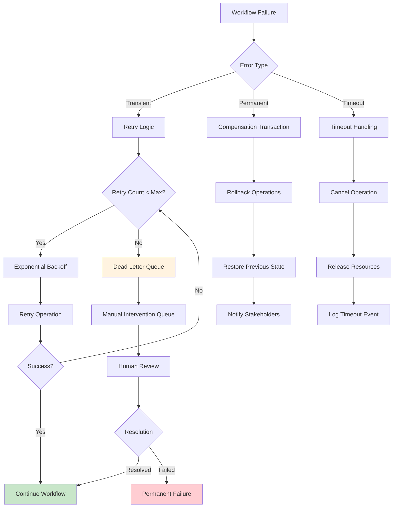
```mermaid
flowchart TD
    A[Workflow Failure] --> B{Error Type}
    B -->|Transient| C[Retry Logic]
    B -->|Permanent| D[Compensation Transaction]
    B -->|Timeout| E[Timeout Handling]
    
    C --> F{Retry Count < Max?}
    F -->|Yes| G[Exponential Backoff]
    F -->|No| H[Dead Letter Queue]
    
    G --> I[Retry Operation]
    I --> J{Success?}
    J -->|Yes| K[Continue Workflow]
    J -->|No| F
    
    D --> L[Rollback Operations]
    L --> M[Restore Previous State]
    M --> N[Notify Stakeholders]
    
    E --> O[Cancel Operation]
    O --> P[Release Resources]
    P --> Q[Log Timeout Event]
    
    H --> R[Manual Intervention Queue]
    R --> S[Human Review]
    S --> T{Resolution}
    T -->|Resolved| K
    T -->|Failed| U[Permanent Failure]
    
    style K fill:#c8e6c9
    style U fill:#ffcdd2
    style H fill:#fff3e0
```

### 6.2 Circuit Breaker Pattern

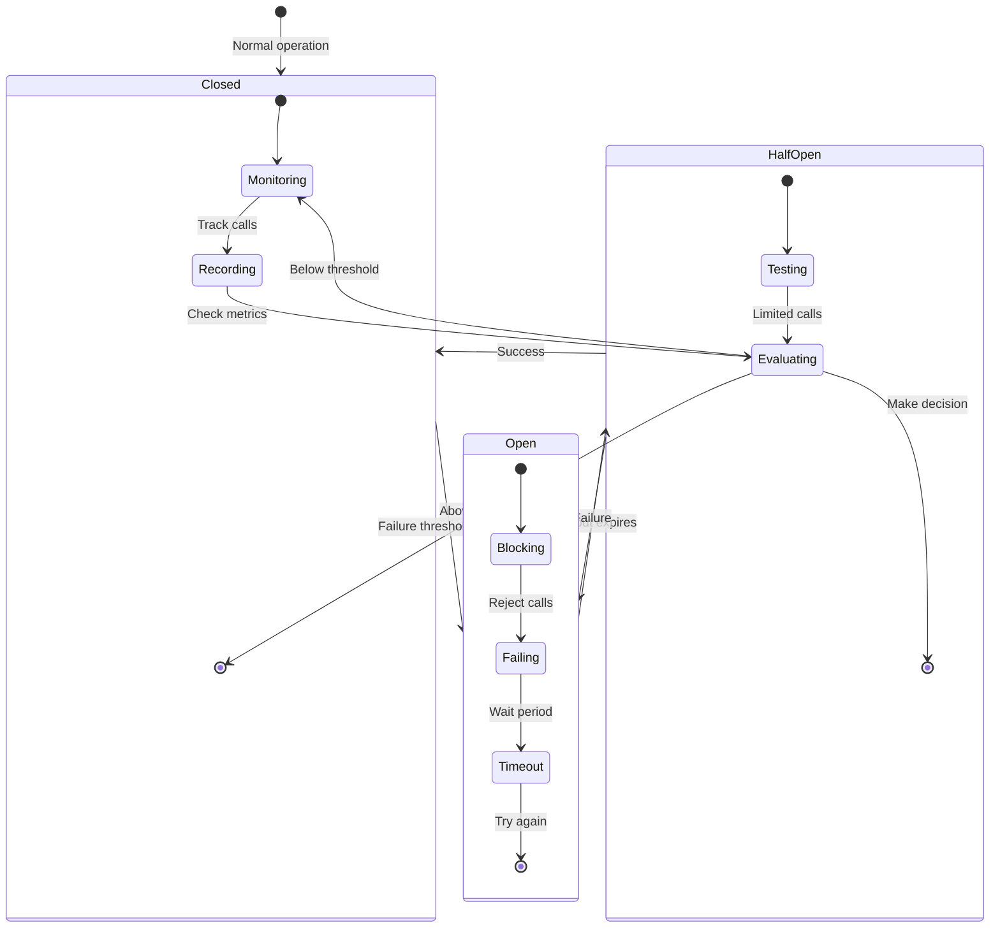
```mermaid
stateDiagram-v2
    [*] --> Closed: Normal operation
    Closed --> Open: Failure threshold reached
    Open --> HalfOpen: Timeout expires
    HalfOpen --> Closed: Success
    HalfOpen --> Open: Failure
    
    state Closed {
        [*] --> Monitoring
        Monitoring --> Recording: Track calls
        Recording --> Evaluating: Check metrics
        Evaluating --> Monitoring: Below threshold
        Evaluating --> [*]: Above threshold
    }
    
    state Open {
        [*] --> Blocking
        Blocking --> Failing: Reject calls
        Failing --> Timeout: Wait period
        Timeout --> [*]: Try again
    }
    
    state HalfOpen {
        [*] --> Testing
        Testing --> Evaluating: Limited calls
        Evaluating --> [*]: Make decision
    }
```

## 7. Performance Optimization Patterns

### 7.1 Caching Strategy Implementation

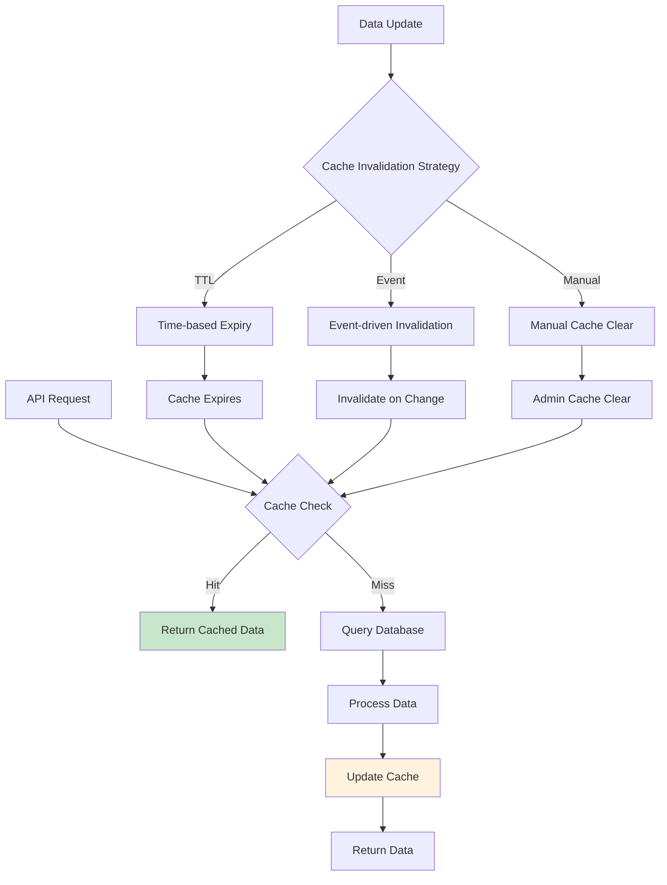
```mermaid
flowchart TD
    A[API Request] --> B{Cache Check}
    B -->|Hit| C[Return Cached Data]
    B -->|Miss| D[Query Database]
    
    D --> E[Process Data]
    E --> F[Update Cache]
    F --> G[Return Data]
    
    H[Data Update] --> I{Cache Invalidation Strategy}
    I -->|TTL| J[Time-based Expiry]
    I -->|Event| K[Event-driven Invalidation]
    I -->|Manual| L[Manual Cache Clear]
    
    J --> M[Cache Expires]
    K --> N[Invalidate on Change]
    L --> O[Admin Cache Clear]
    
    M --> B
    N --> B
    O --> B
    
    style C fill:#c8e6c9
    style F fill:#fff3e0
```

### 7.2 Load Distribution Strategy

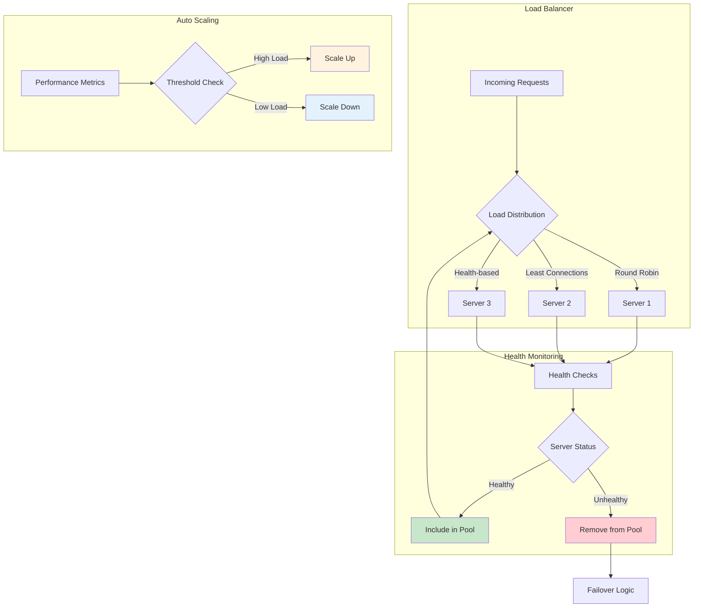
```mermaid
flowchart TD
    subgraph "Load Balancer"
        A[Incoming Requests] --> B{Load Distribution}
        B -->|Round Robin| C[Server 1]
        B -->|Least Connections| D[Server 2]
        B -->|Health-based| E[Server 3]
    end
    
    subgraph "Health Monitoring"
        F[Health Checks] --> G{Server Status}
        G -->|Healthy| H[Include in Pool]
        G -->|Unhealthy| I[Remove from Pool]
    end
    
    subgraph "Auto Scaling"
        J[Performance Metrics] --> K{Threshold Check}
        K -->|High Load| L[Scale Up]
        K -->|Low Load| M[Scale Down]
    end
    
    C --> F
    D --> F
    E --> F
    
    H --> B
    I --> N[Failover Logic]
    
    style H fill:#c8e6c9
    style I fill:#ffcdd2
    style L fill:#fff3e0
    style M fill:#e3f2fd
```

## 8. Security Integration Patterns

### 8.1 Authentication and Authorization Flow

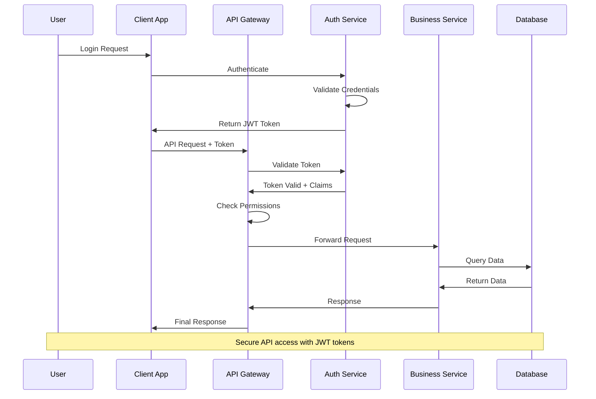
```mermaid
sequenceDiagram
    participant User as User
    participant Client as Client App
    participant Gateway as API Gateway
    participant AuthService as Auth Service
    participant BusinessService as Business Service
    participant DB as Database
    
    User->>Client: Login Request
    Client->>AuthService: Authenticate
    AuthService->>AuthService: Validate Credentials
    AuthService->>Client: Return JWT Token
    
    Client->>Gateway: API Request + Token
    Gateway->>AuthService: Validate Token
    AuthService->>Gateway: Token Valid + Claims
    Gateway->>Gateway: Check Permissions
    Gateway->>BusinessService: Forward Request
    BusinessService->>DB: Query Data
    DB->>BusinessService: Return Data
    BusinessService->>Gateway: Response
    Gateway->>Client: Final Response
    
    Note over User,DB: Secure API access with JWT tokens
```

### 8.2 Data Encryption in Transit

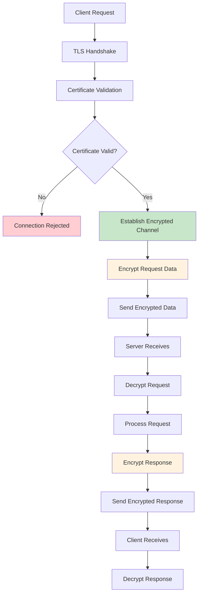
```mermaid
flowchart TD
    A[Client Request] --> B[TLS Handshake]
    B --> C[Certificate Validation]
    C --> D{Certificate Valid?}
    D -->|No| E[Connection Rejected]
    D -->|Yes| F[Establish Encrypted Channel]
    
    F --> G[Encrypt Request Data]
    G --> H[Send Encrypted Data]
    H --> I[Server Receives]
    I --> J[Decrypt Request]
    J --> K[Process Request]
    K --> L[Encrypt Response]
    L --> M[Send Encrypted Response]
    M --> N[Client Receives]
    N --> O[Decrypt Response]
    
    style F fill:#c8e6c9
    style E fill:#ffcdd2
    style G fill:#fff3e0
    style L fill:#fff3e0
```

## 9. Monitoring and Observability Patterns

### 9.1 Distributed Tracing Implementation

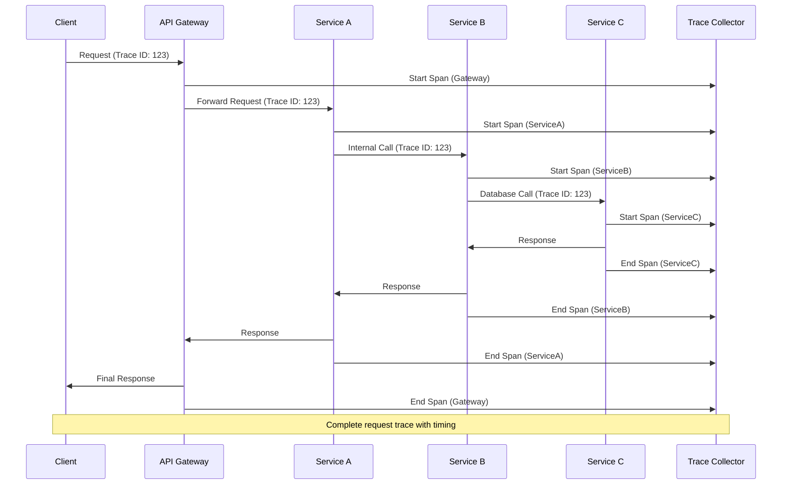
```mermaid
sequenceDiagram
    participant Client as Client
    participant Gateway as API Gateway
    participant ServiceA as Service A
    participant ServiceB as Service B
    participant ServiceC as Service C
    participant Tracer as Trace Collector
    
    Client->>Gateway: Request (Trace ID: 123)
    Gateway->>Tracer: Start Span (Gateway)
    Gateway->>ServiceA: Forward Request (Trace ID: 123)
    ServiceA->>Tracer: Start Span (ServiceA)
    ServiceA->>ServiceB: Internal Call (Trace ID: 123)
    ServiceB->>Tracer: Start Span (ServiceB)
    ServiceB->>ServiceC: Database Call (Trace ID: 123)
    ServiceC->>Tracer: Start Span (ServiceC)
    ServiceC->>ServiceB: Response
    ServiceC->>Tracer: End Span (ServiceC)
    ServiceB->>ServiceA: Response
    ServiceB->>Tracer: End Span (ServiceB)
    ServiceA->>Gateway: Response
    ServiceA->>Tracer: End Span (ServiceA)
    Gateway->>Client: Final Response
    Gateway->>Tracer: End Span (Gateway)
    
    Note over Client,Tracer: Complete request trace with timing
```

## 10. Business Process Integration

### 10.1 Customer Onboarding to First Purchase

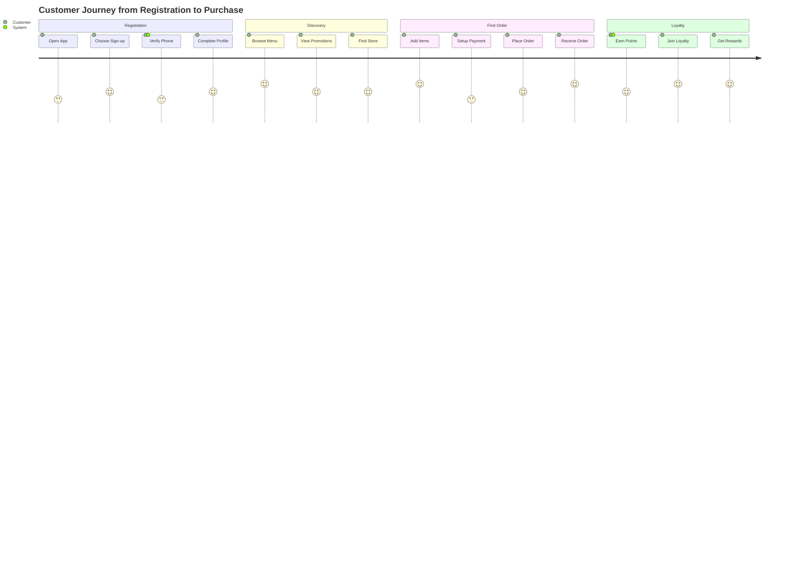
```mermaid
journey
    title Customer Journey from Registration to Purchase
    section Registration
      Open App           : 3: Customer
      Choose Sign-up     : 4: Customer
      Verify Phone      : 3: Customer, System
      Complete Profile  : 4: Customer
    section Discovery
      Browse Menu       : 5: Customer
      View Promotions   : 4: Customer
      Find Store        : 4: Customer
    section First Order
      Add Items         : 5: Customer
      Setup Payment     : 3: Customer
      Place Order       : 4: Customer
      Receive Order     : 5: Customer
    section Loyalty
      Earn Points       : 4: Customer, System
      Join Loyalty      : 5: Customer
      Get Rewards       : 5: Customer
```

### 10.2 Franchise Operations Integration

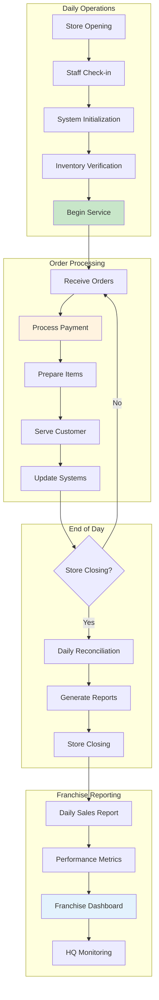
```mermaid
flowchart TD
    subgraph "Daily Operations"
        A[Store Opening] --> B[Staff Check-in]
        B --> C[System Initialization]
        C --> D[Inventory Verification]
        D --> E[Begin Service]
    end
    
    subgraph "Order Processing"
        E --> F[Receive Orders]
        F --> G[Process Payment]
        G --> H[Prepare Items]
        H --> I[Serve Customer]
        I --> J[Update Systems]
    end
    
    subgraph "End of Day"
        J --> K{Store Closing?}
        K -->|No| F
        K -->|Yes| L[Daily Reconciliation]
        L --> M[Generate Reports]
        M --> N[Store Closing]
    end
    
    subgraph "Franchise Reporting"
        N --> O[Daily Sales Report]
        O --> P[Performance Metrics]
        P --> Q[Franchise Dashboard]
        Q --> R[HQ Monitoring]
    end
    
    style E fill:#c8e6c9
    style G fill:#fff3e0
    style Q fill:#e3f2fd
```

This comprehensive workflow interaction documentation provides a detailed view of how all systems and processes work together within the Jian Cha Tea Unity Suite, enabling effective system design, integration planning, and operational understanding.